# Airflow Getting Started

This folder walks through getting started with Airflow. Airflow is a powerful and widely used open-source platform for orchestrating complex data workflows. It allows you to programmatically author, schedule, and monitor workflows as directed acyclic graphs (DAGs) of tasks.

- We take the opportunity to highlight some of the important pages in Airflow documentation.
- **Note**: Other ways of running Airflow are discussed separately e.g. Airflow on Kubernetes (coming soon)

## Quick Start

The quick start guide will help you bootstrap an Airflow standalone instance (that is to say a simple instance of Airflow running on your local machine or VM) and run your first DAGs (data workflows).

- https://airflow.apache.org/docs/apache-airflow/stable/start.html

## Note

- To walk through these steps you should have some basic knowledge of Python programming language.
- The examples we present are intended to introduce you to Airflow concepts and features. It is for exploratory and learning purposes and not intended for production use.

## Recommended Environment

- We recommend using a remote (dedicated) VM.
  - This is because:
    - It is always better to have some sandboxed environment for data processing tasks and testing.
    - Airflow can be resource intensive and may not run well on local machines with limited resources.
    - A VM also allows you to simulate a more realistic environment for data processing tasks.
- For example if you have access to the Destination Earth Data Lake Islet service you could create a dedicated VM.  

## Setting up the project

- To walk through the examples in this folder you should
  - Connect to your VM (e.g. VSCode remote-ssh)
  - cd to where you want to store the project
  - Git Clone the Destination Earth Data Lake Lab (this repository) to a VM
  - cd to the folder HOOK/Data_Processing_Alternatives/airflow/airflow-getting-started
  - Open the folder in a dedicated VSCode window
    - code .
  - You should now be ready to follow the steps below


### Prepare the project with a Python Virtual Environment e.g. 3.12

- To install python we could for instance use uv (a modern python version manager)

```bash

# In e.g. VSCode terminal Run this command on your vm
curl -LsSf https://astral.sh/uv/install.sh | sh

# Restart Terminal to have uv on your path

# get uv version e.g. 0.9.27
uv --version

# install python venv using uv
uv venv --python 3.12

# Select the created venv as you workspace python

```

### Installing Airflow Standalone

Now that you have a terminal with project level virtual environment activated you can execute the following steps

- Note: Based on https://airflow.apache.org/docs/apache-airflow/stable/start.html


- Set airflow home (Optional)

```bash

# Optional: You can change the default folder used by airflow, by default it is this so you don't have to set it.
export AIRFLOW_HOME=~/airflow

```

- Execute the following commands (replacing AIRFLOW_VERSION with latest version e.g. 3.1.3)


```python

AIRFLOW_VERSION=3.1.3

# Here we extract the version of Python you have installed.
PYTHON_VERSION="$(python -c 'import sys; print(f"{sys.version_info.major}.{sys.version_info.minor}")')"

# Here we construct a constraint URL based on the airflow version and python version
CONSTRAINT_URL="https://raw.githubusercontent.com/apache/airflow/constraints-${AIRFLOW_VERSION}/constraints-${PYTHON_VERSION}.txt"

# For example this would install 3.1.3 with python 3.12: https://raw.githubusercontent.com/apache/airflow/constraints-3.1.3/constraints-3.12.txt

uv pip install "apache-airflow==${AIRFLOW_VERSION}" --constraint "${CONSTRAINT_URL}"


```

- Then execute **airflow standalone** to run airflow on the vm (This is suitable for development and installs automatically a number of example DAGs)
- You can will notice that when airflow starts up you get a randomised password for the admin user
  - This can also be found in the airflow home folder in the file ./simple_auth_manager_passwords.json.generated and can be changed later if needed. (note: for production use a proper authentication mechanism should be used)

```bash

# Start  Airflow Standalone
airflow standalone

...

standalone | Starting Airflow Standalone
Simple auth manager | Password for user 'admin': XXXYYYZZZ
standalone | Checking database is initialized

...


```


## Access User Interface

- Now we can access the UI with the admin account and password
- Use port forwarding if you are on a remote VM (e.g. here port 8080 on the remote VM is availalble on port 8080 locally)
  - Go to http://localhost:8080

- Login with user admin and the password provided at startup

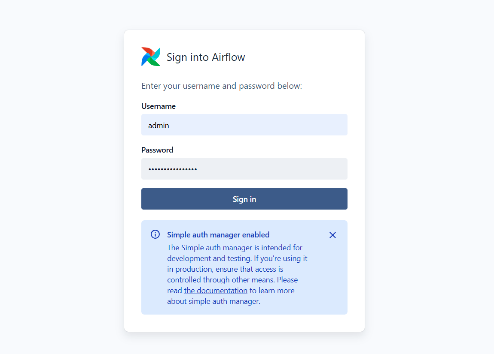

- After login we see the home page of airflow 3

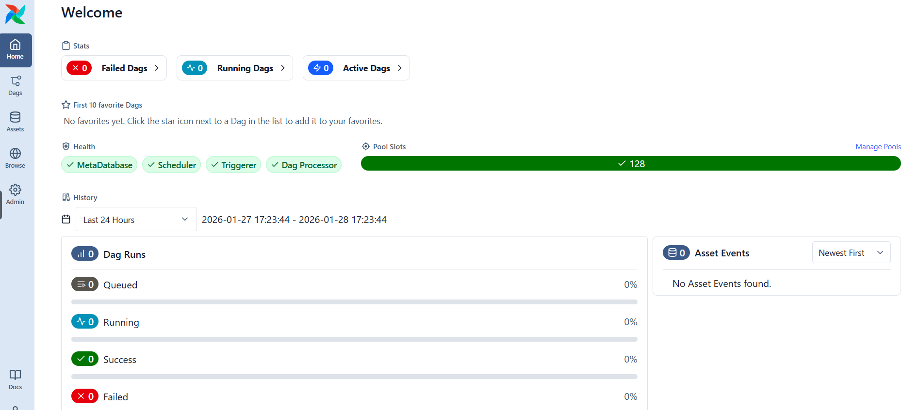

- Clicking on the Dags Page we see a number of example DAGs (Dynamic Asyclic Graphs) ready for tests / execution

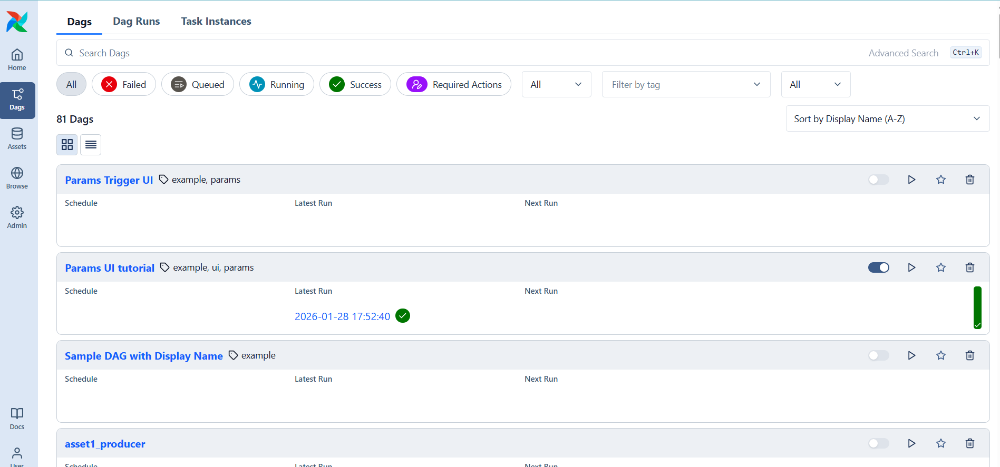


## Airflow 101: Building Your First Workflow

- A good place to start is the Tutorials section of the documentation
  - https://airflow.apache.org/docs/apache-airflow/stable/tutorial/fundamentals.html
- This gives you a high level view of DAGs, Tasks, Operators...

### What is a DAG and relationship to Tasks

At its core, a DAG is a collection of tasks organized in a way that reflects their relationships and dependencies. It’s like a roadmap for your workflow, showing how each task connects to the others. 

### Running tutorial.py

- Search for a DAG called **tutorial**

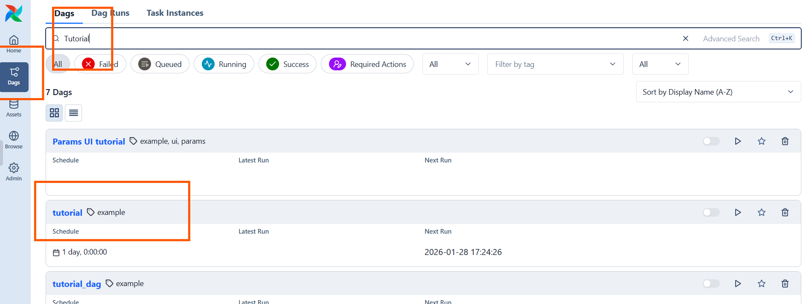

- Click on it to view the overview tab
  - Here we see on the left three different tasks
    - print_date
    - sleep
    - templated

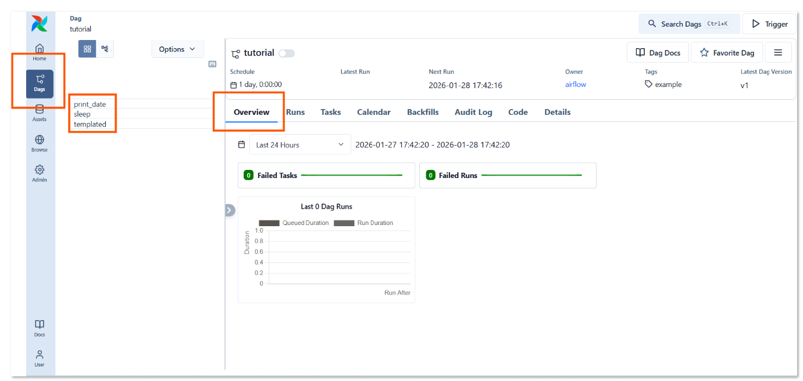

- Click on the **Code** tab to view the python based code that defines the DAG.
- Notice the definition of the DAG
  - Notice that the Dag references 3 Tasks
    - Notice that the Python Code here Orchestrates the data workflow/pipeline
    - Notice also that Python is Triggering BashOperators here.
  - Notice that when task t1 completes, task t2 and task t3 are run in parallel.

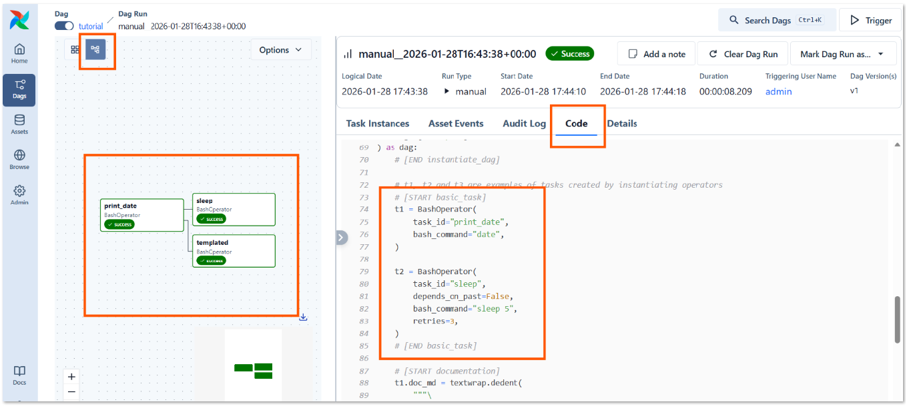

- Now let us **trigger** the DAG
- Click on the trigger button top left
  - Leave default values then the trigger button

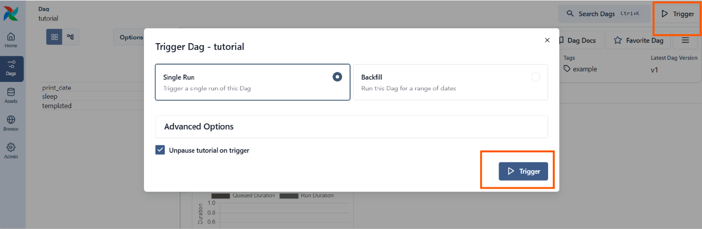

- Click on the Task Instances tab, you should see that the DAG has run successfully
  - Note: There are in fact two successful executions
    - One was scheduled when the DAG was first activated
    - One was triggered manually by us

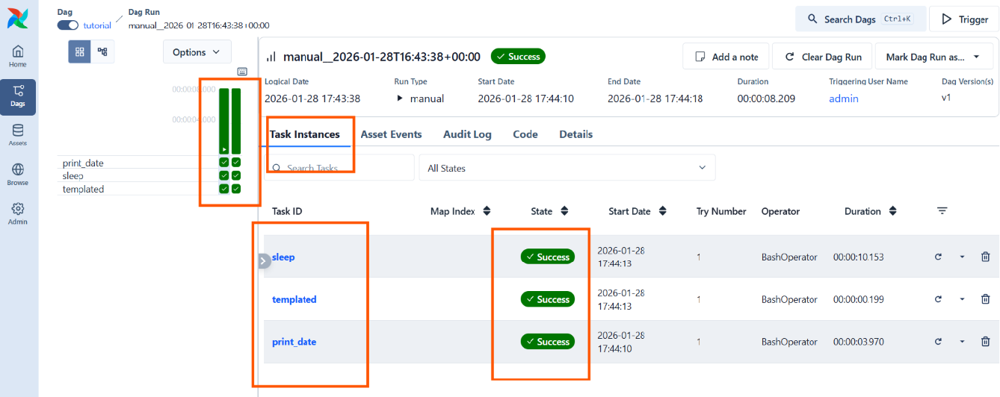


- In the left panel, clicking on the 'Show Graph' Icon will show the task relationships (dependencies)
- Here effectively
  - t1 (print_date) was executed before executing in parallel t2 (sleep) and t3 (templated)
- In this first example you can see that the tasks are BashOperators. Airflow has a large number of Operators allowing you to execute tasks with different languages / technologies.

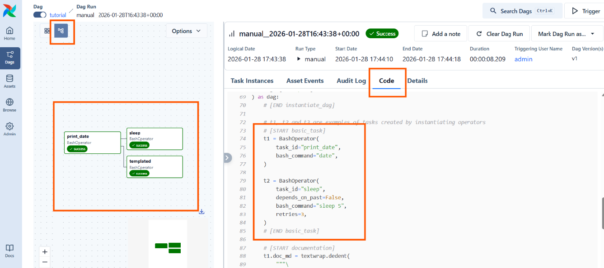

- In the left panel click on the grid view icon
- You can now click on one of the runs that was executed using the vertical green bars
- In the overview panel click on the sleep task
- You will now be able to see the logs of the execution of that task
- Note : Tasks are self contained and Data can be passed from one task to another using the XCom mechanism

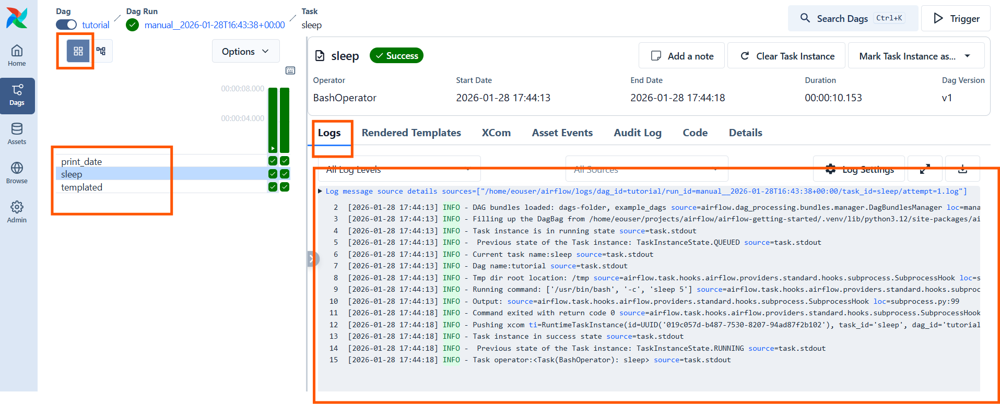


> In the rest of this demo we will focus mainly on exution of Python tasks


## Running tutorial_taskflow_api.py

- Here we execute a DAG fully based on Python code.
- Search for a DAG called 'tutorial_taskflow_api'
- Click on it to see the overview

> Note : Airflow has 2 ways of writing DAGs, the preferred (more pythonic way) is using the more recent Taskflow Api

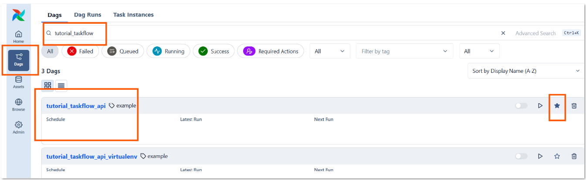

- Here we can see that the workflow (DAG) has 3 tasks extract, transform and load

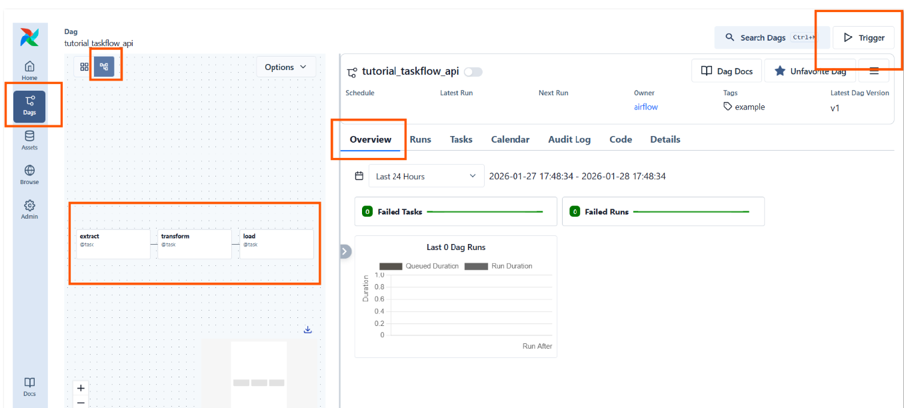


- If we look at the code we can see that the DAG is quite easy to to understand, the tasks have a @task decorator, and the relationship are implied by values (XCom) passed from one task to another.

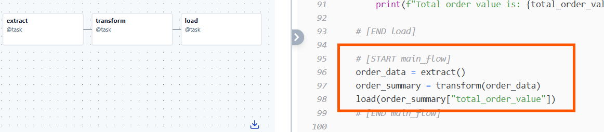


- Go ahead and trigger this Dag. Investigate the logs. You have now executed your fist full python Dag.


For a full walkthrough of the  DAG 'tutorial_taskflow_api' you will find a link to the documentation in the code.

- https://airflow.apache.org/docs/apache-airflow/stable/tutorial/taskflow.html


### Taskflow API - Main Points

- The Taskflow API is a way to author DAGs that emphasizes the use of Python functions as tasks.
- It allows for a more intuitive and Pythonic way to define workflows compared to the traditional method of using Operators and setting dependencies explicitly.

The main points when using the Taskflow API are:

- the @dag decorator defines your DAG (scheduled, manual, backfilled etc...)
- the @task decorator flags a function as a task
- the workflow (orchestration of the tasks) is implied through the call sequence of your @tasks
  - Data can be passed between tasks using XCom mechanism (transparently)

## Passing Parameters to a DAG - with UI

- Here we show how parameters can be passed to a DAG - with UI
- This could be useful for many cases where the DAG and its tasks are dependant on some configurable source data for example
- Search for the DAG 'Params UI tutorial'
- Click on the DAG to see the overview

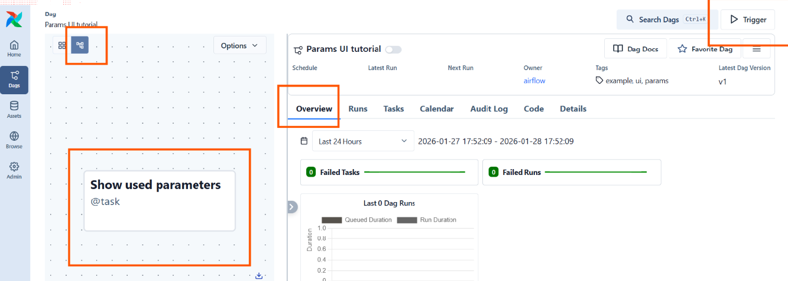

- Click on Trigger
- Note that you are presented with a possibility of providing 'Run Parameters' of different types

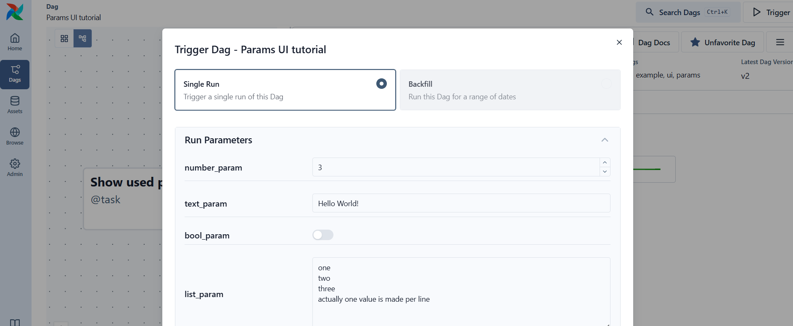

- Note that some Parameters can be required or not

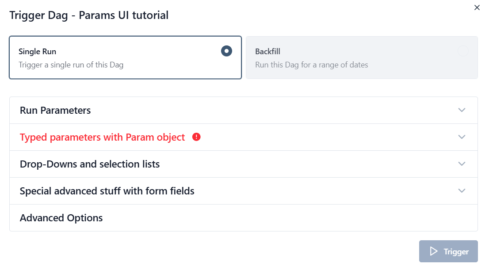

- When the DAG has run you can see the values captured in the logs of the task "Show used parameters'

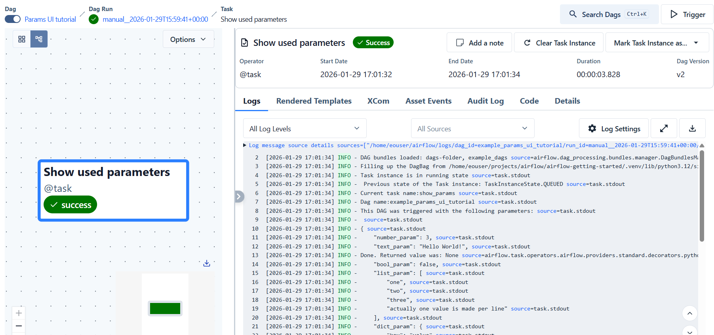


## Running your own DAG

- In this folder you will find a sub-folder called /dags
  - This folder contains our own example Dag that you can run **tutorial_taskflow_api_demo1.py**
    - However, for a Dag to be known to the airflow standalone application, we will need to synchronise this Dag (or Dags if multiple) to the airflow dag folder
  - To keep our code organised you will see that an example dag and supporting code is all in a folder callded 'dedl'


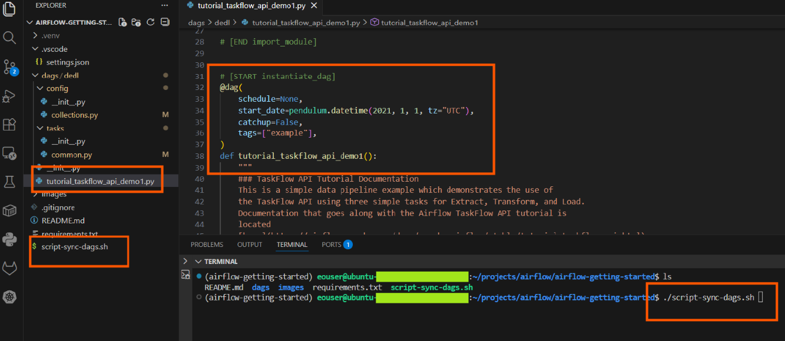

### Synchronising your own DAGs to Airflow

- For these Dags to be known to the airflow standalone application
  - We will use the default folder used by airflow found at $HOME/airflow
  - We will assure that our Dags are synchronised with the folder $HOME/airflow/dags/
    - To do so there is a bash script (sync-dags.sh) at the root of this project that will handle this synchronisation

Here is the script sync-dags.sh which is executed as follows

```bash
# chmod +x ./script-sync-dags.sh
./script-sync-dags.sh

```

- After launching the script, if you have airflow running already, these Dags in the folder /dag/dedl should now be available in the user interface (wait a few moments and refresh the page if needed)

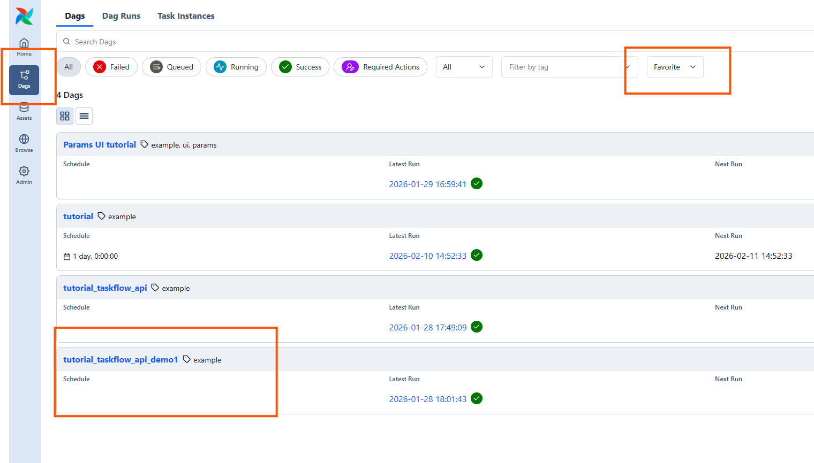

- Click on the Dag to see the details
- Then trigger the DAG and investigate the logs of the "Show used parameters" task
  - Notice that we have called a custom function which fetches the collections of the Destination Earth Data Lake Portfolio

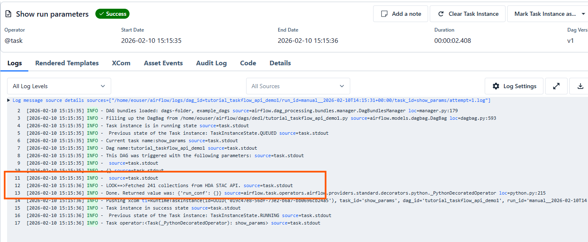

- Here we see the 'Task' called show_params

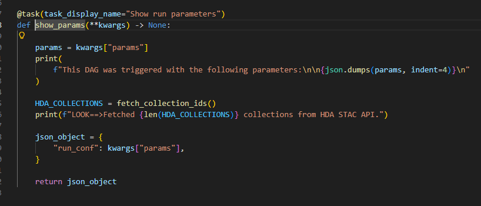

- We can see that our own DAG has now been succesfully executed


# Trouble-shooting

## Cleaning up processes

- Sometimes the airflow standalone application doesn't close down properly, and you will see error messages at startup
- This command will remove gunicorn processes used by airflow

```bash

pkill gunicorn

```

# Next Steps

- Now that you have a basic understanding of Airflow and have run your first DAGs, you can explore more advanced features and concepts
- For example you can explore:
  - Airflow on Kubernetes
  - Airflow Variables and Connections
  - Airflow XComs for passing data between tasks

  
  