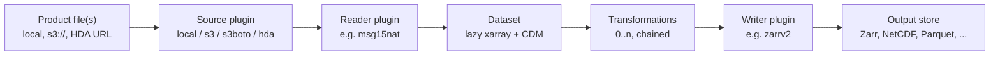
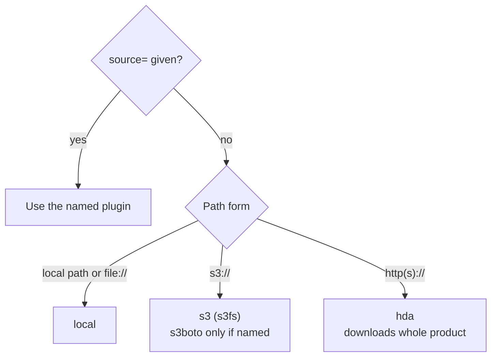
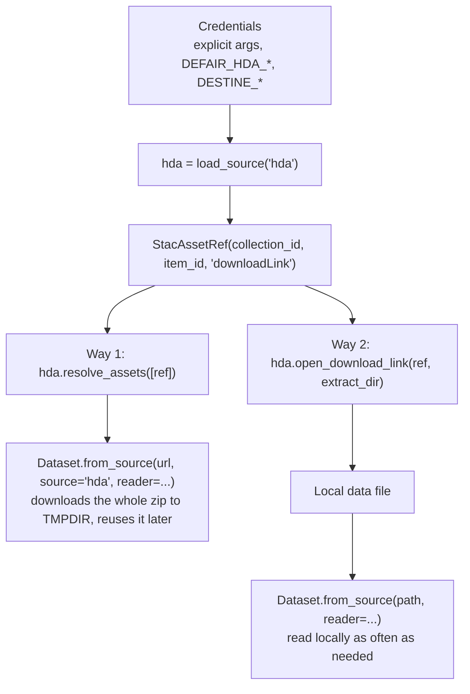
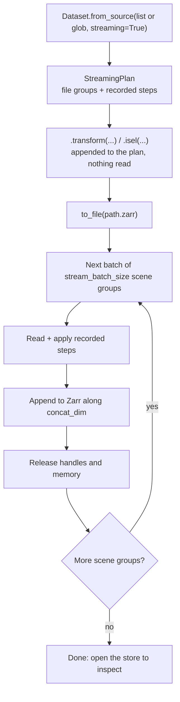
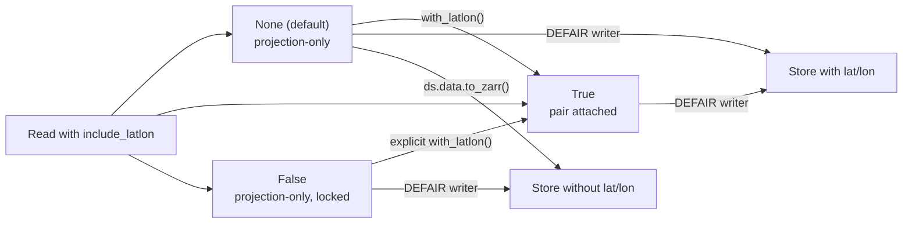
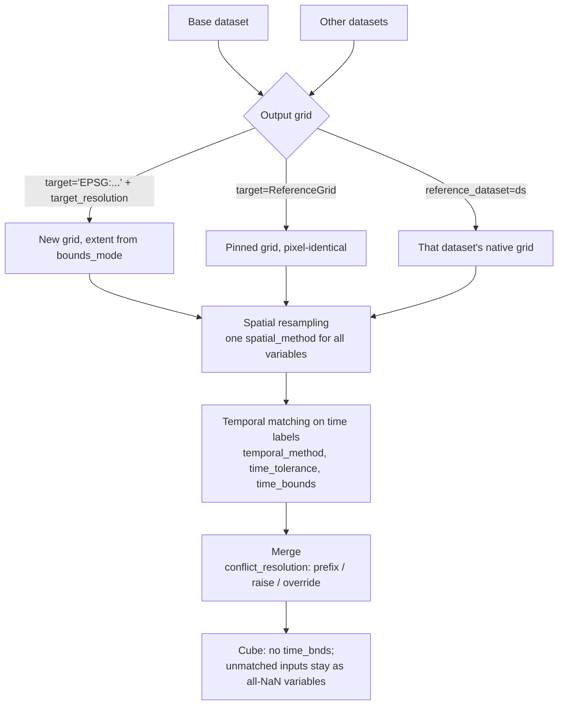
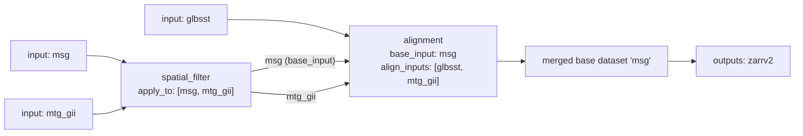
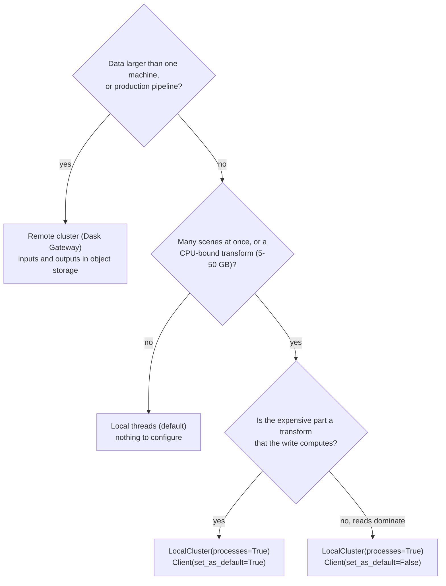

# DEFAIR reference

DEFAIR (Destination Earth Framework for Preparing AI-Ready Data) is a Python library that reads EUMETSAT satellite products (MSG, MTG, Metop, Sentinel-3), transforms them, and writes machine-learning-ready files such as Zarr. This document is a self-contained reference for people and AI coding agents who use DEFAIR. It describes DEFAIR 0.4.0, the release the documentation of 28 September 2026 was validated against.

## Contents

1. [How to use this document](#1-how-to-use-this-document)
2. [What DEFAIR is](#2-what-defair-is)
3. [Install](#3-install)
4. [Credentials and data access](#4-credentials-and-data-access)
5. [Quick start in Python](#5-quick-start-in-python)
6. [Quick start as a workflow](#6-quick-start-as-a-workflow)
7. [Core concepts](#7-core-concepts)
8. [Reading data](#8-reading-data)
9. [Product-specific reader options](#9-product-specific-reader-options)
10. [Grids, orientation and latitude/longitude](#10-grids-orientation-and-latitudelongitude)
11. [Time semantics](#11-time-semantics)
12. [Transformations](#12-transformations)
13. [Writing outputs](#13-writing-outputs)
14. [Workflows (YAML)](#14-workflows-yaml)
15. [Command line reference](#15-command-line-reference)
16. [Dask, memory and performance](#16-dask-memory-and-performance)
17. [Logging, profiling and validation](#17-logging-profiling-and-validation)
18. [HEALPix nside selection](#18-healpix-nside-selection)
19. [Reader catalogue](#19-reader-catalogue)
20. [Worked examples](#20-worked-examples)
21. [Writing plugins](#21-writing-plugins)
22. [Troubleshooting](#22-troubleshooting)
23. [Environment variables](#23-environment-variables)
24. [Python API quick reference](#24-python-api-quick-reference)
25. [Rules for AI coding agents](#25-rules-for-ai-coding-agents)

---

## 1. How to use this document

- **New users**: read sections 2 to 7 in order, then look up what you need in sections 8 to 20.
- **Looking something up**: the reader catalogue (section 19), CLI (section 15), workflow schema (section 14.2), environment variables (section 23) and API quick reference (section 24) are the lookup tables.
- **AI coding agents**: read section 25 first. It lists the rules that prevent the most common mistakes. Then use the other sections as the source of truth for names, signatures and defaults.

Conventions:

- `dataset` is a DEFAIR `Dataset` (the wrapper). `dataset.data` is the underlying `xarray.Dataset`.
- Paths such as `/path/to/file.nat` or `s3://bucket/...` are placeholders. Replace them with real products.
- Log lines start with a timestamp and a bracketed correlation ID such as `[a6ceaf43]`. Both change on every run.

---

## 2. What DEFAIR is

DEFAIR opens every supported product the same way, and returns an xarray dataset with Dask-backed, lazy arrays. You can then crop it, select variables, move it onto another map grid, combine it with other satellites, aggregate it in time, and write it in a format built for large arrays.

You can use DEFAIR from Python, or describe the whole job in a YAML workflow file and run it with the `defair` command.

DEFAIR is a Python library that you install with pip and run in your own Python environment. It is not a managed DEDL or EUMETSAT service.

### 2.1 How the pieces fit



Nothing is computed between the reader and the writer. The writer pulls values through the chain, chunk by chunk.

| Piece | What it does | Built-in examples |
|---|---|---|
| **Source** | Finds and opens bytes (local disk, S3, Destination Earth HDA) | `local`, `s3`, `s3boto`, `hda` |
| **Reader** | Understands one product family and builds the dataset | `msg15nat`, `mtg_fci_l1c_nc`, `metop_avhrrl1`, ... |
| **Transformation** | Changes a dataset and returns a new one | `content_filter`, `spatial_filter`, `reprojection`, `alignment`, ... |
| **Writer** | Saves a dataset | `zarrv2`, `zarrv3`, `netcdf4`, `hdf5`, `parquet`, `geoparquet`, `csv`, `geotiff`, `png`, `jpeg` |

Each piece is a **plugin**: code DEFAIR loads by name through Python entry points. You select one by naming it. Third parties can add plugins (section 21).

### 2.2 The packages

`pip install defair` installs three distributions:

| Distribution | Import name | Holds |
|---|---|---|
| `defair` | `defair` | The `defair` command, workflow models and runner, plugin manager, logging, CF history, profiling |
| `defair-data` | `defair_data` | `Dataset`, readers, sources, writers, Common Data Model, Dask manager |
| `defair-ops` | `defair_ops` | Transformations, reprojection backends, EDA |

Optional extras:

- `defair[notebooks]` adds cartopy, earthkit-data, healpy, matplotlib, ipykernel, and satpy (satpy only on Python 3.11 or newer).
- `defair-ai-demo` is a separate package with a PyTorch cloud-mask U-Net. It is used in the AI example in section 20.12.

### 2.3 What DEFAIR reads and writes

- **Reads**: about fifty readers covering MSG SEVIRI (native and Climate Data Record), MTG FCI Level 1c and Level 2, MTG Lightning Imager, Metop (AVHRR, ASCAT, IASI, HIRS, MHS, AMSU-A, GOME-2, OSI SAF winds, soil moisture, GHRSST, LSA SAF land surface temperature), and Sentinel-3 (OLCI, SLSTR, SRAL). The full list is in section 19.
- **Writes**: Zarr v2 and v3 (local or S3), NetCDF4, HDF5, Parquet, GeoParquet, CSV, GeoTIFF, PNG and JPEG.
- **Never reads by default into memory**: data stays lazy (Dask) until a writer or your own `.compute()` asks for values.

---

## 3. Install

### 3.1 Requirements

| Item | Requirement |
|---|---|
| Python | 3.10 or newer. Tested on 3.10 to 3.13. Python 3.14 installs and imports on macOS but is not in the test suite. Anything using satpy needs 3.11 or newer. |
| Platforms | Linux x86_64 (tested) and macOS on Apple silicon (used daily by the developers). Linux arm64 installs from the same wheels, but is not in the test suite. Windows is untested: nobody has confirmed that it works or that it fails. |
| Memory | 4 GB is enough for typical single-scene work with Dask on one core. Peak memory grows with the number of cores Dask uses. Multi-instrument full-disc collocation peaked at 3.8 GB on 1 core, 4.1 GB on 4 cores and 4.8 GB on 16 cores. Allow about 6 GB with four or more cores. |
| GPU | Not needed. The AI example trains on the CPU and uses CUDA only if PyTorch finds a device. |

### 3.2 Install commands

```bash
python -m venv defair-env
source defair-env/bin/activate          # Windows: defair-env\Scripts\activate
pip install "defair[notebooks]"         # library + notebook/plotting extras
# or, library only:
pip install defair
```

The optional AI package depends on PyTorch. On Linux, install the CPU build of PyTorch first, or pip downloads the CUDA build (about 3 GB instead of 0.2 GB). On macOS and Windows, skip the first line:

```bash
pip install torch --index-url https://download.pytorch.org/whl/cpu
pip install defair-ai-demo
```

**System libraries.** The wheels bundle their native libraries: GDAL with rasterio, PROJ with pyproj, HDF5 with h5py, and ecCodes with eccodeslib (through the notebooks extra). No `apt` or `brew` step is needed on macOS or desktop Linux. The exception is minimal container images such as `python:3.12-slim`, which lack **expat**. There, `defair` fails with `ImportError: libexpat.so.1: cannot open shared object file`. Fix it with:

```bash
apt-get update && apt-get install -y libexpat1
```

### 3.3 Check the install

```bash
defair version
```

```text
2026-09-22 16:04:30 | INFO     | [a6ceaf43] defair.cli.version:version_cmd:30 - Displaying version information
defair <version>
```

The first line is a log message. The second line is the installed version.

Five quick checks:

| # | Check | Expected |
|---|---|---|
| 1 | `defair version` | `defair <version>` after one log line |
| 2 | `defair readers` | A table with columns `Reader`, `Product`, `Collection ID`, starting with the Metop readers |
| 3 | In Python: `from dotenv import load_dotenv; from defair.plugin_manager import load_source; load_dotenv(override=True); print(load_source("s3").list("s3://your-bucket/your-prefix/"))` | A list of `s3://` URIs directly under the prefix |
| 4 | `python -c "import cartopy, healpy, earthkit.data, ipykernel"`, and for the AI package `python -c "import torch, defair_ai_demo"` | No output. An error names the missing package. |
| 5 | In the working folder: `Path("output").mkdir(exist_ok=True); Path("output/write-test.txt").write_text("ok")` | `output/write-test.txt` exists. Delete it afterwards. |

### 3.4 Pin a version

DEFAIR releases often. If results must be reproducible, pin the version and record it beside your results:

```bash
pip install "defair[notebooks]==<version>"
```

To record the environment from Python:

```python
import sys
from importlib.metadata import PackageNotFoundError, version

print(f"python {sys.version.split()[0]}")
for pkg in ("defair", "defair-data", "defair-ops", "xarray", "zarr", "dask"):
    try:
        print(pkg, version(pkg))
    except PackageNotFoundError:
        print(pkg, "NOT INSTALLED")
```

The reference environment printed `defair 0.4.0`, `defair-data 0.4.0`, `defair-ops 0.4.0`, `xarray 2026.7.0`, `zarr 3.4.0` and `dask 2025.3.0` on Python 3.13.

### 3.5 Jupyter kernel

```bash
pip install jupyterlab                        # skip if JupyterLab is installed elsewhere
python -m ipykernel install --user --name defair
jupyter lab
```

In JupyterLab, pick the `defair` kernel. To confirm that the kernel is the right one, run these two cells:

```python
import sys
print(sys.executable)      # must be inside the DEFAIR environment
```

```text
!defair version
```

In a notebook, shell `export` does not reach the kernel. Pass credentials in code, or load them from a `.env` file (section 4.1).

### 3.6 Running on the DEDL JupyterHub

The DestinE Data Lake Central JupyterHub is at `https://jupyter.central.data.destination-earth.eu/`. DEFAIR is not preinstalled there. To get a server, you need:

- a DestinE account,
- an active My DataLake Services profile,
- membership of an approved project,
- the `stack-jupyter` access role and one quota role. A project administrator requests the roles for you.

| Quota role | Cores | Memory | Suitability |
|---|---|---|---|
| `stack-jupyter-low` | 2 | 2 GB | Light single-product work only. Full-disc multi-channel and collocation jobs run out of memory. |
| `stack-jupyter-medium` | 6 | 16 GB | Everything in this document, including the AI example |
| `stack-jupyter-high` | 12 | 32 GB | Everything |

Nothing here needs the Data Lake's separately managed Dask Gateway (`stack-dask` roles). Dask runs inside your notebook server.

Install into a persistent environment. Start from the Hub's "Python DEDL" interpreter (Python 3.11). Open File > New > Terminal and run:

```bash
/opt/conda/envs/python_dedl/bin/python -m venv ~/user_data/envs/defair
source ~/user_data/envs/defair/bin/activate
pip install -U pip
pip install "defair[notebooks]"
python -m ipykernel install --user --name defair --display-name "DEFAIR"
```

The environment takes about 2 GB. Only `~/user_data` persists across restarts. Keep the environment, notebooks, `.env` and `output/` there:

| What | Where |
|---|---|
| Environment | `~/user_data/envs/defair` |
| Notebooks | `~/user_data/defair-tutorials/` (or any folder under `~/user_data`) |
| Credentials | `.env` in that folder |
| Outputs | `output/` in that folder |

**After every server restart** the kernel registration is lost, because it lives in `~/.local`, which is reset. Register it again without reinstalling anything:

```bash
~/user_data/envs/defair/bin/python -m ipykernel install --user --name defair --display-name "DEFAIR"
```

Registering the kernel under `~/user_data` does not help: Jupyter only looks there if `JUPYTER_PATH` is set before the server starts, and the Hub offers no way to set it.

The Hub presets `AWS_*` variables for the platform's own object store. Load your `.env` with `override=True` so that your values win (section 4.1).

### 3.7 Not yet available

A Docker image, a conda-forge package and a preinstalled DEFAIR on the DEDL JupyterStack are planned. None of them exists yet. PyPI (pip) is the only release channel.

---

## 4. Credentials and data access

DEFAIR reads from three kinds of place:

| Path form | Source plugin chosen automatically | Meaning |
|---|---|---|
| Local path, relative path or `file://` URI | `local` (priority 70) | Local or network filesystem (`smb://` and `nfs://` need extra fsspec backends) |
| `s3://` URI | `s3` (priority 80, s3fs) | S3-compatible object storage |
| `http://` or `https://` URI | `hda` (priority 10) | Destination Earth Harmonised Data Access (HDA) download with local caching |

Pass `source="..."` to force a plugin. `s3boto` (priority 60) also handles `s3://`, but only when you name it explicitly.



### 4.1 S3 credentials

Settings are resolved in this order, and the first one set wins:

1. explicit `source_kwargs` (Python) or keys in the workflow `source:` block,
2. DEFAIR-specific environment variables,
3. standard AWS environment variables and the AWS credential chain (profiles, SSO logins, instance roles).

| Setting | Variables, first one set is used | Default |
|---|---|---|
| Access key | `DEFAIR_AWS_ACCESS_KEY_ID`, then `AWS_ACCESS_KEY_ID` | none |
| Secret key | `DEFAIR_AWS_SECRET_ACCESS_KEY`, then `AWS_SECRET_ACCESS_KEY` | none |
| Session token | `AWS_SESSION_TOKEN` | none |
| Region | `AWS_REGION`, then `AWS_DEFAULT_REGION` | `us-east-1` |
| Endpoint | `DEFAIR_S3_ENDPOINT_URL`, then `AWS_ENDPOINT_URL` | **none** |

- There is **no default endpoint**. Every store other than AWS S3 itself needs `AWS_ENDPOINT_URL`, or `endpoint_url` in `source_kwargs`.
- The `DEFAIR_` variants exist for one case: the plain `AWS_*` pair is already used for another store and you cannot change it.

A `.env` template:

```text
# Never commit this file.
AWS_ACCESS_KEY_ID=your-access-key
AWS_SECRET_ACCESS_KEY=your-secret-key
AWS_ENDPOINT_URL=https://s3.example.org
# AWS_SESSION_TOKEN=
# AWS_REGION=us-east-1

# Destination Earth HDA: one of the credential kinds is enough.
# DEFAIR_HDA_TOKEN=
# DEFAIR_HDA_CLIENT_ID=
# DEFAIR_HDA_CLIENT_SECRET=
# DEFAIR_HDA_USERNAME=
# DEFAIR_HDA_PASSWORD=
# DESTINE_USERNAME and DESTINE_PASSWORD also work.
```

Load it at the top of every notebook or script:

```python
from dotenv import load_dotenv
load_dotenv(override=True)   # searches upward from the working folder
```

`override=True` makes `.env` values win over variables already set in the environment. This matters on hosted notebook platforms, the DEDL Stack among them, which preset `AWS_*` for their own store. Without the override, the platform's values would silently win. The reverse also holds: a variable you exported in the shell is replaced when `.env` defines the same key. To use the platform's credentials instead, leave those keys out of `.env`.

Explicit form in Python:

```python
dataset = Dataset.from_source(
    "s3://bucket/path/product.nc",
    reader="mtg_fci_l1c_nc",
    source_kwargs={
        "endpoint_url": "https://s3.example.com",
        "region_name": "us-east-1",
        "aws_access_key_id": "...",
        "aws_secret_access_key": "...",
    },
)
```

**Public buckets and anonymous access.** When no credential resolves from any of the three places, DEFAIR sends unsigned requests, so a public bucket needs no configuration. The side effect is that a *private* bucket read with no credentials fails with `AccessDenied` or `Forbidden`, not with a "missing credentials" message, and DEFAIR logs `No S3 credentials found`. The fallback does not engage while any credential resolves. If ambient credentials exist but the target bucket rejects signed requests, force unsigned access:

```python
Dataset.from_source("s3://public-bucket/path/product.nat", source="s3",
                    source_kwargs={"endpoint_url": "https://s3.example.com", "anon": True})
```

You can also set `DEFAIR_S3_ANON=1`. `anon=False` forces signed requests and disables the fallback.

**`s3` versus `s3boto`**

| Capability | `source="s3"` | `source="s3boto"` |
|---|---|---|
| Listing and direct reads | s3fs | boto3 (paginator, seekable range-request file) |
| Chosen automatically for `s3://` | yes | no |
| Reads made by xarray | shared s3fs settings | the same shared s3fs settings |
| Reason to choose it | normal xarray/Dask integration | direct boto3 connection, timeout, retry or range-read control |

`s3boto` constructor options: `max_pool_connections=50`, `connect_timeout=60`, `read_timeout=60`, `max_attempts=3`. These affect direct boto3 operations only, not the xarray read settings.

Options shared by both S3 plugins: `aws_access_key_id`, `aws_secret_access_key`, `aws_session_token`, `region_name`, `endpoint_url`, `anon`, `read_storage_options`, `assume_single_payload`. The `s3` plugin also takes `cache_enabled=True`, `cache_type="readahead"` and `cache_storage`.

**Remote read limits.** By default, remote xarray reads use 1 MiB blocks, `readahead` caching, eager cache filling disabled, and ten standard retry attempts. This avoids high memory use when many s3fs reads run at once. Change the limits only after measuring:

```python
Dataset.from_source("s3://bucket/path/product.nc", source="s3", reader="mtg_fci_l1c_nc",
    source_kwargs={"read_storage_options": {
        "default_block_size": 2 * 1024 * 1024,
        "default_cache_type": "readahead",
        "default_fill_cache": False}})
```

**Zip archives.** Both the local and S3 sources unpack `.zip` EUMETSAT product archives transparently. An S3 zip is downloaded once to `$TMPDIR/defair_s3_zip_<hash>.zip`, keyed by endpoint, region, URI and ETag, and extracted beside it. Nothing evicts these files. On long-running workers, size `$TMPDIR` for at least twice the largest granule times the number of granules, and clean `$TMPDIR/defair_s3_zip_*` between runs.

**Dask workers.** DEFAIR copies explicit keys and environment-variable credentials to Dask workers that run in their own processes. It cannot copy credentials that exist only in a local AWS profile, instance role or task role. Give workers the same profile or role, or pass the credentials explicitly. Workers inside the calling process (the default threaded setup) already share the environment and are left untouched.

### 4.2 Destination Earth HDA

HDA distributes EUMETSAT products. You need a Destination Earth account (registration is free).

**Important properties of HDA:**

- HDA does **not** serve byte-range requests (no streaming). DEFAIR downloads the **whole product** to the system temporary directory before it reads anything, even if you want one channel or a small region. Free disk space for the full product.
- A `downloadLink` asset is a zip file. DEFAIR extracts it and gives the reader the data file inside.
- A second read of the same URL reuses the local copy. Nothing deletes the copies, so clear the temporary directory yourself.
- HDA does not carry every collection. The full-disc SEVIRI Climate Data Record and several reprocessed Sentinel-3 baselines are not on HDA; get those from the EUMETSAT Data Store. Section 19 shows which collections HDA carries. FCI Level 1c **is** on HDA (`EO.EUM.DAT.MTG.FCI-FDHSI`, `EO.EUM.DAT.MTG.FCI-HRFI`), but HDA lists it only to a request with a token, so it looks absent from anonymous discovery (checked 2026-09-29; see [HDA.md](HDA.md) §8.2). Reading it with `source="hda"` has not been tested here: the data-prep pipeline downloads the needed chunk files over REST and reads them from S3.
- To run the same job many times, download products once or copy them into your own object store. From S3, DEFAIR reads only the bytes it needs.

**Credential kinds**, resolved with the same precedence as S3 (explicit arguments, then `DEFAIR_HDA_*`, then `DESTINE_*`):

| Kind | Explicit arguments | Environment variables | Notes |
|---|---|---|---|
| DEDL service account (API key from My DataLake Services, Access > API Keys) | `client_id`, `client_secret` | `DEFAIR_HDA_CLIENT_ID` + `DEFAIR_HDA_CLIENT_SECRET`, or `DESTINE_CLIENT_ID` + `DESTINE_CLIENT_SECRET` | Recommended for scripts, schedulers, containers. Inherits only its creator's permissions. Both halves are required: one alone raises `PermissionError` naming the missing half. Tokens last about 1 hour. |
| DESP username and password | `username`, `password` | `DEFAIR_HDA_USERNAME` + `DEFAIR_HDA_PASSWORD`, or `DESTINE_USERNAME` + `DESTINE_PASSWORD` | Tokens last about 10 to 12 hours. An account protected by a one-time password is rejected. |
| Pre-acquired token | `token` | `DEFAIR_HDA_TOKEN`, or `DESTINE_TOKEN` | Cannot be refreshed. It must stay valid for the whole read. |

When several credentials are configured, the most specific one wins, in this order: a token DEFAIR propagated to its own Dask workers, an explicit `token`, explicit `client_id`/`client_secret`, explicit `username`/`password`, then the same three kinds from the environment. An environment token therefore does **not** override explicit credentials.

Token behaviour:

- DEFAIR mints a token on first use, caches it per credential, and never hands out an expired one (it reads the JWT `exp` claim).
- It refreshes when a request is rejected, not on a timer.
- If it holds credentials, an expired token is replaced and the read continues. If it holds only a token, it raises `PermissionError`.
- Minting is serialised, so concurrent callers share one login.
- The driver's token is propagated to Dask workers. Credentials passed explicitly in `source_kwargs` travel with it, which lets a worker mint a replacement (these credentials are then serialised into the Dask graph). Credentials resolved from the driver's *environment* are not propagated. Set the same variables on the workers if they must refresh on their own.

A `PermissionError` can also mean the identity provider rejected the credentials themselves: a wrong service-account secret, invalid DESP credentials, or an account with a one-time password.

**Retries.** File probes and downloads are retried on HTTP 429, 500, 502, 503 and 504, and on stalled connections:

- 4 attempts in total by default. Set `max_attempts` in `source_kwargs` to change it.
- A 401 or 403 triggers one token refresh, drawn from the same pool of attempts.
- Other 4xx responses are not retried. A missing object raises `FileNotFoundError`. A failed metadata probe raises `ConnectionError`.
- The backoff doubles from 1 s up to 8 s. A valid `Retry-After` header is honoured, up to 30 s.
- A time window also limits retries: no new attempt is scheduled once elapsed time plus the next delay would reach `max_attempts * (connect_timeout + sock_read_timeout)`. With the defaults (60 s and 120 s) that is 12 minutes. The timeouts are stall timeouts: a transfer that is still moving bytes may run past the window and finish.
- STAC catalogue lookups that resolve a `StacAssetRef` are outside this policy. They keep a one-shot token refresh, but 429 and 5xx responses from the catalogue are not retried.

HDA source constructor: `HdaStacPlugin(username=None, password=None, token=None, client_id=None, client_secret=None, stac_url=<HDA STAC v2 endpoint>, connect_timeout=60, sock_read_timeout=120, max_attempts=4, assume_single_payload=False)`. The default `stac_url` is `https://hda.data.destination-earth.eu/stac/v2`.

**Finding a product.** A `StacAssetRef(collection_id, item_id, asset_name)` names:

- `collection_id`: the HDA collection, for example `EO.EUM.DAT.MSG.HRSEVIRI` (MSG SEVIRI) or `EO.EUM.DAT.MTG.FCI-CLM` (MTG FCI cloud mask). The DestinE column of section 19 lists them.
- `item_id`: one product in that collection. Items live at `{stac_url}/collections/{collection}/items/{item}`. The catalogue needs the same bearer token as downloads: an unauthenticated request returns HTTP 403, so you cannot search the catalogue without credentials.
- `asset_name`: usually `downloadLink`.

**Two ways to use HDA:**



```python
from defair.plugin_manager import load_source
from defair_data.core import Dataset
from defair_data.sources.hda import StacAssetRef

hda = load_source("hda")  # credentials from DEFAIR_HDA_* or DESTINE_* variables
# Explicit form: load_source("hda", client_id="...", client_secret="...")

ref = StacAssetRef(
    collection_id="EO.EUM.DAT.MTG.FCI-CLM",
    item_id="W_XX-EUMETSAT-Darmstadt,IMG+SAT,MTI1+FCI-2-CLM--FD--x-x---x_C_EUMT_20250127140656_L2PF_OPE_20250127135000_20250127140000_N__C_0084_0000",
    asset_name="downloadLink",
)

# Way 1: read through HDA. Resolve the reference to a URL first; do not pass the StacAssetRef itself.
[url] = hda.resolve_assets([ref])
ds = Dataset.from_source(url, source="hda", reader="mtg_l2_clm")
print(ds.data.sizes)  # {'time': 1, 'x': 5568, 'y': 5568, 'bnds': 2}

# Way 2: download and extract once, then read the local copy as often as you like.
[path] = hda.open_download_link(ref, extract_dir=".")
ds = Dataset.from_source(str(path), reader="mtg_l2_clm")
```

If you pass credentials in code rather than through the environment, pass them in **two** places: to `load_source("hda", ...)`, which looks the item up, and in `source_kwargs` to `Dataset.from_source(...)`, which downloads it.

```python
Dataset.from_source(url, reader="mtg_l2_clm", source="hda",
                    source_kwargs={"client_id": "...", "client_secret": "..."})
Dataset.from_source(url, reader="mtg_l2_clm", source="hda",
                    source_kwargs={"username": "...", "password": "..."})
Dataset.from_source(url, reader="mtg_l2_clm", source="hda",
                    source_kwargs={"token": token})
```

To reuse one token across processes, obtain it with `destinelab.AuthHandler(username=..., password=...).get_token()` and pass it as `token`.

Measured timings on a 600 Mbit/s link: a catalogue lookup takes 3 to 5 s. The first open of a full-disc cloud mask takes about 25 s (download and unpack). A second open of the same URL takes about 2 s.

Other methods of the HDA source: `resolve_assets(list)`, `open_asset(ref)`, `open(path)`, `exists(path)`, `get_info(path)`, `cache(path)`, `open_download_link(ref, extract_dir=None)`. `list` and `glob` are not implemented for HDA: use a STAC search instead.

Sentinel-3 items served under `external_fdp` sit in a folder named by the bare product name, without `.SEN3`. The Sentinel-3 readers accept either form.

---

## 5. Quick start in Python

This reads one MSG SEVIRI full-disc image, keeps one channel, crops it to Iberia, writes Zarr, and reads the result back.

### 5.1 Get the sample from HDA

```bash
mkdir defair-first-steps && cd defair-first-steps
export DESTINE_USERNAME=your-username
export DESTINE_PASSWORD=your-password
```

```python
from defair.logging import setup_logging
from defair.plugin_manager import load_source
from defair_data.sources.hda import StacAssetRef

setup_logging(log_level="WARNING")

hda = load_source("hda")  # reads DESTINE_USERNAME and DESTINE_PASSWORD
# In a notebook, where export does not reach the kernel:
# hda = load_source("hda", username="...", password="...")
sample = StacAssetRef(
    collection_id="EO.EUM.DAT.MSG.HRSEVIRI",
    item_id="MSG3-SEVI-MSG15-0100-NA-20251016172744.081000000Z-NA",
    asset_name="downloadLink",
)
[path] = hda.open_download_link(sample, extract_dir=".")
print(path.name)   # MSG3-SEVI-MSG15-0100-NA-20251016172744.081000000Z-NA.nat
```

This prints an expected warning: `downloadLink assets require downloading the entire zip archive...`. The download is about 160 MB and unpacks to a 271 MB image. Any other image from the same collection works.

### 5.2 Read, filter, write

```python
from defair.logging import setup_logging
from defair_data import Dataset

setup_logging(log_level="WARNING")

dataset = Dataset.from_source(
    "MSG3-SEVI-MSG15-0100-NA-20251016172744.081000000Z-NA.nat",
    use_channel_names=True,
)
print(list(dataset.data.data_vars))
# ['VIS006', 'VIS008', 'IR_016', 'IR_039', 'WV_062', 'WV_073', 'IR_087', 'IR_097', 'IR_108', 'IR_120', 'IR_134', 'geostationary']
print(dict(dataset.data.sizes))
# {'time': 1, 'y': 3712, 'x': 3712, 'bnds': 2}

ir = dataset.transform("content_filter", include_vars=["IR_108"])
region = ir.transform("spatial_filter", lat_min=35, lat_max=45, lon_min=-10, lon_max=5)
print(dict(region.data.sizes))   # {'time': 1, 'y': 246, 'x': 440, 'bnds': 2}

region.to_file("output/first-product.zarr", writer="zarrv2", mode="w")
```

What happened:

- DEFAIR looked at the file name and chose the `msg15nat` reader.
- A warning explains that HRV is opt-in because it has its own 1 km grid. It is not an error.
- `geostationary` is not a channel. It is the CF grid-mapping variable that records the projection.
- `bnds` belongs to `time_bnds`, the start and end of the 15-minute slot.
- Without `use_channel_names=True`, the channels are named `ch1` to `ch11`.
- Nothing was read from disk until `to_file`. Only the file header was read before that.

### 5.3 Inspect the result

```python
import xarray as xr
stored = xr.open_zarr("output/first-product.zarr")
print(stored)
print(float(stored["IR_108"].mean()))   # 78.0468...
```

The store holds `IR_108` (radiance in the product's units, mW m-2 sr-1 (cm-1)-1), `time`, `time_bnds`, projection axes `x`/`y` in metres, 2D `lat`/`lon` (added by the writer), `spatial_ref`, and global attributes including `Conventions: CF-1.13`, `history`, `defair_cdm`, `date_created` and `_spatial_filter_bounds`.

---

## 6. Quick start as a workflow

The same job as a YAML file:

```yaml
name: First workflow
description: One MSG SEVIRI channel over Iberia, written to Zarr

inputs:
  - reader:
      name: msg15nat
      use_channel_names: true
    source:
      fs_type: local
      path: MSG3-SEVI-MSG15-0100-NA-20251016172744.081000000Z-NA.nat

transformations:
  - operation: content_filter
    include_vars: [IR_108]
  - operation: spatial_filter
    lat_min: 35
    lat_max: 45
    lon_min: -10
    lon_max: 5

outputs:
  - writer: zarrv2
    path: output/first-workflow.zarr
    mode: w
```

```bash
defair run --config first-workflow.yaml --dry-run   # validate and print the plan; reads no data
defair run --config first-workflow.yaml             # run; ends with "Workflow completed successfully!"
```

The dry run prints three tables (Input Stage, Transformation Stage, Output Stage). It checks every option against the named plugins, so a typo fails here rather than midway through a run.

Exit codes: `0` success, `1` the run failed, `2` the file is invalid (bad YAML, unknown plugin, or an option a plugin does not accept). This makes `defair run` safe to call from scripts and schedulers.

Common edits:

- **Reproject**: add `- operation: reprojection` with `target: EPSG:4326` and `resolution: 0.05`.
- **Time series**: set `path` to a list of files or a glob such as `data/*.nat`.
- **NetCDF output**: set `writer: netcdf4` and `path: output/first-workflow.nc`, and remove `mode: w`.

---

## 7. Core concepts

### 7.1 The `Dataset` wrapper

`defair_data.Dataset` (also importable from `defair_data.core`) wraps an `xarray.Dataset` together with an optional Common Data Model (CDM).

| Member | Meaning |
|---|---|
| `Dataset.from_source(path, ...)` | Class method: read a product (section 8) |
| `.data` | The `xarray.Dataset`. Raises `RuntimeError` on a streaming plan. |
| `.cdm` | The `CommonDataModel`, or `None` if the reader declared none |
| `.is_streaming` | `True` for a deferred streaming plan (section 8.6) |
| `.transform(name, *, target=None, dask_client_kwargs=None, **kwargs)` | Apply a transformation plugin by name. Returns a new `Dataset`. |
| `.reproject(target, *, resampling="bilinear", resolution=None, bounds=None, dask_client_kwargs=None, backend=None, **kwargs)` | Shortcut for the reprojection plugin |
| `.isel(...)` | Index-select. Works on streaming plans too, but not along the concatenation dimension. |
| `.to_file(path, writer="", source="", source_kwargs=None, **kwargs)` | Write. `**kwargs` go to the writer constructor. |
| `.with_latlon(groups=None)` | Attach derived 2D `lat`/`lon` (section 10.3) |
| `.select_grid(grid_id)` | View restricted to one CDM grid, keeping original names |
| `.split_grids()` | `{grid_id: Dataset}`, one standalone dataset per grid, with plain `x`/`y`/`lat`/`lon` names |
| `.to_datatree()` | The same split as an `xarray.DataTree` |
| `.with_cdm(cdm)` | Return a copy carrying another CDM (`None` strips it) |
| `.list_variables()` | Dict of data variables, coordinates and dimensions with shapes and dtypes |
| `.validate_cf(strict=False)` | CF-1.13 check that returns `ValidationResult(errors, warnings)`, with `.is_valid` and `.is_compliant` |

Wrap your own xarray object with `Dataset(xr_ds)` or `Dataset(xr_ds, cdm=...)`. The wrapper forwards attributes it does not define, such as `copy()`, to the xarray object. Explicit `.data` access is clearer.

### 7.2 Lazy evaluation and chunks

- **Lazy**: arrays are Dask arrays. Opening a product reads only headers. Values are read when a writer runs, or when you call `.compute()`, `.values`, `.load()` or plot.
- **Chunk**: one block of a large array, read and processed on its own. Readers choose sensible chunks. You can change them with the reader's `chunks` option, for example `chunks={"y": 464, "x": -1}`.
- `to_file` is the moment the pipeline runs. It pulls values through every chained transformation, chunk by chunk.
- A lazy computation is not bounded memory. Some operations must gather data. See the notes on `temporal_aggregate` user functions, conservative regridding, and `spatial_filter` probes in section 12.

### 7.3 The Common Data Model (CDM)

Every DEFAIR reader attaches a CDM: a JSON-serialisable description of how the product is laid out in space and time. Transformations dispatch on the CDM rather than on variable names. That is why one `spatial_filter` works on a geostationary disc, a polar swath and a sinusoidal grid alike.

Spatial geometry has four kinds, each with a subkind. `dispatch_key = (kind, subkind)`:

| Class | `kind` | Subkinds | Examples |
|---|---|---|---|
| `GriddedModel` | `gridded` | `geostationary`, `geographic`, `projected` | MSG, FCI, GLB-SST, reprojected output |
| `CurvilinearModel` | `curvilinear` | `swath_like`, `grid_like`, `unknown` | AVHRR, OLCI, SLSTR, MTG L2 segment products |
| `PointModel` | `point` | `point`, `trajectory` | LI flashes, AMV winds |
| `HEALPixModel` | `healpix` | | HEALPix output |

```python
ds = Dataset.from_source(msg_uri, reader="msg15nat", source="s3", use_channel_names=True, channels=["IR_108"])
g = ds.cdm.spatial_groups[0]
print(g.dispatch_key)        # ('gridded', 'geostationary')
geo = ds.transform("reprojection", target="EPSG:4326", resolution=0.05)
print(geo.cdm.spatial_groups[0].dispatch_key)   # ('gridded', 'geographic')
```

Useful CDM members:

- `cdm.reader` and `cdm.product_family`
- `cdm.spatial_groups` and `cdm.temporal_groups`
- `cdm.group_for(var)` and `cdm.time_for(var)`: `time_for` returns a `TemporalModel` with `.time_representation` (section 11)
- `cdm.acquisition_time_for(var)`
- `cdm.to_json()` and `CommonDataModel.from_serialized(ds_or_json)`

Persistence: the CDM is stored in the global attribute `defair_cdm` as JSON, and survives NetCDF4 and Zarr round trips. Tools that strip non-CF global attributes (for example the EUMETSAT Data Tailor) drop it. Such files come back with `cdm=None`.

A dataset you build outside a DEFAIR reader, such as ERA5 read with earthkit, has no CDM. Consequences:

- `select_grid`, `split_grids` and `with_latlon` raise `ValueError` on it.
- It adds nothing to a merged cube's `defair_cdm`.
- If two grids in such a cube have the same shape, reprojection warns about the ambiguity and uses the first grid.
- It cannot be used in YAML workflows or the CLI.
- It cannot be the base input of a streaming plan.

---

## 8. Reading data

### 8.1 `Dataset.from_source`

```python
Dataset.from_source(
    path,                    # str | PathLike | list of paths | glob pattern (local or s3://)
    source="",               # "local" | "s3" | "s3boto" | "hda"; empty = auto-detect from path
    source_kwargs=None,      # dict for the source plugin (credentials, endpoint, read options)
    reader="",               # reader short name; empty = auto-detect from the path
    concat_dim="time",       # dimension used to join several scene groups
    *,
    streaming=None,          # True: return a streaming plan (list/glob only)
    stream_batch_size=None,  # scene groups per streaming batch (default 4)
    on_error="raise",        # "raise" | "skip" (list/glob only)
    **kwargs,                # reader constructor and read() options, by name
)
```

Errors: `ValueError` if the reader is not found, no reader can handle the path, or the file list is empty. `FileNotFoundError` if a glob matches nothing.

### 8.2 Choosing the reader

`Dataset.from_source("file.nat")` picks the reader from the path. Each reader declares extensions and a filename pattern, and the highest `PRIORITY` among the readers that match wins. Pass `reader=` when detection picks the wrong one, or to be explicit. Naming the reader is recommended in code and required for products whose files have no distinctive extension.

```python
from defair_data.readers import list_readers, describe_readers, get_reader_info, find_reader_for_path

list_readers()                  # ['metop_amsul1', ..., 'msg15nat', 'mtg_fci_l1c_nc', ...]
get_reader_info("mtg_fci_l2_amv")
# {'short_name': 'mtg_fci_l2_amv',
#  'products': [{'product_name': 'Atmospheric Motion Vectors (netCDF) - MTG - 0 degree',
#                'provider': 'EUMETSAT Data Store', 'collection_id': 'EO:EUM:DAT:0676', 'notes': None}]}
for info in describe_readers():             # plain lists and dicts, safe for json.dumps
    for p in info["products"]:
        print(info["short_name"], p["product_name"], p["collection_id"])
find_reader_for_path("/data/MSG3-...nat")   # 'msg15nat'
```

Command-line equivalent: `defair readers` (add `--format json` for machine-readable output).

### 8.3 Reader options: discovery and validation

Options such as `calibration`, `chunks`, `use_channel_names`, `channels`, `bands`, `variables` and `include_aux_metadata` belong to the selected reader. They are passed through `from_source` by name. Some are constructor options and some are `read()` options, and both go into the same call. Because the reader is chosen by name, editors cannot autocomplete them. Inspect the reader instead:

```python
from inspect import signature
from defair.plugin_manager import load_reader

reader = load_reader("msg15nat")
print(signature(type(reader)))   # constructor options
print(signature(reader.read))    # read() options
help(type(reader))
```

```python
dataset = Dataset.from_source(
    "/data/MSG3-SEVI-MSG15-product.nat",
    reader="msg15nat",
    chunks={"y": 464, "x": -1},        # constructor
    calibration="auto",                # constructor
    use_channel_names=True,            # constructor
    channels=["VIS006", "IR_108"],     # read()
    lazy_coordinates=True,             # read()
    include_latlon=None,               # read(); None is the default
)
```

**Validation is strict**, for readers, writers, transformations and sources, from Python and from YAML alike:

- **Names**: an undeclared option raises `UnknownArgumentError` (a `TypeError`), which lists the valid names and suggests a close match. For readers, declaring `**kwargs` does not widen the accepted set.
- **Types**: checked from annotations; `InvalidArgumentTypeError` is a `TypeError`.
  - A `bool` accepts only `True`/`False` (YAML `true`/`false`). `"true"`, `"yes"`, `1` and `np.bool_` are rejected. Nothing is coerced.
  - An `int` rejects booleans. A `float` accepts ints. NumPy scalars are accepted for int and float, but a 0-d array is not: call `.item()` first.
  - A `list`, `tuple`, `set` or `Sequence` accepts any non-string, non-mapping collection. A **string is not a sequence**: `channels="IR_108"` is rejected. Use `channels=["IR_108"]`.
  - `bool | None` options such as `include_latlon` keep `None` as a distinct third meaning.
- **Exceptions to strictness**: plugins that declare `**kwargs` pass unknown options through to an underlying library, so a typo there is *not* caught. These are `reprojection` (passed to backends), `netcdf4`, `hdf5`, `zarrv2` and `zarrv3` (passed to xarray `to_netcdf`/`to_zarr`), and the `local`, `s3` and `s3boto` sources (passed to fsspec or boto3).

### 8.4 Choosing the source

See section 4. For an `s3://` path with no `source`, DEFAIR uses `s3`. Installing a third-party source with priority above 80 changes that.

Useful source-plugin calls:

```python
from defair.plugin_manager import load_source
s3 = load_source("s3")                        # or load_source("s3", endpoint_url=..., ...)
s3.list("s3://bucket/prefix/", pattern="*.nat")
s3.glob("s3://bucket/data/**/*.nc")
s3.exists("s3://bucket/key")                  # only genuine absence returns False; denials raise
s3.get_info("s3://bucket/key")                # name, size, type, mtime
with s3.open("s3://bucket/key", mode="rb") as f: ...
```

`exists()` returns `False` only for genuine absence. Denied or expired credentials, throttling and dropped connections raise, so a skip policy never silently drops data because of a credential problem.

### 8.5 Reading many files as one dataset

`path` accepts a list or a glob. DEFAIR first sorts the files into **scene groups**: the set of files a reader assembles into one scene. For most readers a scene group is one file. Multi-file readers:

- **MTG FCI L1c**: all chunk files (`*CHK-BODY*.nc`) of one repeat cycle and resolution form one scene. `CHK-TRAIL` files are dropped automatically.
- **MTG LI**: the files of one time slot.
- **Metop IASI THR (`metop_iasthr011`)**: every input becomes one along-track swath. The files must be same-platform, non-overlapping orbits in time order. Streaming is not available for this reader.

Default mode (`streaming=False`) builds one lazy `xarray.Dataset` holding every scene, concatenated along `concat_dim` (default `time`). Swath products get geolocation with that dimension, for example `latitude(time, y, x)`. Use this mode whenever you need `.data`, alignment, aggregation, or any writer other than Zarr.

```python
granules = ["s3://bucket/metop/AVHR_...1.nat", "s3://bucket/metop/AVHR_...2.nat"]
pass_ = Dataset.from_source(granules, source="s3", reader="metop_avhrrl1")
print(pass_.data["latitude"].dims)   # ('time', 'y', 'x')
```

### 8.6 Streaming plans

`streaming=True` (list or glob only; it has no effect on a single file) returns a **plan** instead of a dataset. The plan records the files and the transformations. Work happens only in `to_file()`, which processes `stream_batch_size` scene groups at a time, applies the transformations, appends each batch to a Zarr store along the concatenation dimension, releases the batch's memory, and moves on.

```python
cube = Dataset.from_source("s3://bucket/archive/*.nc", source="s3", reader="mtg_fci_l1c_nc",
                           calibration="auto", use_channel_names=True,
                           streaming=True, stream_batch_size=4)
print(cube.is_streaming)   # True
cube = cube.transform("content_filter", include_vars=["vis_06", "ir_105"])
cube.to_file("output/archive.zarr", writer="zarrv2")
```



Batch size resolution: the `stream_batch_size` argument, then `DEFAIR_STREAM_BATCH_SIZE`, then 4. Set `DEFAIR_STREAMING_MODE=on` to make streaming the default for every list and glob read. An explicit `streaming=False` still wins.

Limits of a streaming plan:

- No data access: `.data`, xarray attributes, and `"var" in plan` raise `RuntimeError`. To inspect the result, open the written store.
- **Zarr output only.** Column writers fail before reading any data.
- `isel()` cannot index the concatenation dimension (normally `time`), or `fci_geometric_vector`.
- Accepted transformations: `content_filter`, `spatial_filter`, `reprojection`, `temporal_filter`, `mask_filter`, `rasterise`, plus `isel`.
- Not accepted: `alignment`, `temporal_aggregate`, `angles`, and anything else that needs more than one batch. These need `streaming=False`.
- With a ragged positional layout (MTG FCI with `include_aux_metadata=True`), every named `.transform()` is rejected before output is created. Only spatial `isel()` is allowed.
- Not available with `select_grid`/`split_grids`/`with_latlon`, or with datasets you built outside a reader.
- Streaming does the handle cleanup of section 8.8 after every batch.
- Over HDA, every product is still downloaded in full.

To get the full xarray dataset (still lazy), use `streaming=False`.

### 8.7 When one of several inputs is unreadable: `on_error`

The default, `on_error="raise"`, stops at the first input that cannot be opened. `on_error="skip"` logs a warning, drops that **scene group**, and continues:

```python
cube = Dataset.from_source("s3://bucket/archive/*.nc", source="s3", reader="mtg_l2_clm", on_error="skip")
cube.data.attrs["skipped_input_count"]   # e.g. 2 (present only if something was skipped)
cube.data.attrs["skipped_inputs"]        # the dropped files
```

In YAML, add `on_error: skip` in the input's `source:` block.

Only three failures are skippable:

- a missing input (`FileNotFoundError`),
- a zip that is not a readable archive (`zipfile.BadZipFile`),
- a file the HDF5 or netCDF library cannot open as a container (bad signature or truncation, reported as a plain `OSError`).

Everything else stops the read, whatever `on_error` says:

- environment problems: permissions, credentials, connection failures, timeouts, throttling, full disk, too many open files,
- decode failures such as the wrong reader or a channel the product lacks (`ValueError`, `KeyError`),
- failures during later lazy computation.

Some readers check magic bytes or parse byte by byte. A corrupt file those checks reject raises a decode error, which is fatal. If every input fails, the read raises `ValueError: Every input was skipped: ...` with the first error as its cause.

A dropped scene group loses all its files: an unreadable FCI chunk drops its whole scene, an LI file drops its time slot, and one bad IASI THR granule leaves nothing to read.

`skipped_inputs` and `skipped_input_count` survive Zarr and NetCDF writes, but are lost when the dataset is aligned as a secondary input. Save the record before aligning.

### 8.8 Reading one product per loop iteration: open file handles

A lazy dataset keeps its files open. The MTG FCI L1c reader keeps each chunk file open across groups, bounded by an LRU cache of `DEFAIR_MAX_OPEN_READ_HANDLES` (default 16) per process. When the cache evicts a file that a dataset still needs, the reader reopens it later. Each extra reopen costs a file open. For a 40-chunk repeat cycle:

| Situation | File opens |
|---|---|
| 2 channels at the default limit of 16 | about 110 to 120 |
| 4 channels at the default limit | about 190 |
| Limit of 40 | only the read's own 40 |

Set the limit to the number of files in the product if memory allows. On a distributed cluster, set the variable for the workers too:

- an in-process cluster needs nothing extra,
- a process cluster DEFAIR starts inherits it,
- a Dask Gateway reads it from the cluster's environment option or its worker image,
- your own client uses the environment the workers started in.

Between loop iterations, call `release_read_handles()`. It closes all reader handles, empties xarray's file cache, frees the HDF5 free lists, and returns memory to the operating system, in this process and on all Dask workers. Datasets you read earlier stay usable: they reopen files on demand.

```python
from defair_data import Dataset, release_read_handles

for cycle in cycles:   # e.g. "2025-09-16T12:00", one repeat cycle per iteration
    cube = Dataset.from_source(f"s3://bucket/fci/*{cycle}*.nc", source="s3",
                               reader="mtg_fci_l1c_nc", channels=["ir_105"])
    cube.data.to_zarr(f"out/{cycle}.zarr")
    del cube
    release_read_handles()
```

Streaming writes already do this after every batch.

### 8.9 Formats DEFAIR has no reader for (GRIB, arbitrary NetCDF)

Read the file with a library that understands it, adapt the result, and wrap it in `Dataset`. This works through the Python API only, and the dataset cannot be the base of a streaming plan. Example: ERA5 GRIB aligned onto MSG.

```python
import shutil
import earthkit.data as ekd
import rioxarray  # noqa: F401  registers the .rio accessor
from defair.plugin_manager import load_source
from defair_data.core import Dataset
from defair_ops.transformations.alignment import AlignmentPlugin

# Fetch with DEFAIR's S3 source; earthkit's own S3 source does not sign requests every endpoint accepts.
with load_source("s3").open(uri, mode="rb") as remote, open("era5.grib", "wb") as local:
    shutil.copyfileobj(remote, local, length=8 * 1024 * 1024)

era5 = ekd.from_source("file", "era5.grib").to_xarray(
    time_dim_mode="valid_time",      # ERA5 mixes forecast reference times and steps
    ensure_dims=["valid_time"],      # keep the time dim on single-step files
    add_earthkit_attrs=False,
    chunks={"valid_time": 1},
)
era5 = era5.rename({"valid_time": "time"})                                          # 1. time dim named "time"
era5 = era5.assign_coords(longitude=(((era5["longitude"] + 180) % 360) - 180)).sortby("longitude")  # 2. 0..360 -> -180..180
era5 = era5.rio.write_crs("EPSG:4326").rio.set_spatial_dims(x_dim="longitude", y_dim="latitude")   # 3. CRS + spatial dims
era5.attrs["source"] = "ERA5"                                                       # 4. names the output prefix
era5 = era5.compute(scheduler="threads")                                            # 5. materialise locally, by name

msg = Dataset.from_source(msg_path, reader="msg15nat", source="s3")
window = {"lat_min": 30.0, "lat_max": 48.0, "lon_min": -10.0, "lon_max": 40.0}
cube = AlignmentPlugin().transform(
    msg.transform("spatial_filter", **window),
    target="EPSG:4326", target_resolution=0.05,
    datasets=[Dataset(era5).transform("spatial_filter", **window)],
    conflict_resolution="prefix",
)
```

Why each step matters:

1. Transformations expect a time dimension named `time`.
2. **Longitude shift.** Without it, ERA5 (0 to 360) and MSG (-180 to 180) disagree about everything west of Greenwich. The ERA5 field west of 0° comes out almost empty, and values differ by up to 21 K. Without the `spatial_filter`, the output grid also spans the union of both inputs, about -81 to 360 degrees, which is mostly empty. The shift assumes an axis that runs west to east once. It scatters an antimeridian-crossing axis, and duplicates a column when both -180 and +180 are present. Neither case raises, so check that the shifted axis is strictly increasing.
3. **CRS.** Without `rio.write_crs`, alignment skips the variables and fails with `ValueError: No variables could be reprojected from dataset with N variables...`. `set_spatial_dims` is only needed for axes not named `latitude`/`longitude`.
4. `conflict_resolution="prefix"` names merged variables after each input's `source` attribute. Set it, or the prefix comes from whatever attribute the file happens to carry.
5. A lazy earthkit graph references objects and a file path on this machine. A bare `.compute()` would use the default scheduler. After a Dask Gateway client connects, that scheduler is remote, and the workers cannot run the graph. Naming `scheduler="threads"` keeps the work local. Dask then warns that a local scheduler runs while a client is active. That is intended. The costs: the whole field must fit in local memory (48 hourly global 0.1° steps are 2.5 GB as float64), and the materialised arrays are embedded in the graph and sent with every submission, so filter first. If the field does not fit in memory, convert it to a format a DEFAIR reader accepts and put it on shared storage.

---

## 9. Product-specific reader options

The constructor and `read()` signatures are listed here. All readers also accept `dask_client_kwargs` (constructor) and `source`/`source_kwargs` (read).

### 9.1 MSG SEVIRI native, `msg15nat`

Constructor: `chunks=None` (dict or str), `calibration="radiance"` (str or per-channel mapping), `use_channel_names=False`.
`read()`: `channels=None`, `visir_lines_num=None`, `lazy_coordinates=True`, `include_latlon=None`, `include_aux_metadata=False`, `upper_right_corner="NE"`.
Extensions: `.nat`, `.NAT`, `_nat`. Priority 80. Covers the 0-degree, Rapid Scan and Indian Ocean services.

- **Channels**: `VIS006`, `VIS008`, `IR_016`, `IR_039`, `WV_062`, `WV_073`, `IR_087`, `IR_097`, `IR_108`, `IR_120`, `IR_134`, and `HRV`. The default read has the 11 standard channels (3 solar, 8 thermal). **HRV is opt-in**: it sits on its own grid of about 1 km, 11136 by 11136 pixels over the full disc, about 9 times the data of one standard band. Request it with `channels=["HRV", ...]`.
- **`use_channel_names`**: `True` names variables `IR_108` and so on. `False` names them `chN` (HRV is `ch12`; `IR_108` is `ch9`).
- **`calibration`**: `"radiance"` (default), `"counts"`, `"reflectance"`, `"brightness_temperature"`, or `"auto"` (reflectance for solar channels, brightness temperature for thermal ones). An invalid value for any selected channel raises `ValueError` before reading. HRV supports `counts`, `radiance` and `reflectance`. For per-channel calibration, pass a mapping, for example `calibration={"HRV": "reflectance", "IR_108": "brightness_temperature"}`. The mapping's keys *are* the channel selection, so do not pass `channels=` as well; that raises `ValueError`.
- **`include_aux_metadata=True`** adds one `<var>_pixel_acquisition_time` raster per channel: the mean acquisition time of each scan line, assigned to every pixel of the line, NaT outside the scanned band. The `angles` transformation needs it.
- Reading HRV together with standard bands returns two grids in one dataset. The HRV coordinates are suffixed `x_hrv`/`y_hrv` (`lat_hrv`/`lon_hrv`). CDM grid ids are `msg_visir` and `msg_hrv`. See section 10.1.
- The `geostationary` data variable is the CF grid mapping, not a channel.
- The former `area_extent` attribute is now `source_area_extent`. It describes the native VIS/IR source grid in the instrument's scan orientation, not the output array. Use the projection axes and CRS for geometry.
- `time` is the nominal repeat-cycle slot start (section 11).

```python
hrv = Dataset.from_source("/path/to/MSG3-SEVIRI-file.nat", reader="msg15nat",
                          channels=["HRV"], calibration="reflectance", use_channel_names=True)
```

### 9.2 MSG SEVIRI Climate Data Record, `msg15cdr`

Constructor: `chunks=None`, `calibration="radiance"`, `use_channel_names=False`, `calibration_source="operational"`. The alternative values `"prefer"` and `"recalibrated"` opt into the recalibrated coefficients where a file provides them.
`read()`: `channels=None`. Extensions `.nc`/`.NC`, and it also detects files without a suffix by name pattern. Priority 65.

- It uses the same channel names and calibration rules as `msg15nat`.
- It reads Full Disk and Rapid Scan, detecting the variant from the file's row extent. Rapid Scan is 1392 by 3712.
- HRV raises `NotImplementedError`, because the CDR lacks the HRV window anchors.
- Output is north-up. There is no `upper_right_corner` option.
- Recalibration on Rapid Scan exists only for scenes before April 2020, and only for the IR and water-vapour channels.
- The full-disc CDR has a DOI rather than a Data Store collection ID, and it is not on HDA.

### 9.3 MTG FCI Level 1c, `mtg_fci_l1c_nc`

Constructor: `chunks=None`, `calibration="radiance"`, `use_channel_names=False`.
`read()`: `channels=None`, `chunk_files=None`, `auto_discover_chunks=False`, `include_latlon=None`, `include_aux_metadata=False`, `include_pixel_quality=False`, `upper_right_corner="NE"`.
Covers FDHSI (normal resolution, 16 channels) and HRFI (high resolution).

- **Channel names**: `vis_04`, `vis_05`, `vis_06`, `vis_08`, `vis_09`, `nir_13`, `nir_16`, `nir_22`, `ir_38`, `wv_63`, `wv_73`, `ir_87`, `ir_97`, `ir_105`, `ir_123`, `ir_133`. HRFI carries a subset (`vis_06`, `nir_22`, `ir_38`, `ir_105`) at doubled sampling.
- **Grids** are resolution-suffixed: dims `x_2km`/`y_2km`, `x_1km`/`y_1km`, `x_500m`/`y_500m`. Grid ids include `fci_2km` and `fci_1km`. A one-channel FDHSI read of `vis_06` gives `y_1km`/`x_1km` = 11136. `ir_105` gives `y_2km`/`x_2km` = 5568. HRFI `vis_06` gives 22272 at 500 m.
- **Reading a scene**: pass the list of its chunk files (about 40 `*CHK-BODY*.nc`). DEFAIR groups them by date, scene and resolution. `auto_discover_chunks=True` finds the sibling chunks of a single path.
- **Calibration**: `radiance`, `reflectance`, `brightness_temperature`, `auto`. `counts` raises `NotImplementedError` (FCI L1c has no raw counts). `auto` keeps all 16 default channels: reflectance for the 8 solar channels, brightness temperature for the 8 thermal ones. IR 3.8 decodes its separate cold and warm scale/offset before calibration. If one calibration is invalid for any requested channel, the read fails before reading. To get brightness temperature for all channels, select only thermal channels.
- The **reflectance** definition is `100 * pi * radiance * d^2 / F`, *without* division by cos(solar zenith). It is therefore not the bidirectional reflectance factor, and it is not tagged `toa_bidirectional_reflectance`. It matches satpy's quantity.
- **`include_pixel_quality=True`** adds `<channel>_pixel_quality` (a raw integer bitfield with CF flags) and a boolean `<channel>_pixel_quality_available` companion that says where the bitfield was observed. That is two extra full-resolution rasters per channel. Section 12.7 shows how to use them.
- **`include_aux_metadata=True`** adds per-channel pixel acquisition time and source `index_map`, satellite-position and solar-geometry vectors, and calibration constants, copied unchanged from the product. The vectors are indexed by `fci_geometric_vector`, a zero-based record position per scene. Scenes can have different record counts. When you concatenate scenes yourself, use `xr.concat([...], dim="time", join="outer")`. Integer vectors are then promoted when padded (`uint16` to `float32`, `int32` to `float64`), and datetimes pad with NaT. Use `fci_geometric_source_chunk.notnull()` as the record-validity mask. In streaming mode, this ragged layout forbids named transformations (section 8.6), and the streaming writer first inspects every scene's small geometric metadata to fix the final widths and dtypes.
- `time` is the sensing start, the earliest `time_coverage_start` across chunks.
- FCI Level 1c is on HDA as `EO.EUM.DAT.MTG.FCI-FDHSI` / `FCI-HRFI`, but HDA lists it only to an authenticated request (checked 2026-09-29). Each item has one asset per chunk file.
- **Warning for satpy users in a DEFAIR environment**: satpy's `fci_l1c_nc` reader uses a netCDF4 wheel whose HDF5 is not thread-safe, and full-disc scenes can segfault or raise `NetCDF: HDF error` under Dask threads. Load satpy scenes single-threaded:

```python
import dask
from satpy import Scene
with dask.config.set(scheduler="synchronous"):
    scn = Scene(filenames=fci_files, reader="fci_l1c_nc")
    scn.load(["vis_06"])
```

### 9.4 MTG FCI Level 2

| Reader | Product | Options | Geometry |
|---|---|---|---|
| `mtg_l2_clm` | Cloud Mask | constructor `chunks` | Gridded geostationary, 2 km, 5568². Variables include `cloud_state` and quality flags. |
| `mtg_l2_oca` | Optimal Cloud Analysis | constructor `chunks` | Gridded 2 km. Some variables have a layer dimension (2 layers). |
| `mtg_l2_olr` | Outgoing Longwave Radiation | constructor `chunks` | Gridded 2 km. Variables `olr_value`, `quality_overall_processing`, `cloud_type`. |
| `mtg_l2_gii` | Global Instability Indices | constructor `chunks` | Segment product (6 km FoR). Lat/lon come from the product. Variables include `k_index`, `lifted_index`, `prec_water_*`. |
| `mtg_l2_asr` | All Sky Radiance | constructor `chunks`; `read(variables=None)` | Segment product (32 km FoR). Expanded per-channel and per-category variables. |
| `mtg_fci_l2_amv` | Atmospheric Motion Vectors | `read(variables=None)` | Point cloud, one observation per vector. Scalar time from `wind_time`. |

The gridded readers (CLM, OCA, OLR) are projection-only by default and take `include_latlon` and `upper_right_corner`. GII, ASR and AMV do not take `include_latlon`, because their geolocation comes from the product.

### 9.5 MTG Lightning Imager

| Reader | Product | Kind | Main variable |
|---|---|---|---|
| `mtg_li_af` | Accumulated Flashes | accumulated (30 s bins, 20 per 10-minute file) | `flash_accumulation` |
| `mtg_li_afa` | Accumulated Flash Area | accumulated | `accumulated_flash_area` |
| `mtg_li_afr` | Accumulated Flash Radiance | accumulated | `flash_radiance` |
| `mtg_li_lfl` | Lightning Flashes | point (`flashes` dim) | `radiance`, `flash_time`, `flash_id`, ... |
| `mtg_li_lgr` | Lightning Groups | point (`groups` dim) | `radiance`, `group_time`, ... |
| `mtg_li_lef` | Lightning Events Filtered | point (`events` dim, 4 sectors with a `sector` coordinate) | per-event variables |

- `reconstruction=` selects the layout. `"gridded"` reconstructs the data onto the 5568 by 5568 FCI 2 km grid, for AF/AFA/AFR and for LFL/LGR. Otherwise accumulated products keep their sparse record layout, and point products keep their points (`reconstruction="point"` for LFL/LGR). LEF has no gridded mode. The documentation is inconsistent about which layout is the default, so **always pass `reconstruction` explicitly**.
- Gridded reconstructions are always projection-only and take no `include_latlon`. Use `with_latlon()` if you need the pair.
- Several files of one time slot are one scene group. Several slots concatenate in time.
- `time` is the file sensing start. Each bin or event carries its own `observation_time`.

```python
lightning = Dataset.from_source(lfl_uri, reader="mtg_li_lfl", source="s3", reconstruction="point")
# dims: {'time': 1, 'flashes': 2064, ...}; coordinates latitude, longitude, observation_time
```

### 9.6 Metop

EPS native readers (`.nat`, priority 80) take the constructor option `chunks` and, where listed, `read(bands=None, *, chunk_rows=None)`:

| Reader | Instrument/product | `read()` extras | Notes |
|---|---|---|---|
| `metop_avhrrl1` | AVHRR/3 L1B | `bands`, `chunk_rows` | 2048 pixels per line. Tie-point geolocation interpolated. `time_mdr` per scanline. Bands such as `channel_4`, `brightness_temperature_4`, `latitude`, `longitude`. |
| `metop_ascszf1b`, `metop_ascszfr02` | ASCAT SZF full-resolution sigma0 (NRT, CDR R2) | `bands`, `beam`, `chunk_rows` | `beam_number` coordinate. **Reprojection requires one beam**: `beam=1..6` or `left_fore`, `left_mid`, `left_aft`, `right_fore`, `right_mid`, `right_aft`. MDR 3.3 packs six beams per record (beam along `x`). |
| `metop_ascszo1b`, `metop_ascszor02`, `metop_ascszr1b`, `metop_ascszrr02` | ASCAT sigma0 on 25 km / 12.5 km swath grids | `bands` | Fore, mid and aft already combined into named variables such as `sigma0_trip_fore`. Passing `beam` raises. |
| `metop_somo12`, `metop_somo25` | ASCAT soil moisture | `bands` | `soil_moisture`. Formats v10 to v12. |
| `metop_amsul1` | AMSU-A L1B | `bands` | 15 channels, `channel_1`..`channel_15` |
| `metop_mhsl1` | MHS L1B | `bands` | 5 channels |
| `metop_hirsl1` | HIRS/4 L1B | `bands` | 20 channels |
| `metop_iasil1c_all` | IASI L1C spectra | `bands`, `chunk_rows` | `gs_1c_spect` (y, 8700, 4). Wavenumber coordinate. `time_efov`. |
| `metop_iasisnd02` | IASI L2 sounding | `bands`, `chunk_rows` | V10 and V11 layouts |
| `metop_gomel1`, `metop_gomel1r03` | GOME-2 L1B (NRT, FDR R3) | `bands`, `mdr_subclass="earthshine"`, `chunk_rows` | One MDR subclass per read |

NetCDF/HDF readers (priority 60) take `read(variables=None)`:

| Reader | Product | Notes |
|---|---|---|
| `metop_glbsst` | GHRSST L3C global SST, 0.05° | `lat`/`lon` grid 3600 × 7200. Variables such as `sea_surface_temperature` and `wind_speed`. Also reads files without a suffix. |
| `metop_hirs_fdr` | HIRS L1C FDR | `btemps` (y, x, channel). 20 channels. |
| `metop_iasthr011` | IASI all-sky T/H profiles CDR | 138 levels. A list of files becomes one along-track swath. |
| `metop_osi150a`, `metop_osi150b`, `metop_osi104` | ASCAT L2 winds 25 km, 12.5 km, coastal | `wind_speed`, `wind_dir`, `wvc_quality_flag`, ... |
| `metop_avhrr_amv` | AVHRR GAC AMV CDR | Point cloud (`numAMV`). Per-vector `sensing_time`. |
| `metop_edlst` | LSA-002 daily land surface temperature | Sinusoidal grid with `lat` and `sinusoidal_x` (lon = sinusoidal_x / cos(lat)). Latitude flipped to ascending. |

Metop `time` is the granule **sensing start**, not the midpoint (section 11).

### 9.7 Sentinel-3

All Sentinel-3 readers take a `.SEN3` SAFE package, its manifest, or a member file. Priority 70. `read(variables=None)` unless noted. Flags are expanded into boolean coordinates (`EXPAND_CF_FLAGS=True`).

| Reader | Product | Extra `read()` options and notes |
|---|---|---|
| `sentinel3_ol_1_efr`, `sentinel3_ol_1_err` | OLCI L1B radiances, 300 m / 1.2 km, 21 bands | `radiance` stacked on a `band` axis (select with `.sel(band=665)`). A band missing from a package is kept as NaN, with a warning and a `missing_bands` attribute. |
| `sentinel3_ol_2_wfr`, `sentinel3_ol_2_wrr` | OLCI L2 ocean colour | `reflectance` on `band`, `CHL_OC4ME`, IOPs, 54-flag WQSF. `processing_baseline` attribute. |
| `sentinel3_sl_1_rbt` | SLSTR L1B | `grid=None` (default `"in"`): `an`, `ao`, `bn`, `bo`, `cn`, `co` (500 m radiance), `in`, `io` (1 km TIR brightness temperature), `fn`, `fo` (fire grid, BC004+). `include_flags=True`, `include_geometry=True`. Variables such as `S8_BT_in`, `S1_radiance_an`. |
| `sentinel3_wst` | SLSTR L2 SST (GHRSST L2P) | `sea_surface_temperature`, `quality_level`, `l2p_flags`, ... Keeps its own `time`. |
| `sentinel3_aod` | SLSTR L2 aerosol optical depth, 9.5 km | `AOD_550`, ... |
| `sentinel3_frp` | SLSTR L2 fire radiative power | `variant=None`: `standard` (default), `alternative`, `swir`, `merged`. Mixed dims: a `fires` table (`FRP_MWIR`, `fire_latitude`, `fire_longitude`) plus a `rows × columns` flag grid. |
| `sentinel3_sr1_sra`, `sentinel3_sr1_sra_a`, `sentinel3_sr1_sra_bs` | SRAL L1B, L1A, L1B-S | Along-track 1-D groups. SRA_BS excludes the large 3-D I/Q echoes by default. |
| `sentinel3_sr2_wat` | SRAL L2 marine altimetry | `variant="std"` (`std`, `enh`, `red`) |

---

## 10. Grids, orientation and latitude/longitude

### 10.1 Products with more than one grid

MSG SEVIRI with HRV, and FCI with mixed-resolution channels, return several grids in one dataset. Only one grid can own the plain coordinate names, so the others are suffixed:

```python
ds = Dataset.from_source(path, reader="msg15nat", channels=["VIS006", "IR_108", "HRV"], use_channel_names=True)
dict(ds.data.sizes)   # {'time': 1, 'y': 3712, 'x': 3712, 'y_hrv': 11136, 'x_hrv': 11136}

grids = ds.split_grids()             # {'msg_visir': <Dataset>, 'msg_hrv': <Dataset>}
hrv = grids["msg_hrv"]               # dims (time, y, x) = (1, 11136, 11136), plain names restored
hrv.reproject(target="EPSG:4326").to_file("hrv.zarr")

tree = ds.to_datatree()              # one node per grid: ['msg_hrv', 'msg_visir']
one = ds.select_grid("msg_hrv")      # one grid, keeping the original (suffixed) names
```

- Use the combined dataset to keep every band together. It is also what writers store.
- Use `split_grids()` for code that should work across products without knowing grid spellings.
- Use `select_grid()` for one grid with its original names.
- The split is metadata-only and stays lazy. Suffixes are removed only when unambiguous.
- Variables that no grid declares, such as FCI `*_index_map` and `*_pixel_acquisition_time`, go with the grid whose dimensions they share. Reprojection recognises them and does not resample them. Variables on no grid's dimensions, such as per-scene state vectors, stay behind with a warning.
- These methods need a CDM, and are unavailable on streaming plans.
- The HRV grid is padded: each transmitted HRV line covers 5568 pixels of the 11136 reference grid. The reader places the windows at their true columns and fills the rest.

### 10.2 Orientation of geostationary arrays

`msg15nat`, `mtg_fci_l1c_nc`, `mtg_l2_clm`, `mtg_l2_oca`, `mtg_l2_olr` and gridded LI reconstructions return **north-up, west-left** arrays by default: `x` rises west to east, `y` descends north to south, and row 0 is north. `imshow(img, origin="upper")` therefore gives the same orientation for all of them. `msg15cdr` is also north-up, but has no option to change it.

`upper_right_corner=` selects the compass corner at the array's upper right:

| Value | Columns | Rows |
|---|---|---|
| `"NE"` (default) | west to east | north to south |
| `"NW"` | east to west | north to south |
| `"SE"` | west to east | south to north |
| `"SW"` | east to west | south to north |
| `"native"` | product ordering | product ordering (`msg15nat`: SW; FCI and LI: SE) |

```python
upright = Dataset.from_source("scene.nat", upper_right_corner="NE")
native = Dataset.from_source("scene.nat", upper_right_corner="native")
```

- The reordering is lazy, without interpolation. Coordinates, quality fields and acquisition times move with their pixels, and chunk sizes are preserved.
- FCI source x angles are west-positive. The readers convert them to east-positive before orienting, whatever corner you request.
- **Migration**: earlier DEFAIR versions returned MSG VIS/IR as NE, padded MSG HRV as SW, and FCI and gridded LI as SE. To reproduce old array positions, request that corner. A combined VIS/IR and HRV read needs separate reads for that. Older LI accumulated outputs, and outputs from before a longitude correction, must be regenerated.
- **Select by coordinate (`sel`), not by index (`isel`)**, when a window must hold across readers and versions. Appending to a Zarr store fails if the x/y coordinate values differ, so a slice with the opposite orientation cannot be appended in the wrong place unnoticed.
- The option does not apply to polar swaths, FCI curvilinear segment products, or sparse/point LI products. Use coordinate-aware plotting, or reproject for north-up display.

### 10.3 Per-pixel latitude/longitude are derived, not stored

A geostationary projected grid is fully described by its 1D `x`/`y` axes (metres) and its CF grid mapping. The 2D `lat`/`lon` pair is a second spelling of the same information, and building it is most of the cost of a full-disc read. A plain read of `msg15nat`, `mtg_fci_l1c_nc`, `mtg_l2_clm`, `mtg_l2_oca`, `mtg_l2_olr` and gridded LI is therefore **projection-only**:

```python
ds = Dataset.from_source(path, reader="mtg_l2_clm")
sorted(ds.data.coords)            # ['spatial_ref', 'time', 'time_bnds', 'x', 'y']
located = ds.with_latlon()        # every gridded group; or ds.with_latlon(["msg_visir"])
sorted(located.data.coords)       # ['lat', 'lon', 'spatial_ref', 'time', 'time_bnds', 'x', 'y']
```

`with_latlon()` is lazy and idempotent. It survives `select_grid()` and `split_grids()`, and raises on a streaming plan. Use it rather than re-reading with `include_latlon=True`.

The `include_latlon` read option:

| Value | In memory | In a store written by a DEFAIR writer |
|---|---|---|
| `None` (default) | projection-only | the writer computes and stores the pair |
| `True` | pair attached at read | unchanged |
| `False` | projection-only, and nothing downstream adds it | no lat/lon, and no reference to it |



`False` is for deliberately smaller stores. Transformations and writers honour it, and column writers emit no lat/lon columns. An explicit `with_latlon()` call still overrides it.

**Writers store the pair; direct xarray writes do not.** Zarr v2/v3, NetCDF4, HDF5, Parquet, GeoParquet and CSV all materialise the pair before writing.

```python
dataset.data.to_zarr("out.zarr")   # projection-only, whatever is in memory
dataset.to_file("out.zarr")        # lat/lon computed and stored by the writer
```

How transformations handle projection-only data:

- `spatial_filter` converts the region into an index window per grid and builds lat/lon only on that window. For example, MTG CLM filtered to 35-55N, 10W-30E takes about 1.5 s to build and 0.3 s to compute. It falls back to the full extent when no covering window can be proven: regions crossing the limb, containing the disc, global regions, open-sided boxes, and regions that wrap the antimeridian.
- `content_filter` keeps the grid-mapping variable that a kept channel references (`geostationary` on MSG and MTG).
- Reprojection (EPSG and HEALPix), conservative regridding and alignment all work from the projection.
- `angles` rebuilds the pair internally and drops it afterwards.
- An error is raised only for grids that cannot be inverted: axes not in metres, or science variables with no resolvable grid mapping.

### 10.4 Swath products across granules

Each granule of a swath product has its own geolocation. A multi-granule read gives the geolocation the concatenation dimension. Reprojecting resamples each granule with its own coordinates onto one shared output grid that covers the union of the footprints:

```python
grid = pass_.transform("reprojection", target="EPSG:4326", resampling="nearest", resolution=0.05)
grid.data["brightness_temperature_4"].dims   # ('time', 'lat', 'lon')
```

- Each frame is filled only where its own granule observed.
- Cost scales with the number of granules. Reproject bounded sets, not whole archives.
- Footprints that cross the antimeridian are emitted with longitudes in [0, 360), for example 176.8 to 196.4, which keeps the axis affine. To get [-180, 180), wrap and sort: `lon = ((lon + 180) % 360) - 180`.

---

## 11. Time semantics

A granule covers an interval, but `time` is one label. `time_bnds` (named by `time.attrs["bounds"]`) holds the interval. The CDM states which instant the label is:

```python
ds = Dataset.from_source(path, reader="metop_avhrrl1")
ds.cdm.time_for("channel_4").time_representation   # 'sensing_start'
ds.data.time_bnds.values   # [['2025-12-31T07:55:03', '2025-12-31T09:37:03']]
```

| `time_representation` | Meaning |
|---|---|
| `nominal_slot_start` | Start of the nominal repeat cycle, not the instant sensing began |
| `sensing_start` | The instant the granule's observation began |
| `per_sample_observation` | No file-level label. One instant per cell, scanline or event. |
| `product_reference` | A reference instant inside the covered interval |
| `valid_time` | Instant a field is valid for, with no interval |
| `composite_window_start` | Start of a composite window. No reader uses it; `temporal_aggregate` does. |

| Reader family | `time` carries | Representation | `time_bnds` |
|---|---|---|---|
| `msg15nat` | Nominal slot start, rounded to the 15-minute (full disc) or 5-minute (rapid scan) cycle. Equals satpy's `start_time`. | `nominal_slot_start` | Nominal slot start and end |
| `mtg_fci_l1c_nc` | Earliest `time_coverage_start` across chunks | `sensing_start` | Earliest chunk start, latest chunk end |
| `mtg_l2_clm`, `oca`, `olr`, `gii`, `asr` | Product `time_coverage_start` | `sensing_start` | Product coverage start and end |
| `mtg_fci_l2_amv` | `wind_time` (middle of the three tracked images) | `product_reference` | Earliest image start, latest image end |
| `mtg_li_af`, `afa`, `afr` | File sensing start. Bins carry `observation_time`. | `sensing_start` | Coverage start and end |
| `mtg_li_lef`, `lfl`, `lgr` | File sensing start. Events carry `observation_time`. | `sensing_start`; `per_sample_observation` for `observation_time` | Coverage start and end |
| Metop EPS native | Sensing start (not midpoint, not per-pixel) | `sensing_start` | Sensing start and end |
| `metop_osi150a`, `osi150b` | Sensing start from filename | `sensing_start` | Stop date and time |
| `metop_osi104` | `time(y, x)`, per cell. No scene label. | `per_sample_observation` | n/a |
| `metop_iasthr011` | `time(y)`, per scanline | `per_sample_observation` | n/a |
| `metop_glbsst` | Reference instant, the centre of the collation window | `product_reference` | Coverage start and end |
| `metop_hirs_fdr` | Sensing start from filename window | `sensing_start` | Filename window |
| `metop_edlst` | Sensing start from filename | `sensing_start` | None |
| `metop_avhrr_amv` | Sensing start. Vectors carry `sensing_time`. | `sensing_start` (+ per sample) | Filename window |
| Sentinel-3 SAFE readers | Sensing start. Scanlines carry `observation_time`. | `sensing_start` | SAFE start and stop |
| `sentinel3_sr1_*`, `sr2_wat` | Sensing start. Samples carry their own instants. | `sensing_start` (+ per sample) | SAFE start and stop |
| `sentinel3_wst` | Product's own `time` (= coverage start) | | |

Consequences:

- `temporal_filter`, `temporal_aggregate` and `alignment` use the **label**, not the interval. A Metop AVHRR granule labelled 07:55:03 that observed until 09:37:03 falls entirely in the 07:55 bin. A filter for 08:00 to 09:00 leaves it out. Read `time_bnds` when the extent matters.
- `temporal_aggregate` rebuilds `time_bnds` for its bins. `hourly` and `daily` put the label at the bin **start** (`composite_window_start`). `weekly`, `monthly` and `yearly` put it at the bin **end** (`product_reference`): a January mean is labelled 31 January.
- `alignment` output carries **no** `time_bnds`.
- A multi-file read keeps bounds only if every granule has them.
- Column writers (Parquet, GeoParquet, CSV) write the label but not the bounds. A label that is constant for the whole file (FCI AMV) goes into file metadata.

```mermaid
gantt
    title Granule labels versus observations (2025-12-10)
    dateFormat HH:mm:ss
    axisFormat %H:%M
    section MSG SEVIRI
    time label, nominal slot start               :milestone, 10:15:00, 0s
    full-disc scan                               :10:15:27, 10:27:32
    study box scanned                            :crit, 10:20:16, 10:26:00
    section Metop AVHRR
    time label, sensing start                    :milestone, 10:10:03, 0s
    whole granule                                :10:10:03, 11:49:03
    study box scanned                            :crit, 10:13:04, 10:29:39
```



Alignment compares only the two milestones (297 s apart), not the red observation windows.

**Geostationary versus polar orbit matching.** Alignment compares one timestamp per granule. An MSG slot whose file name ends `20251210102744` has `time = 10:15:00`. The AVHRR granule covering 10:10:03 to 11:49:03 has `time = 10:10:03`, so the labels are 297 s apart. If `time_tolerance` is shorter than that gap, **nothing matches**: the swath variable stays in the cube at full shape, all NaN, and **no error is raised**. The actual observations of a study box can be only minutes apart (AVHRR scanlines 10:13 to 10:29, SEVIRI sweeping the box 10:20 to 10:26), even though the granule's last scanline is 99 minutes after its first. Temporal alignment treats every scanline as simultaneous. To keep only scanlines near a slot, select on `time_mdr` (AVHRR) yourself. For SEVIRI per-pixel times, use `include_aux_metadata=True`. Choosing a slot whose scan overlaps the part of the orbit you care about is up to you.

---

## 12. Transformations

A transformation takes a `Dataset` and returns a new `Dataset`. Everything stays lazy. Call it by name:

```python
result = (
    Dataset.from_source("/path/to/file.nat")
    .transform("content_filter", include_vars=["ch1", "ch9"])
    .transform("spatial_filter", lat_min=35, lat_max=45, lon_min=5, lon_max=20)
    .transform("reprojection", target="EPSG:4326", resolution=0.05)
)
```

**Filter before you reproject.** A smaller input makes every later step cheaper.

You can also use the plugin classes directly. They work as context managers:

```python
from defair.plugin_manager import load_transformation, list_transformations
list_transformations()
sf = load_transformation("spatial_filter")
out = sf.transform(dataset, lat_min=40, lat_max=60, lon_min=0, lon_max=20)

from defair_ops.transformations.alignment import AlignmentPlugin
with AlignmentPlugin() as plugin:
    cube = plugin.transform(base, target="EPSG:4326", target_resolution=0.05, datasets=[other])
```

| Name | What it does | Streaming plan |
|---|---|---|
| `content_filter` | Keep or drop variables, squeeze dims | yes |
| `spatial_filter` | Keep pixels inside a lat/lon box and/or polygon | yes |
| `temporal_filter` | Keep time steps in a range | yes |
| `temporal_aggregate` | Reduce the time axis to bins | no |
| `reprojection` | Move onto another grid (EPSG, HEALPix, conservative, fixed `ReferenceGrid`) | yes |
| `alignment` | Put several datasets on one grid and time axis, and merge | no |
| `mask_filter` | Set pixels to NaN where a boolean mask or CF flag says so | yes |
| `rasterise` | Burn a vector file onto the grid as a boolean mask | yes |
| `angles` | Compute the solar zenith angle (and optionally a night flag) | no |

Every transformation appends a CF `history` entry, for example `Transform operation [DEFAIR v0.4.0:SpatialFilterPlugin, lat_min=35.0, ...]`.

### 12.1 `content_filter`

`transform(dataset, target=None, include_vars=None, exclude_vars=None, squeeze_dims=None)`

- `include_vars` keeps the named variables. `exclude_vars` drops them. Passing both raises. At least one of the three options is required.
- `squeeze_dims` removes singleton dimensions. It raises if the dimension is absent or not singleton.
- The grid-mapping variable that a kept variable references is **always kept**, so the result still describes its projection. With MSG and MTG, `list(ds.data_vars)` therefore gains `geostationary`.
- Raises if the result has no data variables.

### 12.2 `spatial_filter`

`transform(dataset, target=None, lat_min=None, lat_max=None, lon_min=None, lon_max=None, polygon=None, drop=True, allow_partial=True, coordinate_group=None, validate_data=False)`

- Box: latitude -90 to 90, longitude -180 to 180.
- `polygon`: a shapely Polygon or MultiPolygon, a GeoJSON dict, a WKT string, or a path to a GeoJSON file or Shapefile. With both a box and a polygon, the intersection is kept.
- `drop=True` removes outside pixels (smaller dims). `drop=False` keeps the dims and sets outside pixels to NaN.
- `allow_partial=True` warns when the region extends beyond the data. `False` raises. `validate_data=True` together with `allow_partial=False` additionally rejects an all-NaN result. That check evaluates the data.
- `coordinate_group=(lat_name, lon_name)` restricts filtering to one group on multi-group products, for example the Sentinel-3 SRAL tracks. For the EDLST sinusoidal grid, use `("lat", "sinusoidal_x")`.
- On multi-group products, groups outside the region are set to NaN with their dims kept. An error is raised only if no group intersects.
- `SpatialFilterEmptyError` (a `ValueError`) is raised when nothing matches.
- Adds the `_spatial_filter_bounds` attribute. Drops a stale `GeoTransform` when the grid is narrowed.
- **Not fully lazy**: at construction it computes coordinate and mask probes to validate coverage and find indices. There is a shared 256 MiB cache budget per call. Oversized masks stay lazy.

### 12.3 `temporal_filter`

`transform(dataset, target=None, start_time=None, end_time=None, variable_name=None)`

- Both bounds are inclusive. One of them may be omitted.
- ISO 8601 is parsed natively. Ambiguous formats are day-first. Timezone-aware values are converted to UTC.
- `variable_name` names the time coordinate. It is auto-detected when omitted.

### 12.4 `temporal_aggregate`

`transform(dataset, target=None, freq=None, method="mean", time_coord=None, q=None, reference_time=None)`

- `freq` is required: a pandas string (`"1h"`, `"1D"`, `"1ME"`) or a preset (`hourly`, `daily`, `weekly`, `monthly`, `yearly`).
- Built-in `method` values: `mean` (default), `min`, `max`, `sum`, `median`, `std`, `var`, `count`, `first`, `last`, `mode`, `percentile`, `interval_mean`, `nearest_time`. The method can also be a Python callable, or in YAML a dotted import path such as `"numpy.nanmedian"`. The workflow imports and runs whatever that path names, so treat workflow files as code.
- `q`: `percentile` takes a scalar on the 0 to 100 scale. `interval_mean` takes `[low, high]` and averages the values between those percentiles, inclusive. `q` is rejected for other methods.
- `reference_time`: required by `nearest_time`, rejected by every other method. It must carry a date. `"12:00"` alone and bare numbers are rejected. Timezone-aware values become UTC.
- `time_coord` names the time coordinate (auto-detected otherwise).

```yaml
- operation: temporal_aggregate
  apply_to: msg
  freq: daily
  method: percentile
  q: 90
```

Behaviour to know:

- **Bin labels**: `hourly` and `daily` label the bin start. `weekly`, `monthly` and `yearly` label the bin end (January gives `2024-01-31`; the first week gives `2024-01-07`). This is pandas' convention.
- **Missing data**: `mean`, `min`, `max`, `sum`, `median`, `std` and `var` skip NaN.
- **Empty versus all-NaN bins**: an empty bin gives NaN for every method, `count` included. An all-NaN bin gives NaN for mean, median, min and max, but `sum = 0.0` and `count = 0`.
- **Output length** scales with span ÷ frequency. Every empty bin is a full NaN array: three granules over 55 hours at `hourly` give 55 cells, about 18 times the input. Choose the frequency to fit the span.
- **`std` and `var` use the population convention (ddof=0)**. `[1, 2, 3, 4]` gives 1.118. A one-sample bin gives 0.0. For ddof=1, supply your own function.
- **`mode`** returns the most frequent value, skipping NaN, with ties going to the smallest value. It is meant for discrete values. On continuous values it silently returns the bin minimum.
- **`interval_mean`**: a bin holding exactly two distinct samples always returns NaN.
- **Overlapping polar passes**: `last` puts the latest orbit on top. For floats, it falls back per pixel to earlier orbits where the latest has a gap. For integers, it keeps the latest pass, fill value included. `nearest_time` takes, **per pixel**, the sample closest to `reference_time` among samples that observed that pixel. It treats declared `_FillValue`/`missing_value` as gaps. Ties go to the earlier sample. Each variable is chosen independently, so a flag and its measurement may come from different passes. Distance is measured from the dataset's `time` (the Metop sensing start). With one sample per bin, it is indistinguishable from `first`, `last`, `min` and `max`. It rejects cftime calendars and times outside roughly 1678 to 2262. **Neither is the default**: the default `mean` averages passes into a value no orbit measured.
- Only variables carrying the time dimension are reduced. Static variables and `spatial_ref` pass through unchanged.
- `time_bnds` is always emitted and rebuilt for the bins. Cells span the full nominal width even when empty. cftime calendars get no bounds (with a log message).
- `cell_methods` is recorded using CF names where they exist: `time: mean`, `time: minimum`, `time: maximum`, `time: standard_deviation`, `time: variance`. `count`, `first`, `last`, `percentile` and `nearest_time` are recorded as written. Existing entries are kept. Anonymous lambdas record nothing.
- `count` sets `units: 1` and drops `standard_name` and flag attributes. `var` squares the units (`(K)2`) and drops `standard_name`. Both drop `valid_*` and `actual_range`. `std` and `var` drop `units_metadata`.
- **Flags and categories**: see the table below. Only `nearest_time` treats fill values as gaps. DEFAIR applies one method to every variable in the call. Split flags out with `content_filter` before averaging the science variables.

| Reduction | dtype, every bin populated | dtype, any bin empty | Meaningful for a flag? |
|---|---|---|---|
| `mode` | `uint8` | `float32` | yes: the dominant class |
| `min`, `max`, `first`, `last`, `nearest_time` | `uint8` | `float32` | yes: a real code |
| `count` | `int64` | `float64` | yes |
| `sum` | `uint64` | `float64` | rarely |
| `mean`, `median`, `std`, `var` | `float64` | `float64` | no |

**User functions** are called as `func(values, axis=<int>)` on one lazy array per bin, and must reduce that axis:

- Build them from Dask-dispatchable operations. Calling `np.asarray`, `.values` or `.compute()` inside them is a contract violation that loads the whole cube.
- DEFAIR does not mask NaN for you. The `np.nan*` functions skip NaN; plain numpy propagates it.
- The output dtype is whatever the function returns.
- Peak memory scales with one bin, not with the chunk size.
- In Python, `functools.partial(np.nanpercentile, q=90)` is a valid method.

### 12.5 `reprojection`

`transform(dataset, target=None, resampling="bilinear", resolution=None, resolution_unit="degrees", bounds=None, backend=None, **kwargs)`

Shortcut: `dataset.reproject(target, resampling=..., resolution=..., bounds=..., backend=...)`.

- `target`: any CRS pyproj understands (`"EPSG:4326"`, `"EPSG:3035"`, `"EPSG:3034"`, ...), `"healpix:<nside>"`, or a `ReferenceGrid` (section 12.6).
- `resolution` is in `resolution_unit` (`"degrees"`, `"km"`, `"meters"`), converted to the target CRS units. **State the unit whenever the resolution is not in degrees**: `resolution: 25, resolution_unit: km` means 25,000 m. For HEALPix, the resolution is ignored.
- `bounds=(minx, miny, maxx, maxy)` in target CRS units. Example: `bounds=(-180.0, -90.0, 180.0, 90.0)`.
- Output dims: geographic targets give `lat`/`lon` (lat descending, north-up). Projected targets give `x`/`y`. HEALPix gives `healpix_index`.
- The source grid-mapping variable (`geostationary`) is skipped with a warning, and a new grid mapping is written. The warning is expected.
- **Argument validation is disabled** for this plugin: extra kwargs go to the backend, and typos are not caught.

Backend selection:

| Backend | Selected when | `resampling` values | Extra kwargs |
|---|---|---|---|
| `RioxarrayBackend` | EPSG target and a regular grid | `nearest`, `bilinear` (default), `cubic`, `average` | `tile_size=0` (auto; env `DEFAIR_REPROJECT_TILE_SIZE`). Env `DEFAIR_REPROJECT_WARP_THREADS` sets GDAL threads per tile (default 1). |
| `SwathResamplingBackend` | EPSG target and 2D-navigated source (swath) | `nearest`, `bilinear`, `bicubic`, `idw_cubic` | `radius_of_influence` |
| `AstropyHealpixBackend` | `healpix:N` target | `mean`, `nearest`, `idw` | IDW: `power=2.0`, `neighbours=8`, `radius_of_influence=50000`, `epsilon=0.5`. Mean: `split_every=128`, `auto_optimize_chunking=True` (source-forward path only). |
| `ConservativeRegridBackend` | only with `backend="conservative"` | `conservative` | `normalization="fracarea"` or `"dstarea"`, `skipna=True`, `na_thres=1.0`, `include_frac_b=False`, `line_type="cartesian"` or `"great_circle"` |

Guidance:

- `nearest` for flags and classes. `bilinear` for measurements.
- For geostationary sources onto non-geostationary targets, `nearest`, `bilinear` and `cubic` sample the native image plane and require a full valid stencil, so no partial pixels appear at the limb. Other methods use the GDAL warp, which may fill partial limb pixels.
- Regional projections: crop first. Reprojecting a whole disc to a regional grid creates saw-tooth limb artefacts and costs more.
- **Conservative regridding** gives the area-weighted mean of the overlapping source cells, which preserves totals. It matches xESMF `conservative_normed`. Weights are computed **eagerly**, so memory follows the source pixel count:

| Source | Cells | Peak memory | Time (0.1° target) |
|---|---|---|---|
| 2048 × 2048 | 4.2 M | 3.26 GB | 89.7 s |
| 4096 × 4096 | 16.8 M | 7.92 GB | 228.6 s |
| Full MTG disc 5568 × 5568 | 31.0 M | 12.89 GB | 399.9 s |
| Padded MSG HRV | 124 M | about 50 GB (extrapolated) | not run |

A full disc fits a 40 GiB host. On a laptop, filter or `select_grid()` first. Science variables on more than one projection grid raise an error that points to `select_grid()`.

```python
dataset.transform("reprojection", target="EPSG:4326", resampling="conservative",
                  resolution=10, resolution_unit="km", backend="conservative")
```

**HEALPix** (`target="healpix:1024"`):

- The output covers the whole globe with 12 × nside² equal-area cells, ring-ordered, on authalic latitude. The `healpix_index` attributes are `{'grid_name': 'healpix', 'level': L, 'indexing_scheme': 'ring'}` with nside = 2^L.
- For MSG and FCI, DEFAIR samples straight from the native image plane when the geometry is unambiguous: one science grid, evenly spaced metre axes, a clear CF geostationary mapping, and agreement with the CDM. Otherwise it falls back to lon/lat resamplers.
- `nearest` maps each cell centre to the nearest native pixel. It also preserves every occurrence of the source minimum and maximum in the cell containing it (the maximum wins a tie). This spreads the extreme class codes of categorical maps.
- `mean` averages the 16 nested child centres two levels down (deterministic supersampling).
- `idw` is inverse-distance weighting. It is refused for sinusoidal sources.
- Point and sparse products (LI point mode, AMVs, the SWIR-only FRP variant) and SRAL 1-D data are rejected.
- Choose nside with section 18.

### 12.6 Fixed grids: `ReferenceGrid`

`defair_ops.transformations.reprojection.ReferenceGrid` pins an output grid exactly (CRS, affine transform, width and height). Alignment is then pixel-identical and deterministic across runs.

```python
from pyproj import Transformer
from defair_ops.transformations.reprojection import ReferenceGrid

full = ReferenceGrid.from_dataset(msg_ds)                       # the grid of a dataset
tr = Transformer.from_crs("EPSG:4326", full.crs, always_xy=True)
xs, ys = tr.transform([-6, 25, -6, 25], [35, 35, 56, 56])      # area-of-interest corners
ref = ReferenceGrid.from_bounds(full.crs, (min(xs), min(ys), max(xs), max(ys)),
                                resolution=abs(full.transform.a))  # or width=..., height=...
ref.width, ref.height, ref.bounds(), ref.hash_key()
```

- `from_bounds(crs, bounds, *, resolution=None, width=None, height=None, y_dim=None, x_dim=None)` builds a north-up grid. With `resolution`, the pixel count is rounded up, and the grid may overshoot by less than 1 pixel.
- `from_dataset(ds)` and `from_dataarray(da)` take the grid of existing data.
- Pass a `ReferenceGrid` as `target=` to `reprojection` or `alignment`.
- Check a result with `ReferenceGrid.from_dataset(out.data).hash_key() == ref.hash_key()`.

### 12.7 `alignment`

Puts several datasets on one spatial grid and one time axis, then merges them.



`transform(dataset, target=None, target_resolution=None, resolution_unit="auto", reference_dataset=None, reference_grid_id=None, datasets=None, spatial_method="bilinear", temporal_method="nearest", time_tolerance=None, target_times=None, target_freq=None, target_time_range=None, time_bounds="intersection", bounds_mode="union", conflict_resolution="prefix")`

| Parameter | Values and meaning |
|---|---|
| `dataset` | The base dataset |
| `datasets` | The other datasets to align and merge |
| `target` | A CRS string (any pyproj CRS, or `"healpix:N"`) or a `ReferenceGrid`. `None` skips spatial alignment, which then requires all inputs to share a CRS. |
| `target_resolution` | Required for non-HEALPix CRS strings. Ignored for HEALPix and `ReferenceGrid`. |
| `resolution_unit` | `"auto"` (degrees for geographic CRSs, metres for projected ones), `"degrees"`, `"meters"`, `"km"` |
| `reference_dataset` | Use this dataset's grid as the output grid, keeping its native pixels. Mutually exclusive with `target`. |
| `reference_grid_id` | Required when `reference_dataset` has several grids (for example `fci_2km`). Selects the geometry only: all channels are kept and resampled onto it. |
| `spatial_method` | `nearest`, `bilinear`, `cubic` (CRS targets). `mean`, `nearest`, `idw` (HEALPix). One method applies to **every** variable. |
| `temporal_method` | `nearest`, `ffill` |
| `time_tolerance` | Maximum gap for a match, for example `"10min"` or `"1h"`. Default `None`. |
| `target_times` / `target_freq` + `target_time_range` | An explicit time axis (highest priority), or a regular one, for example `target_freq="30min"` |
| `time_bounds` | `intersection` (default: only the overlapping period), `union`, or `base` (the base dataset's range) |
| `bounds_mode` | `union` (default: outer bounds, with NaN edges) or `intersection` (common area only; raises if there is none). CRS-string targets only. |
| `conflict_resolution` | `prefix` (default: prefix each variable with its source; colliding prefixes get `_0`, `_1`), `raise`, or `override` (the last one wins) |

For European areas of interest, equal-area CRSs such as EPSG:3035 (LAEA Europe) or EPSG:6933 are recommended over EPSG:4326, whose pixels become anisotropic above 45°N.

Output naming with `prefix` comes from each input's `source` attribute (or similar metadata). Observed examples: `msg_seviri_native_format_IR_108`, `ds1_brightness_temperature_4` (an input without a usable source attribute gets `ds<index>`), `ipf-sl-1_06.22_S8_BT_in`, and `era5_o3` after setting `attrs["source"] = "ERA5"`. **Do not hard-code prefixes.** Find variables by substring, as in `[v for v in cube.data.data_vars if "IR_108" in v]`, or with `defair.notebook_helpers.viz.pick(ds, "IR_108")`.

Other behaviour:

- The output has no `time_bnds`.
- Of a secondary input's attributes, only `history` is kept.
- The extent comes from each dataset's projection axes, computed as exactly as a 2D lat/lon envelope would be, but 4 to 540 times faster. For an FCI full disc, the extent is about ±81.2° around the sub-satellite point.
- An input without 1-D spatial coordinates, such as SLSTR `rows`/`columns`, logs `Could not determine bounds for dataset N`. Its values are still resampled, but it does not contribute to the extent.
- Alignment never streams.

```python
cube = msg.transform("alignment", datasets=[avhrr], target="EPSG:4326", target_resolution=0.05,
                     spatial_method="nearest", temporal_method="nearest", time_tolerance="10min",
                     time_bounds="base", bounds_mode="intersection")
cube_native = msg.transform("alignment", datasets=[avhrr], reference_dataset=msg,
                            spatial_method="nearest", temporal_method="nearest",
                            time_tolerance="10min", time_bounds="base")
```

### 12.8 `mask_filter`

Sets the masked pixels of the named variables to NaN. It applies an existing boolean mask and never builds one. `True` always means "mask this pixel out".

`transform(dataset, target=None, *, variables, mask_vars=None, mask_where=None, datasets=None, mask_source=None, mask_source_reader=None, mask_variable=None, combine="any", invert=False, on_integer="error", drop_mask_vars=False)`

| Parameter | Meaning |
|---|---|
| `variables` | **Required.** DEFAIR never guesses which floats are science. |
| `mask_vars` | Boolean variable or coordinate name(s) on the dataset, such as an expanded flag or a `rasterise` output |
| `mask_where` | `{flag_variable: [flag names or values]}`, resolved against CF `flag_masks`/`flag_values`. Works whether or not the reader expanded the flags. |
| `mask_source` | Path or URI of a file holding the mask. It is recorded in history and is safe under streaming. It is opened through a DEFAIR reader (`mask_source_reader`), so a plain NetCDF or Zarr mask you made yourself **cannot** be opened this way. Use `rasterise` or the Python API instead. |
| `mask_variable` | The variable in `mask_source` or `datasets`. It can be omitted only when the file has exactly one data variable. |
| `datasets` | Secondary datasets routed by a workflow (`base_input` + `align_inputs`). Works for eager runs only; rejected under streaming. |
| `combine` | `any` (default) or `all` |
| `invert` | The mask marks pixels to keep |
| `on_integer` | Integer variables cannot hold NaN. `error` (default) raises; `promote` casts to float64 (exact up to 32-bit). |
| `drop_mask_vars` | Remove the named mask variables from the output |

- The mask **must already be on the data's grid**: the same dims, sizes, coordinate values and units, and the same grid mapping. Otherwise `MaskGridMismatchError` (a `ValueError`) is raised. It never resamples. Either rasterise the vector onto the grid (preferred), or align the mask first in a separate step with `spatial_method: nearest`. A combined step would force nearest-neighbour resampling on the science data too.
- Unmasked values are bit-identical to the input.
- **Choose flags deliberately.** Two of the eight MTG FCI pixel-quality bits, `straylight_correction_warning` and `extended_dynamic_range_warning` (IR3.8 only), describe pixel composition, not defects. EUMETSAT records IR3.8 pixel quality as unreliable near fires. DEFAIR applies no flags by default.
- A quality bitfield can be absent, stored as 0, which reads as "no flag raised". This covers 69% of SOMO12 nodes and 98% of the quality rows in a gap-filled FCI chunk. Use the `*_available` companion, which marks observed pixels (the opposite sense), with `invert`:

```yaml
transformations:
  - operation: mask_filter
    apply_to: fci
    mask_vars: ["ch3_pixel_quality_available"]
    invert: true
    variables: ["ch3"]
  - operation: mask_filter
    apply_to: fci
    mask_where:
      ch3_pixel_quality: ["missing_warning"]
    variables: ["ch3"]
```

`mask_filter` warns when a flag variable declares a companion that the call does not use.

In Python: `dataset.transform("mask_filter", mask_where={"ch3_pixel_quality": ["saturation_warning"]}, variables=["ch3"])`.

### 12.9 `rasterise`

`transform(dataset, target=None, *, source, name="rasterised_mask", layer=None, all_touched=False, invert=False)`

- Burns a vector file (anything geopandas reads: Shapefile, GeoJSON, GeoPackage) onto the dataset's own grid, as a **boolean coordinate** named `name`. `True` means mask out. Then apply it with `mask_filter` and `mask_vars: [name]`.
- The file must declare a CRS: a missing CRS raises `RasteriseError`, and DEFAIR never assumes lon/lat. A Shapefile needs its `.shx`, `.dbf` and `.prj` sidecars. The `.prj` carries the CRS. A GeoPackage is a single file.
- A file in another projection is reprojected to the grid's CRS.
- `layer` selects a layer of a multi-layer file (default: the first layer).
- `all_touched=True` burns every touched pixel. The default burns only pixels whose centre is covered. The two differ by up to one pixel at coastlines.
- `invert=True` when the file outlines what to keep.
- The mask records its source path, transform, shape, CRS, polarity and `all_touched` setting. The layer is recorded only in the history. A path does not identify a file that later changed.
- The burn is lazy.

```yaml
transformations:
  - operation: rasterise
    apply_to: fci
    source: "s3://bucket/vectors/coastline.shp"
    name: land
  - operation: mask_filter
    apply_to: fci
    mask_vars: ["land"]
    variables: ["ch3"]
```

### 12.10 `angles`

`transform(dataset, target=None, reference_variable=None, output_name=<default>, threshold=None, flag_name=<default>)`

- Computes the solar zenith angle from the variable's CDM geolocation and product-declared acquisition time.
- FCI and MSG need `include_aux_metadata=True` at read time, for the per-pixel times. A nominal scene time is deliberately not used.
- `threshold` adds an integer CF flag variable (`flag_name`), set where `solar_zenith_angle > threshold` (strictly greater). Invalid time or geolocation gives a NaN angle and flag code `0` (`day_or_unclassified`), so the flag is not a validity mask. Apply it with `mask_filter` and `mask_where: {night_side: [night_side]}`, **before** reprojection.
- Resample angles only with range-preserving methods (`nearest` or `bilinear`). Cubic, bicubic, cubic-spline, Lanczos and `sum` are rejected for solar zenith angle variables.
- It never overwrites a native angle: choose another `output_name`. Run it before any content filter that would remove its inputs.
- It is lazy, but not allowed on streaming plans. Run it on one swath scene at a time, before concatenating.

```yaml
inputs:
  - id: fci
    source: {path: "s3://bucket/fci/*.nc"}
    reader: {name: mtg_fci_l1c_nc, channels: ["vis_06"], use_channel_names: true, include_aux_metadata: true}
transformations:
  - {operation: angles, apply_to: fci, reference_variable: vis_06, output_name: solar_zenith_angle,
     threshold: 90.0, flag_name: night_side}
  - {operation: mask_filter, apply_to: fci, mask_where: {night_side: [night_side]}, variables: [vis_06]}
  - {operation: reprojection, apply_to: fci, target: "EPSG:4326"}
```

---

## 13. Writing outputs

`dataset.to_file(path, writer="", source="", source_kwargs=None, **writer_options)`. When `writer` is omitted, DEFAIR picks it from the path extension. Writing runs the whole pipeline chunk by chunk.

| Writer | Format | Extensions (auto-detect) | Use it for |
|---|---|---|---|
| `zarrv2` | Zarr v2 | `.zarr` (priority 90) | ML inputs, cloud storage, widest tool support. Local or `s3://`. |
| `zarrv3` | Zarr v3 | `.zarr` (priority 85; name it explicitly) | The newer Zarr format |
| `netcdf4` | NetCDF4 | `.nc`, `.nc4`, `.netcdf` | Self-describing files for science tools |
| `hdf5` | HDF5 (h5netcdf with `invalid_netcdf=True`) | `.h5`, `.hdf5` | HDF5 with native filters |
| `parquet` | Parquet, one row per observation | `.parquet`, `.pq` | Sounder, scatterometer and wind tables |
| `geoparquet` | Parquet with a point geometry | none: name it explicitly | Point geometries |
| `csv` | CSV plus a metadata sidecar | `.csv` | Small tables |
| `geotiff` | GeoTIFF, one per variable and time step | `.tif`, `.tiff` | Georeferenced rasters with physical values |
| `png`, `jpeg` | Images, one per variable and time step | `.png`; `.jpg`, `.jpeg` | Viewing only |

```python
from defair_data.writers import list_writers, find_writer_for_path
list_writers()   # ['csv', 'geoparquet', 'geotiff', 'hdf5', 'jpeg', 'netcdf4', 'parquet', 'png', 'zarrv2', 'zarrv3']
find_writer_for_path("out.tif")   # 'geotiff'
```

Every writer that stores coordinates adds the deferred 2D lat/lon (section 10.3) and appends to `history`. Only Zarr output works for streaming plans. Only the Zarr writers write to `s3://` paths.

### 13.1 Zarr

`ZarrV2Writer` / `ZarrV3Writer(mode="w", consolidated=None, encoding=None, auto_chunk=True, chunk_size_mb=128, chunks=None, merge_append_attrs=True, **kwargs)`. The kwargs go to `xarray.to_zarr`.

```python
dataset.to_file("/path/out.zarr", writer="zarrv2", mode="w", consolidated=True,
                auto_chunk=True, chunk_size_mb=10)
dataset.to_file("s3://bucket/path/out.zarr", writer="zarrv2",
                storage_options={"key": "...", "secret": "...", "endpoint_url": "https://s3.example.com"})
```

- `mode`: `"w"` overwrites. `"w-"` refuses an existing store. `"a"` adds to one.
- To **append along time**, pass `mode="a"` **and** `append_dim="time"`. `mode="a"` alone rewrites the stored variables in place.
- An append whose coordinates do not match the store fails, so a scan cannot land in the wrong place. Orient data consistently (section 10.2).
- Default compression is Blosc zstd level 3. Override it per variable with `encoding={"var": {"compressor": numcodecs.Blosc(cname="zstd", clevel=9), "chunks": (100, 512, 512)}}` or `{"compressor": None}`.
- S3 output needs write permission on the destination bucket. Read access to an input bucket is not enough.
- A plain `ds.to_zarr()` in recent xarray defaults to Zarr v3, which rejects numcodecs Blosc encodings. The DEFAIR `zarrv2` writer avoids this.
- HEALPix datasets get Zarr DGGS v1 metadata (a root `dggs` object and an xdggs-compatible `healpix_index`). Decoding was verified with `xdggs==0.6.0` on Python 3.11 or newer: `xdggs.decode(xr.open_zarr(p), name="healpix_index")`. Conflicting existing `dggs` metadata raises `ValueError`. Appends check that the grid identity is unchanged.

### 13.2 NetCDF4 and HDF5

- `NetCDF4Writer(compression_level=4, engine="h5netcdf", format="NETCDF4", **kwargs)`. The kwargs go to `to_netcdf`.
- `HDF5Writer(compression="gzip", compression_opts=..., engine="h5netcdf", **kwargs)`. `compression` also takes `"lzf"`, `"szip"` (if the HDF5 build has it), or integer filter IDs through hdf5plugin, for example `32001` for blosc and `32015` for zstd.
- Both keep the complete dataset, including grid mappings.
- The NetCDF writer takes a file or a directory. A directory path yields one file per variable. Find the file with a glob after writing.
- Local paths only.

### 13.3 Column writers: Parquet, GeoParquet, CSV

One row is **one observation**. The row key comes from the CDM, not from the union of all dimensions:

| CDM kind | Row key |
|---|---|
| point | optional `track_dim`, then `sample_dim` |
| curvilinear | `row_dim`, `col_dim` |
| gridded | `y_dim`, `x_dim` |
| healpix | `pixel_dim` |

`time` is prepended when it is a real dimension, and kept even at length 1. Rows are in C order. This differs from `xarray.Dataset.to_dataframe()`, which would turn one IASI pixel into 8700 rows.

Column order:

1. row-dimension columns (a bare dimension becomes a zero-based `int64` marked `generated_index`),
2. non-scalar coordinates on the key, such as `latitude`, `longitude`, per-scanline times, and the materialised `lat`/`lon`,
3. `source_file`,
4. the selected data variables,
5. `geometry` (GeoParquet only).

Scalar coordinates such as the grid mapping go into the file metadata (`defair:scalar_coordinates`), not into columns.

`ParquetWriter(variables=None, layout="wide", row_dims=None, geometry=None, geometry_crs=None, provenance="strict", compression="zstd", geometry_bbox=False, block_rows=..., block_bytes=128 MiB, single_file=True, max_single_file_bytes=1 GiB, allow_unowned_drop=False)`

- `layout="wide"` (default) fails if a variable has a dimension outside the key. `layout="nested"` stores extra axes as Arrow fixed-size lists, and records the feature coordinates once in `defair:feature_coordinates`. You must ask for `nested`.
- `single_file=True` fails above an estimated 1 GiB uncompressed. `single_file=False` writes a directory of `part-NNNNN.parquet` files. A dataset with several spatial groups is always written as a directory with one `group=<id>/` subfolder per group, and variables go only into their own group's table.
- **Metadata**: each column carries `defair:attrs` (lossless JSON) plus plain `units`, `standard_name` and `long_name` keys. `defair:source_encoding` records how the source packed the variable. It is provenance only: do **not** apply its scale or offset again, because the values are already decoded. Read the metadata with **PyArrow**. `pandas.read_parquet` discards it.
- **Provenance**: `source_file` comes from an aligned `source_file` coordinate (present on multi-granule reads), or from a `file_path`, `source_path` or `filename` global attribute. For a multi-granule cube with neither, `provenance="strict"` (default) fails. `provenance="dataset"` records the granule list with `row_mapping: unavailable`.
- Timestamps coarser than milliseconds are widened to milliseconds.
- **GeoParquet**: `writer="geoparquet"`, or `parquet` with `geometry="point"`. It writes one little-endian WKB point column with x = longitude and y = latitude, and GeoParquet 1.1 metadata with the CRS as PROJJSON. Rows with non-finite coordinates get a null geometry. It never reprojects. A dataset without a CRS fails. `geometry_crs` can supply a missing CRS but cannot contradict a declared one. `geometry_bbox=True` adds a bbox, at the cost of a full pass over the coordinates. Geostationary grids are not supported.
- **CSV**: `CSVWriter(variables=None, layout="wide", row_dims=None, provenance="strict", max_rows=1_000_000, max_bytes=256 MiB, allow_large=False, write_sidecar=True)`. The size limits are checked before computing: pass `allow_large=True` to lift them. Output is `wide` only, plus a `<name>.csv.metadata.json` sidecar with the metadata and the CSV's SHA-256.
- Column writers compute on the registered Dask client explicitly (section 16).

### 13.4 Image writers: GeoTIFF, PNG, JPEG

`GeoTIFFWriter` / `PNGWriter` / `JPEGWriter(variables=None, compression=None, normalize=None, stretch=(2.0, 98.0), value_range=None, normalizer=None, nodata_value=None, target_dtype="uint8", bigtiff="IF_SAFER", tiled=True, blockxsize=512, blockysize=512, filename_template=None, timestamp_format="%Y%m%dT%H%M%S", prefer_vsi=False, subfolder_per_time=None, max_workers=None, **rio_kwargs)`. JPEG also takes `quality` (default 90).

- The path is a **directory**. Files are named like `IR_108_20251016T171500.tif`.
- One image per science variable and time step. Grid-mapping containers are excluded automatically. Selecting one explicitly raises `ValueError`.
- Inputs must be regular 2D grids with finite, monotonic, uniformly spaced 1D x/y axes (native MSG and MTG geostationary grids qualify). Swath, curvilinear, point and HEALPix data are rejected before any output is created. Reproject first, or write NetCDF4 or HDF5.
- GeoTIFF keeps physical values (float) and stores the CRS in the file. PNG and JPEG are quantised for display (by default a 2 to 98 percentile stretch to `uint8`), with the CRS and scale/offset in `.aux.xml` and worldfile sidecars. They are georeferenced only while the sidecar travels with the image. JPEG is lossy.
- An integer nodata code can collide with valid data after normalisation. For analysis, use GeoTIFF, NetCDF4 or HDF5. For exact nodata in PNGs, reserve the top code:

```python
import numpy as np, xarray as xr

def reserved_nodata_normalizer(lo, hi, *, dtype="uint8"):
    """Lazy linear normaliser that reserves the top integer code for nodata."""
    nodata = int(np.iinfo(dtype).max)
    valid_max = nodata - 1
    scale = (float(hi) - float(lo)) / valid_max
    def normalize(array):
        encoded = ((array - lo) / scale).clip(0, valid_max)
        encoded = xr.where(np.isfinite(array), encoded, nodata).astype(dtype)
        attrs = dict(array.attrs)
        attrs.update(_FillValue=nodata, scale_factor=scale, add_offset=float(lo))
        return encoded.assign_attrs(attrs)
    return normalize

msg.to_file("out/geotiff", writer="geotiff", compression="lzw")
msg.to_file("out/png", writer="png", normalizer=reserved_nodata_normalizer(0.0, 150.0), nodata_value=255)
msg.to_file("out/jpeg", writer="jpeg", normalizer=reserved_nodata_normalizer(0.0, 150.0),
            nodata_value=255, quality=85)
sst.to_file("out/png16", writer="png", normalizer=reserved_nodata_normalizer(270.0, 320.0, dtype="uint16"),
            target_dtype="uint16", nodata_value=65535)
```

`nodata_value=255` with the default full-range normaliser is **not** enough, because a saturated pixel also encodes as 255. Choose the range to fit the data: too wide wastes codes, too narrow clips.

### 13.5 History and provenance

Each read, transform and write appends a line to the global `history` attribute:

```text
2026-09-22T17:26:31+00:00: Read operation [DEFAIR v0.4.0:MSG15NativeReaderPlugin, channels=['IR_108'], source='s3://...']
2026-09-22T17:26:34+00:00: Transform operation [DEFAIR v0.4.0:ContentFilterPlugin, include_vars=['IR_108'], ...]
2026-09-22T17:26:37+00:00: Write operation [DEFAIR v0.4.0:ZarrV2Writer, mode='w', consolidated=True, ...]
```

Multi-granule reads also record `source_granules`. Written stores carry `Conventions: CF-1.13`, `date_created` and `defair_cdm`.

---

## 14. Workflows (YAML)

### 14.1 Structure

```yaml
name: "Workflow Name"            # required
description: "Optional"

inputs:                          # required, at least one
  - id: input_name               # optional; defaults to input_0, input_1, ...
    reader:                      # optional block; omit it or set name: null to auto-detect
      name: reader_plugin_name
      chunks: {time: 1, y: 1024, x: 1024}
      <reader option>: value     # any reader option, under its Python name
    source:
      fs_type: local             # local | s3 | s3boto | hda; auto-detected from path if omitted
      path: /path/to/data        # one path, a glob, or a YAML list of paths
      concat_dim: time           # optional
      on_error: raise            # optional: raise | skip
      <source option>: value     # e.g. endpoint_url

transformations:                 # optional; run in order
  - operation: operation_name
    apply_to: input_name         # or a list of ids; optional with a single input
    <option>: value

outputs:                         # required, at least one
  - writer: writer_name          # optional; chosen from the path extension if omitted
    path: output/result.zarr     # local path, or s3:// for Zarr writers
    <writer option>: value       # e.g. mode: w
```

- Any option a plugin accepts in Python goes under the same name in its block.
- Every option of a **named** plugin is validated when the file loads: `--dry-run` catches typos and type errors before any data is read. Options of a plugin DEFAIR chooses itself are validated once it is chosen, at run time.
- Booleans must be YAML `true`/`false`, not quoted.
- Keep credentials out of the file: use environment variables or `.env`.
- A validated example also carried a top-level `version: "1.0"` key.

### 14.2 Field reference

| Field | Required | Meaning |
|---|---|---|
| `name` | yes | Workflow name |
| `description` | no | Free text |
| `inputs[].id` | no | Name used by routing fields |
| `inputs[].reader.name` | yes inside a `reader` block | Reader plugin. `null` auto-detects. |
| `inputs[].reader.chunks` | no | Dask chunk sizes |
| `inputs[].reader.<option>` | no | Any reader option |
| `inputs[].source.fs_type` | no | Source plugin |
| `inputs[].source.path` | yes | Path, glob, or list |
| `inputs[].source.concat_dim` | no | Join dimension (default `time`) |
| `inputs[].source.on_error` | no | `raise` or `skip` |
| `inputs[].source.<option>` | no | Any source option |
| `transformations[].operation` | yes | Transformation name |
| `transformations[].apply_to` | in multi-input workflows | Input id or list. The operation runs on each named input independently. |
| `transformations[].base_input` | for multi-source operations | Base dataset of an operation such as `alignment` |
| `transformations[].align_inputs` | no | Other inputs to align with `base_input` |
| `transformations[].reference_input` | no | Input whose grid becomes the output grid (becomes `reference_dataset`) |
| `transformations[].reference_grid_id` | no | Grid of a multi-grid `reference_input`, e.g. `fci_2km` |
| `transformations[].reference_grid` | no | Fixed grid: `crs`, `bounds`, and `resolution` **or** `width` + `height` (optional `x_dim`, `y_dim`) |
| `transformations[].<option>` | no | Any operation option |
| `outputs[].writer` | no | Writer name |
| `outputs[].path` | yes | Output path |
| `outputs[].<option>` | no | Any writer option |

How routing fields move data between inputs (the multi-source example in section 14.3):



**Routing rules:**

- In a multi-input workflow, every transformation needs `apply_to` **or** `base_input`, not both. A single-input workflow may omit routing.
- `align_inputs` requires `base_input`.
- After alignment, only the merged base dataset remains.
- `target`, `reference_input` and `reference_grid` are mutually exclusive.
- `reference_input` requires `base_input`. `reference_grid_id` requires `reference_input`.
- A multi-grid reference input requires `reference_grid_id`. Without it, DEFAIR raises an error that lists the grids.

### 14.3 Examples

**Temporal filter to NetCDF:**

```yaml
name: MSG Temporal Filtering
inputs:
  - id: msg
    reader: {name: msg15nat}
    source: {fs_type: local, path: test-data/MSG2-SEVI-MSG15-0100-NA-20251008074241.503000000Z-NA.nat}
transformations:
  - {operation: temporal_filter, apply_to: msg, start_time: "2025-10-08T00:00:00", end_time: "2025-10-08T12:00:00"}
outputs:
  - {writer: netcdf4, path: output/filtered.nc}
```

**Multi-step pipeline with chunks and hourly mean:**

```yaml
name: MSG Multi-Step Processing
inputs:
  - id: msg
    reader:
      name: msg15nat
      use_channel_names: true
      chunks: {time: 1, y: 1024, x: 1024}
    source: {fs_type: local, path: "data/MSG*.nat"}
transformations:
  - {operation: temporal_filter, apply_to: msg, start_time: "2025-10-08T00:00:00", end_time: "2025-10-08T23:59:59"}
  - {operation: spatial_filter, apply_to: msg, lat_min: 30.0, lat_max: 50.0, lon_min: -10.0, lon_max: 20.0}
  - {operation: content_filter, apply_to: msg, include_vars: ["IR_108", "VIS006"]}
  - {operation: temporal_aggregate, apply_to: msg, method: mean, freq: "1h"}
outputs:
  - {writer: zarrv2, path: output/processed.zarr}
```

**S3 input** (credentials come from the environment):

```yaml
inputs:
  - reader: {name: msg15nat}
    source:
      fs_type: s3
      path: s3://bucket/path/to/file.nat
      endpoint_url: https://s3.example.com
```

**Multi-source data cube** (MSG + Metop GLB-SST + MTG GII):

```yaml
name: multi_source_cube
inputs:
  - id: msg
    reader: {name: msg15nat, use_channel_names: true, channels: [IR_108, VIS006, IR_039]}
    source: {fs_type: local, path: "data/msg/MSG3-SEVI-MSG15*.nat"}
  - id: glbsst
    reader: {name: metop_glbsst}
    source: {fs_type: s3, path: "s3://bucket/metop_glbsst/S-OSI_-FRA_-MTOP-GLBSST_FIELD-20250801*Z"}
  - id: mtg_gii
    reader: {name: mtg_l2_gii}
    source: {fs_type: local, path: "data/mtg_gii/gii_*.nc"}
transformations:
  - {operation: spatial_filter, apply_to: [msg, mtg_gii], lat_min: 30.0, lat_max: 46.0, lon_min: -6.0, lon_max: 36.0}
  - operation: alignment
    base_input: msg
    align_inputs: [glbsst, mtg_gii]
    target: "EPSG:4326"
    target_resolution: 0.05
    spatial_method: bilinear
    temporal_method: nearest
    time_bounds: base
    conflict_resolution: prefix
outputs:
  - {writer: zarrv2, path: output/med_datacube.zarr}
```

**Pin alignment to a native multi-grid geometry** (FCI 2 km grid):

```yaml
transformations:
  - operation: alignment
    base_input: msg
    align_inputs: [fci]
    reference_input: fci
    reference_grid_id: fci_2km
    spatial_method: nearest
    conflict_resolution: prefix
```

**Fixed projected grid:**

```yaml
  - operation: alignment
    base_input: msg
    align_inputs: [glbsst]
    reference_grid: {crs: "EPSG:3035", bounds: [2000000, 1000000, 6000000, 5000000], resolution: 50000}
```

**Reprojection with explicit units:**

```yaml
  - {operation: reprojection, apply_to: msg, target: "EPSG:3035", resolution: 25, resolution_unit: km, resampling: nearest}
```

Reprojection accepts `degrees`, `km` and `meters`. Alignment's `target_resolution` also accepts `auto`.

**Polar passes composited to one field:**

```yaml
  - {operation: reprojection, apply_to: metop, target: "EPSG:4326"}
  - {operation: temporal_aggregate, apply_to: metop, freq: daily, method: nearest_time, reference_time: "2026-01-01T12:00"}
```

**Align a mask in its own step, then apply it:**

```yaml
  - {operation: alignment, base_input: mask, reference_input: fci, spatial_method: nearest}
  - {operation: mask_filter, apply_to: fci, mask_vars: ["sea"], variables: ["ch3"]}
```

**External mask file** (it must be readable by a DEFAIR reader and on the data's grid):

```yaml
  - {operation: mask_filter, apply_to: fci, mask_source: "s3://bucket/masks/sea_mask.nc",
     mask_variable: sea, invert: true, variables: ["ch3"]}
```

### 14.4 Workflows from Python

```python
from defair.models.workflow import WorkflowConfig
from defair.execute import execute_workflow

workflow = WorkflowConfig.from_yaml("workflow.yaml")    # or WorkflowConfig.model_validate(dict_config)
print(workflow.get_execution_plan())                    # dry-run plan as text
execute_workflow(workflow)
```

Validation models (pydantic): `WorkflowConfig`, `InputConfig`, `ReaderConfig`, `SourceConfig`, `TransformationConfig`, `OutputConfig`, `ReferenceGridConfig`. Bad options raise `ValueError` with messages such as `Invalid writer parameters: ['...']` or `Invalid operation parameters: ['...']`.

To run the CLI from a notebook with the same interpreter:

```python
import subprocess, sys
subprocess.run([sys.executable, "-m", "defair", "run", "--config", "wf.yaml", "--dry-run"],
               capture_output=True, text=True, check=True)
```

---

## 15. Command line reference

Global options go **before** the command name:

| Option | Env var | Default | Effect |
|---|---|---|---|
| `--log-level TEXT` | `DEFAIR_LOG_LEVEL` | `INFO` | `DEBUG`, `INFO`, `WARNING`, `ERROR`, `CRITICAL` |
| `--log-json` | `DEFAIR_LOG_JSON` | off | JSON log lines |
| `--log-module-level TEXT` | `DEFAIR_LOG_MODULE_LEVEL` | none | e.g. `"defair_data:DEBUG,defair_ops:INFO"` |
| `--profile` | `DEFAIR_PROFILE` | off | Time the read, transform and write stages of `defair run`; report under `.defair/reports/` |

```bash
defair --log-level DEBUG run --config workflow.yaml
```

| Command | Purpose | Options | Exit codes |
|---|---|---|---|
| `defair run` | Run a workflow | `--config/-c PATH` (required), `--dry-run/-n` | 0 success, 1 run failed, 2 invalid file |
| `defair readers` | List readers, products and collection IDs | `--format table\|json` | |
| `defair validate cf FILE` | Check a file against CF-1.13 (reader auto-detected) | `--strict`: a missing `Conventions`, `title`, `institution` or `source` becomes an error | 0 valid, 1 otherwise |
| `defair eda report PATHS...` | Summary statistics, histograms, correlations per spatial grid, as JSON or YAML plus PNGs | `--reader`, `--source`, `--output/-o` (default `output/eda`), `--format json\|yaml`, `--subsample N` (1 = every pixel), `--bins` (64), `--variables a,b`, `--max-pairs` (15), `--plots/--no-plots` | 2 unusable option or missing variable, 1 failure |
| `defair version` | Print the version | | |

`defair --help` and `defair <command> --help` print the same information. There is no command that lists writers or transformations. Use `defair.plugin_manager.list_writers()` and `list_transformations()`.

```bash
defair eda report data/*.nc --output output/eda
defair eda report s3://bucket/product.nc --reader mtg_fci_l1c_nc --variables vis_06,ir_105 --no-plots
```

Python equivalent of the EDA report: `defair_ops.eda.compute_report(ds, cdm, subsample=1, bins=64, variables=None, max_pairs=15, scatter_points=10000)` returns `EdaResult(report, scatter)`. `save_plots(result, outdir)` writes the PNGs.

---

## 16. Dask, memory and performance

### 16.1 How DEFAIR uses Dask

- Operations build task graphs. They run when you write or call `.compute()`.
- By default **no distributed client** is created, and work runs on Dask's threaded scheduler.
- A managed client is created only when you ask for one: `dask_client_kwargs=` (for example `Dataset.from_source(p, dask_client_kwargs={"n_workers": 4, "memory_limit": "2GB"})`), `dask_client_context(...)`, or `get_dask_client(...)`. The default managed client is a threaded `LocalCluster`.
- If a distributed client already exists when DEFAIR first needs one, DEFAIR **adopts** it. DEFAIR needs a client only for tasks such as propagating S3 credentials, so a local-file read adopts nothing. `close_dask_client()` detaches from an adopted client and leaves it running.
- `set_dask_client(client)` hands a client to DEFAIR, which then owns it and closes it.
- `DaskClientManager` is a singleton: one client for all plugins.

```python
from defair_data.dask_manager import (get_dask_client, set_dask_client, close_dask_client,
                                      dask_client_context, compute_with_managed_client,
                                      persist_with_managed_client, propagate_s3_credentials)
client = get_dask_client(n_workers=1, threads_per_worker=4, memory_limit="12GB", processes=False)
...
close_dask_client()   # when done with all Dask work
```

### 16.2 Choosing where work runs



| Mode | Best for | Recipe |
|---|---|---|
| Local threads (default) | Development, I/O-bound work, filters, small to medium data | Nothing to do |
| Local processes | Reading many scenes at once, CPU-bound transforms (5 to 50 GB) | `LocalCluster(processes=True)` + `set_dask_client` |
| Remote cluster (Dask Gateway) | Larger than one machine, production | `gateway.new_cluster(...)`, `cluster.get_client()`, `set_dask_client` |

**Processes, read-oriented** (results come back to the driver):

```python
from dask.distributed import Client, LocalCluster
from defair_data.dask_manager import set_dask_client

cluster = LocalCluster(n_workers=4, threads_per_worker=2, memory_limit="4GB", processes=True)
client = Client(cluster, set_as_default=False)   # do not make it the process-wide scheduler
set_dask_client(client)
```

Use an `if __name__ == "__main__":` guard in scripts, to avoid spawn problems.

**Processes, CPU-bound transform computed by a write:**

```python
cluster = LocalCluster(n_workers=4, threads_per_worker=1, processes=True)
client = Client(cluster, set_as_default=True)    # the write's graph runs on the process-wide scheduler
set_dask_client(client)
Dataset.from_source("/path/big.nat").transform("reprojection", target="EPSG:4326",
    resolution=0.05, resampling="bilinear").to_file("/path/out.zarr")
```

Where work runs:

- DEFAIR always sends **one task per scene** of a multi-file read to the registered client. The parallelism is across scenes, not across files: an FCI scene of 40 chunks is one unit.
- Your own `.compute()`, `.persist()` and `.load()` calls, and Zarr, NetCDF and image writes, run on the **process-wide** scheduler.
- Parquet, GeoParquet and CSV compute on the registered client explicitly.
- To run one computation on the managed client without changing global configuration, use `compute_with_managed_client(obj)`. `with client.as_current():` also works, but it redirects every other thread's computations too.

Measured on a 12-core node from local disk: `LocalCluster(n_workers=4, threads_per_worker=1, memory_limit="6GB", processes=True)` with `DEFAIR_MULTI_SOURCE_PARALLELISM=4`, median read plus `.load()` time:

| Workload | No cluster | Process-wide default | `set_as_default=False` |
|---|---|---|---|
| MTG FCI, 4 scenes (160 chunks), 2 IR channels | 58.4 s | 18.4 s | 23.1 s |
| MSG SEVIRI, 6 scenes, 4 channels | 6.3 s | 9.5 s | 6.8 s |

Use `set_as_default=False` for MSG and for computations that mostly ship finished data back. Keep the process-wide default for decompression-heavy FCI reads and CPU-bound transforms.

**Dask Gateway:**

```python
from dask_gateway import Gateway
from defair_data.dask_manager import set_dask_client

gateway = Gateway()
cluster = gateway.new_cluster(**cluster_options)
cluster.scale(4)
client = cluster.get_client()          # becomes the process-wide scheduler (intended here)
set_dask_client(client)
Dataset.from_source("s3://bucket/file.nat").transform("reprojection", target="EPSG:4326").to_file("s3://bucket/out.zarr")
cluster.close()
```

- Remote workers cannot see local files. Keep inputs and outputs in object storage.
- DEFAIR computes a write to a **local** path on local threads.
- Workers need the DEFAIR packages, and credentials (section 4.1).
- Anything whose graph references local objects must be materialised with `scheduler="threads"` first (section 8.9).
- `DEFAIR_DASK_WORKER_IMAGE` overrides the worker image DEFAIR uses for Gateway clusters.

### 16.3 Parallel reads: what to expect

Building a lazy dataset over many objects reads every header, and that can dominate: 42 s for 120 FCI chunk objects. Threaded versus single-threaded computation gave the same result and about a 1.0x speed-up when a single stream already filled the network link. Parallel reads help when time goes to waiting on many separate requests. One graph over all scenes lets the scheduler overlap them. A loop that reads and computes one scene at a time loses the overlap between scenes.

### 16.4 Memory

- Set `MALLOC_ARENA_MAX=2` in the environment of notebook kernels (in the `env` of `kernel.json`) and of Dask workers, at process start. It limits memory retained by per-thread allocator arenas. Setting it from a running notebook has no effect.
- Loops: call `release_read_handles()` between iterations (section 8.8).
- Large collocations: compute one time step at a time, for example `aligned.data.isel(time=[i]).compute()` under `dask.config.set(scheduler="synchronous")`, then concatenate. This keeps peak memory at one scene.
- On out-of-memory kernel restarts: use more memory, run Dask on fewer cores (`dask.config.set(num_workers=1)`), or lower `threads_per_worker`.
- When combining numpy, BLAS, GDAL or blosc heavy work with Dask threads, pinning native thread pools avoids oversubscription. Set these **before** importing numpy: `OMP_NUM_THREADS`, `OPENBLAS_NUM_THREADS`, `MKL_NUM_THREADS`, `NUMEXPR_NUM_THREADS`, `GDAL_NUM_THREADS`, `BLOSC_NTHREADS` and `PYKDTREE_OMP_NUM_THREADS`, all set to `1`.

---

## 17. Logging, profiling and validation

```python
from defair.logging import setup_logging
setup_logging(log_level="WARNING")                               # quiet: problems only
setup_logging(log_level="DEBUG", json_output=True)               # JSON for log aggregation
setup_logging(log_level="WARNING", module_levels={"defair_data": "DEBUG", "defair_ops": "INFO"})
```

- `WARNING` shows problems only. `INFO` adds one line per step. `DEBUG` shows everything.
- `DEFAIR_LOG_LEVEL`, when set, overrides the `log_level` argument.
- Every message from one command shares a correlation ID.
- `defair.notebook_helpers.viz.quiet()` silences messages below WARNING and library warnings.

Profiling: `defair --profile run ...`, or in Python: `defair.profiling.enable_profiling()`, `profile_stage("read", output_dir=...)` as a context manager, `get_profiling_results()`, `print_profiling_summary()` and `generate_html_summary()`.

CF validation: `defair validate cf file.nc [--strict]`, or `dataset.validate_cf(strict=False)` which returns a `ValidationResult` with `errors`, `warnings`, `is_valid` (no errors) and `is_compliant` (no errors and no warnings).

---

## 18. HEALPix nside selection

nside must be a power of two. The output has 12 × nside² cells covering the whole globe, whatever the source covers. The approximate sampling distance is √(π/3)/nside rad, which is about 58.6°/nside or 6520 km/nside. Each step up in nside quadruples the output. The index and coordinates are computed up front: at nside 8192 they take about 19 GB, plus 3.2 GB per float32 variable per time step. At nside 16384 they take about 77 GB.

| nside | Level | Approximate sampling distance | Cells |
|---|---|---|---|
| 32 | 5 | 1.83° / 204 km | 12,288 |
| 64 | 6 | 0.916° / 102 km | 49,152 |
| 128 | 7 | 0.458° / 50.9 km | 196,608 |
| 256 | 8 | 0.229° / 25.5 km | 786,432 |
| 512 | 9 | 0.115° / 12.7 km | 3,145,728 |
| 1024 | 10 | 0.0573° / 6.37 km | 12,582,912 |
| 2048 | 11 | 0.0286° / 3.18 km | 50,331,648 |
| 4096 | 12 | 0.0143° / 1.59 km | 201,326,592 |
| 8192 | 13 | 0.0072° / 0.80 km | 805,306,368 |
| 16384 | 14 | 0.0036° / 0.40 km | 3,221,225,472 |

The nside whose distance is closest to the native pixel size keeps the output compact. One step finer preserves the native resolution, at 4 times the cells. For values not in the table:

```python
from astropy import units as u
from astropy_healpix import pixel_resolution_to_nside
pixel_resolution_to_nside((3 / 6371) * u.rad)   # 3 km native pixels -> 2048
```

Recommended nside per reader (closest match to the native pixel; check memory first for 8192 and 16384):

| Native pixel | nside | Readers |
|---|---|---|
| 0.3–0.5 km | 16384 | `sentinel3_ol_1_efr`, `sentinel3_ol_2_wfr`; `sentinel3_sl_1_rbt` 500 m; `mtg_fci_l1c_nc` 500 m |
| ~1 km | 8192 | `mtg_fci_l1c_nc` 1 km; `msg15nat` HRV; `metop_avhrrl1`; `sentinel3_sl_1_rbt` 1 km; `sentinel3_wst`; `sentinel3_frp`; `metop_edlst` |
| 1.2–2 km | 4096 | `mtg_fci_l1c_nc` 2 km; `mtg_l2_clm`, `mtg_l2_oca`, `mtg_l2_olr`; gridded `mtg_li_af`/`afa`/`afr`; `sentinel3_ol_1_err`, `sentinel3_ol_2_wrr` |
| 3 km | 2048 | `msg15nat` VIS/IR |
| 5–6 km | 1024 | `metop_glbsst`; `mtg_l2_gii` |
| 10–16 km | 512 | `sentinel3_aod`; `metop_iasil1c_all`, `metop_iasisnd02`, `metop_iasthr011`; `metop_ascszr1b`, `metop_ascszrr02`, `metop_somo12`, `metop_osi104`, `metop_osi150b`; `metop_mhsl1` |
| 20–32 km | 256 | `metop_hirsl1`, `metop_hirs_fdr`; `metop_ascszf1b`, `metop_ascszfr02`, `metop_ascszo1b`, `metop_ascszor02`, `metop_somo25`, `metop_osi150a`; `mtg_l2_asr` |
| 40–80 km | 128 | `metop_amsul1`; `metop_gomel1`, `metop_gomel1r03` |

A coarser nside is often the practical choice. Coarse sampling aliases: detail finer than the cells reappears as false structure. `nearest` aliases more than `mean`. With `nearest`, a coarsened land-water mask marks every cell that holds any pixel of the higher-coded class as that class, because of extreme preservation. As a starting point, use `mean` for continuous variables and `nearest` for categorical ones.

---

## 19. Reader catalogue

"Collection ID" is the EUMETSAT Data Store identifier. "HDA collection" is the Destination Earth HDA identifier: blank means HDA does not carry it. Where a reader covers several collections, the operational one is listed first.

| Reader | Product | Collection ID | HDA collection | Notes |
|---|---|---|---|---|
| `metop_amsul1` | AMSU-A Level 1B - Metop - Global | EO:EUM:DAT:METOP:AMSUL1 | EO.EUM.DAT.METOP.AMSUL1 | |
| `metop_ascszf1b` | ASCAT Level 1 Sigma0 Full Resolution - Metop - Global | EO:EUM:DAT:METOP:ASCSZF1B | EO.EUM.DAT.METOP.ASCSZF1B | |
| `metop_ascszfr02` | ASCAT Level 1 SZF Climate Data Record Release 2 - Metop | EO:EUM:CM:METOP:ASCSZFR02 | EO.EUM.CM.METOP.ASCSZFR02 | |
| `metop_ascszo1b` | ASCAT Level 1 Sigma0 resampled at 25 km Swath Grid - Metop - Global | EO:EUM:DAT:METOP:ASCSZO1B | EO.EUM.DAT.METOP.ASCSZO1B | |
| `metop_ascszor02` | ASCAT Level 1 SZO Climate Data Record Release 2 - Metop | EO:EUM:CM:METOP:ASCSZOR02 | EO.EUM.CM.METOP.ASCSZOR02 | |
| `metop_ascszr1b` | ASCAT Level 1 Sigma0 resampled at 12.5 km Swath Grid - Metop - Global | EO:EUM:DAT:METOP:ASCSZR1B | EO.EUM.DAT.METOP.ASCSZR1B | |
| `metop_ascszrr02` | ASCAT Level 1 SZR Climate Data Record Release 2 - Metop | EO:EUM:CM:METOP:ASCSZRR02 | EO.EUM.CM.METOP.ASCSZRR02 | |
| `metop_avhrr_amv` | AVHRR GAC Atmospheric Motion Vectors Climate Data Record Release 2 - Multimission - Polar | EO:EUM:DAT:0558 | EO.EUM.DAT.METOP.AVHRRGACR02 | |
| `metop_avhrrl1` | AVHRR Level 1B - Metop - Global | EO:EUM:DAT:METOP:AVHRRL1 | EO.EUM.DAT.METOP.AVHRRL1 | |
| `metop_edlst` | EPS Daily Land Surface Temperature - Metop | EO:EUM:DAT:METOP:LSA-002 | EO.EUM.DAT.METOP.LSA-002 | |
| `metop_glbsst` | Global L3C AVHRR Sea Surface Temperature (GHRSST) - Metop | EO:EUM:DAT:METOP:GLB-SST-NC | EO.EUM.DAT.METOP.GLB-SST-NC | |
| `metop_gomel1` | GOME-2 Level 1B - Metop - Global | EO:EUM:DAT:METOP:GOMEL1 | EO.EUM.DAT.METOP.GOMEL1 | |
| `metop_gomel1r03` | GOME-2 Level 1B Fundamental Data Record Release 3 - Metop-A and -B | EO:EUM:DAT:0533 | EO.EUM.DAT.METOP.GOMEL1R03 | |
| `metop_hirs_fdr` | HIRS Level 1C Fundamental Data Record Release 2 - Multimission - Global | EO:EUM:DAT:0961 | EO.EUM.DAT.MULT.HIRSL1C-FDR | |
| `metop_hirsl1` | HIRS Level 1B - Metop - Global | EO:EUM:DAT:MULT:HIRSL1 | EO.EUM.DAT.MULT.HIRSL1 | |
| `metop_iasil1c_all` | IASI Level 1C - All Spectral Samples - Metop - Global | EO:EUM:DAT:METOP:IASIL1C-ALL | EO.EUM.DAT.METOP.IASIL1C-ALL | |
| `metop_iasisnd02` | IASI Combined Sounding Products - Metop | EO:EUM:DAT:METOP:IASSND02 | EO.EUM.DAT.METOP.IASSND02 | |
| `metop_iasthr011` | IASI All Sky Temperature and Humidity Profiles - CDR Release 1.1 - Metop-A and -B | EO:EUM:DAT:0576 | EO.EUM.DAT.METOP.IASTHR011 | |
| `metop_mhsl1` | MHS Level 1B - Metop - Global | EO:EUM:DAT:METOP:MHSL1 | EO.EUM.DAT.METOP.MHSL1 | |
| `metop_osi104` | ASCAT Coastal Winds at 12.5 km Swath Grid - Metop | EO:EUM:DAT:METOP:OSI-104 | EO.EUM.DAT.METOP.OSI-104 | |
| `metop_osi150a` | ASCAT L2 25 km Winds Data Record Release 1 - Metop | EO:EUM:DAT:METOP:OSI-150-A | EO.EUM.DAT.METOP.OSI-150-A | |
| `metop_osi150b` | ASCAT L2 12.5 km Winds Data Record Release 1 - Metop | EO:EUM:DAT:METOP:OSI-150-B | EO.EUM.DAT.METOP.OSI-150-B | |
| `metop_somo12` | ASCAT Soil Moisture at 12.5 km Swath Grid in NRT - Metop | EO:EUM:DAT:METOP:SOMO12 | EO.EUM.DAT.METOP.SOMO12 | |
| `metop_somo25` | ASCAT Soil Moisture at 25 km Swath Grid in NRT - Metop | EO:EUM:DAT:METOP:SOMO25 | EO.EUM.DAT.METOP.SOMO25 | |
| `msg15cdr` | SEVIRI Level 1.5 Image Data - MSG - 0 degree - Climate Data Record | (none: DOI 10.15770/EUM_SEC_CLM_0102) | | Full Disk |
| `msg15cdr` | SEVIRI Rapid Scan High Rate Level 1.5 Image Data CDR Release 1 - MSG | EO:EUM:DAT:0962 | EO.EUM.DAT.MSG.SEVIRI-RSS_HR_IMG-L1_5-V1 | Rapid Scan; DOI 10.15770/EUM_SEC_CLM_0098 |
| `msg15nat` | High Rate SEVIRI Level 1.5 Image Data - MSG - 0 degree | EO:EUM:DAT:MSG:HRSEVIRI | EO.EUM.DAT.MSG.HRSEVIRI | |
| `msg15nat` | Rapid Scan High Rate SEVIRI Level 1.5 Image Data - MSG | EO:EUM:DAT:MSG:MSG15-RSS | EO.EUM.DAT.MSG.MSG15-RSS | Rapid scan service |
| `msg15nat` | High Rate SEVIRI Level 1.5 Image Data - MSG - Indian Ocean | EO:EUM:DAT:MSG:HRSEVIRI-IODC | EO.EUM.DAT.MSG.HRSEVIRI-IODC | Indian Ocean Data Coverage |
| `mtg_fci_l1c_nc` | FCI Level 1c Normal Resolution Image Data - MTG - 0 degree | EO:EUM:DAT:0662 | EO.EUM.DAT.MTG.FCI-FDHSI | HDA lists it only to an authenticated request (checked 2026-09-29) |
| `mtg_fci_l1c_nc` | FCI Level 1c High Resolution Image Data - MTG - 0 degree | EO:EUM:DAT:0665 | EO.EUM.DAT.MTG.FCI-HRFI | High resolution variant; HDA lists it only to an authenticated request |
| `mtg_fci_l2_amv` | Atmospheric Motion Vectors (netCDF) - MTG - 0 degree | EO:EUM:DAT:0676 | EO.EUM.DAT.MTG.FCI-AMV-NETCDF | |
| `mtg_l2_asr` | All Sky Radiance (netCDF) - MTG - 0 degree | EO:EUM:DAT:0677 | EO.EUM.DAT.MTG.FCI-ASR-NETCDF | |
| `mtg_l2_clm` | Cloud Mask (netCDF) - MTG - 0 degree | EO:EUM:DAT:0678 | EO.EUM.DAT.MTG.FCI-CLM | |
| `mtg_l2_gii` | Global Instability Indices - MTG - 0 degree | EO:EUM:DAT:0683 | EO.EUM.DAT.MTG.FCI-GII | |
| `mtg_l2_oca` | Optimal Cloud Analysis - MTG - 0 degree | EO:EUM:DAT:0684 | EO.EUM.DAT.MTG.FCI-OCA | |
| `mtg_l2_olr` | Outgoing LW radiation at TOA - MTG - 0 degree | EO:EUM:DAT:0685 | EO.EUM.DAT.MTG.FCI-OLR | |
| `mtg_li_af` | LI Accumulated Flashes - MTG - 0 degree | EO:EUM:DAT:0686 | EO.EUM.DAT.MTG.LI-AF | |
| `mtg_li_afa` | LI Accumulated Flash Area - MTG - 0 degree | EO:EUM:DAT:0687 | EO.EUM.DAT.MTG.LI-AFA | |
| `mtg_li_afr` | LI Accumulated Flash Radiance - MTG - 0 degree | EO:EUM:DAT:0688 | EO.EUM.DAT.MTG.LI-AFR | |
| `mtg_li_lef` | LI Lightning Events Filtered - MTG - 0 degree | EO:EUM:DAT:0690 | EO.EUM.DAT.MTG.LI-LEF | |
| `mtg_li_lfl` | LI Lightning Flashes - MTG - 0 degree | EO:EUM:DAT:0691 | EO.EUM.DAT.MTG.LI-LFL | |
| `mtg_li_lgr` | LI Lightning Groups - MTG - 0 degree | EO:EUM:DAT:0782 | EO.EUM.DAT.MTG.LI-LGR | |
| `sentinel3_aod` | SLSTR Level 2 Aerosol Optical Depth - Sentinel-3 | EO:EUM:DAT:0416 | EO.EUM.DAT.SENTINEL-3.AOD | |
| `sentinel3_frp` | SLSTR Level 2 Fire Radiative Power - Sentinel-3 | EO:EUM:DAT:0417 | EO.EUM.DAT.SENTINEL-3.FRP | |
| `sentinel3_ol_1_efr` | OLCI Level 1B Full Resolution - Sentinel-3 | EO:EUM:DAT:0409 | EO.EUM.DAT.SENTINEL-3.OL_1_EFR___ | |
| `sentinel3_ol_1_efr` | OLCI Level 1B Full Resolution (BC004) - Reprocessed | EO:EUM:DAT:0885 | | Reprocessed BC004 |
| `sentinel3_ol_1_err` | OLCI Level 1B Reduced Resolution - Sentinel-3 | EO:EUM:DAT:0410 | EO.EUM.DAT.SENTINEL-3.OL_1_ERR___ | |
| `sentinel3_ol_1_err` | OLCI Level 1B Reduced Resolution (BC004) - Reprocessed | EO:EUM:DAT:0886 | | Reprocessed BC004 |
| `sentinel3_ol_2_wfr` | OLCI Level 2 Ocean Colour Full Resolution - Sentinel-3 | EO:EUM:DAT:0407 | EO.EUM.DAT.SENTINEL-3.OL_2_WFR___ | |
| `sentinel3_ol_2_wfr` | OLCI Level 2 Ocean Colour Full Resolution (BC003) - Reprocessed | EO:EUM:DAT:0556 | EO.EUM.DAT.SENTINEL-3.OL_2_WFRBC003 | Reprocessed BC003 |
| `sentinel3_ol_2_wrr` | OLCI Level 2 Ocean Colour Reduced Resolution - Sentinel-3 | EO:EUM:DAT:0408 | EO.EUM.DAT.SENTINEL-3.OL_2_WRR___ | |
| `sentinel3_ol_2_wrr` | OLCI Level 2 Ocean Colour Reduced Resolution (BC003) - Reprocessed | EO:EUM:DAT:0557 | | Reprocessed BC003 |
| `sentinel3_sl_1_rbt` | SLSTR Level 1B Radiances and Brightness Temperatures - Sentinel-3 | EO:EUM:DAT:0411 | EO.EUM.DAT.SENTINEL-3.SL_1_RBT___ | |
| `sentinel3_sl_1_rbt` | SLSTR Level 1B RBT (BC003) - Reprocessed | EO:EUM:DAT:0581 | | Reprocessed BC003 |
| `sentinel3_sl_1_rbt` | SLSTR Level 1B RBT (BC004) - Reprocessed | EO:EUM:DAT:0615 | | Reprocessed BC004 |
| `sentinel3_sr1_sra` | SRAL Level 1B - Sentinel-3 | EO:EUM:DAT:0406 | EO.EUM.DAT.SENTINEL-3.SR_1_SRA___ | |
| `sentinel3_sr1_sra` | SRAL Level 1B (BC005) - Reprocessed | EO:EUM:DAT:0833 | | Reprocessed BC005 |
| `sentinel3_sr1_sra_a` | SRAL Level 1A Unpacked L0 Complex Echoes - Sentinel-3 | EO:EUM:DAT:0413 | EO.EUM.DAT.SENTINEL-3.SR_1_SRA_A_ | |
| `sentinel3_sr1_sra_a` | SRAL Level 1A (BC005) - Reprocessed | EO:EUM:DAT:0836 | | Reprocessed BC005 |
| `sentinel3_sr1_sra_bs` | SRAL Level 1B stack echoes - Sentinel-3 | EO:EUM:DAT:0414 | EO.EUM.DAT.SENTINEL-3.SR_1_SRA_BS | |
| `sentinel3_sr1_sra_bs` | SRAL Level 1B Stack Echoes (BC004) - Reprocessed | EO:EUM:DAT:0585 | | Reprocessed BC004 |
| `sentinel3_sr1_sra_bs` | SRAL Level 1B Stack Echoes (BC005) - Reprocessed | EO:EUM:DAT:0835 | | Reprocessed BC005 |
| `sentinel3_sr2_wat` | SRAL Level 2 Altimetry Global - Sentinel-3 | EO:EUM:DAT:0415 | EO.EUM.DAT.SENTINEL-3.SR_2_WAT___ | |
| `sentinel3_sr2_wat` | SRAL Level 2 Altimetry Global (BC005) - Reprocessed | EO:EUM:DAT:0834 | | Reprocessed BC005 |
| `sentinel3_wst` | SLSTR Level 2 Sea Surface Temperature (SST) - Sentinel-3 | EO:EUM:DAT:0412 | EO.EUM.DAT.SENTINEL-3.SL_2_WST___ | |
| `sentinel3_wst` | SLSTR Level 2 SST (BC003) - Reprocessed | EO:EUM:DAT:0582 | | Reprocessed BC003 |

Generate this list yourself with `defair readers --format json` or `describe_readers()`. Third-party readers appear with `-` or empty products.

---

## 20. Worked examples

These examples were executed with DEFAIR 0.4.0. The S3 paths come from the test bucket they ran against. Replace bucket and object names with your own copies of the same product types (any product of the same type works), and load S3 credentials from `.env` first. Printed outputs are shown where they help you check your own results.

Common preamble:

```python
from pathlib import Path
import numpy as np
import xarray as xr
from dotenv import load_dotenv
from defair.logging import setup_logging
from defair.plugin_manager import load_source
from defair_data.core import Dataset
from defair_data.dask_manager import close_dask_client

setup_logging(log_level="WARNING")
load_dotenv(override=True)
OUTPUT = Path("output"); OUTPUT.mkdir(exist_ok=True)
s3 = load_source("s3")
```

Finish each script or notebook with `close_dask_client()`.

### 20.1 Geostationary products: MSG, CDR, FCI, LI

```python
msg = Dataset.from_source("s3://bucket/msg15/MSG3-SEVI-MSG15-0100-NA-20251016172744.081000000Z-NA_nat",
                          reader="msg15nat", source="s3", use_channel_names=True, channels=["IR_108"])
# dims {'time': 1, 'y': 3712, 'x': 3712, 'bnds': 2}; vars ['IR_108', 'geostationary']

cdr = Dataset.from_source("s3://bucket/msg15_cdr_fd/W_XX-EUMETSAT-Darmstadt,VIS+IR+HRV+IMAGERY,MSG2+SEVIRI_C_EUMG_...",
                          reader="msg15cdr", source="s3", use_channel_names=True, channels=["IR_108"])

# FCI: one scene = a folder of ~40 CHK-BODY chunks. Pass the chunk list.
scene = "s3://bucket/mtg_fci_l1c_fdhsi/W_XX-EUMETSAT-Darmstadt,IMG+SAT,MTI1+FCI-1C-RRAD-FDHSI-FD--x-x---x_C_EUMT_..._N__O_0055_0000/"
chunks = sorted(f for f in s3.list(scene) if "CHK-BODY" in f)          # 40 chunks
fdhsi = Dataset.from_source(chunks, reader="mtg_fci_l1c_nc", source="s3",
                            use_channel_names=True, channels=["vis_06"])
# dims {'time': 1, 'y_1km': 11136, 'x_1km': 11136, 'bnds': 2}
assert fdhsi.data["y_1km"].values[0] > fdhsi.data["y_1km"].values[-1]  # north-first by default

hrfi = Dataset.from_source(hrfi_chunks, reader="mtg_fci_l1c_nc", source="s3", use_channel_names=True)
# vars ['vis_06', 'nir_22', 'ir_38', 'ir_105']; dims include y_500m=22272 and y_1km=11136

lightning = Dataset.from_source(lfl_granule, reader="mtg_li_lfl", source="s3", reconstruction="point")
flashes = lightning.data.compute()   # small: 2064 flashes with latitude/longitude coordinates
```

Plotting a native geostationary grid with cartopy: build the projection from the grid mapping attributes, and plot against the real `x`/`y` coordinates, not pixel indices. Thin the array while it is still lazy, because HRFI is 500 million cells.

```python
import cartopy.crs as ccrs
a = msg.data["spatial_ref"].attrs
proj = ccrs.Geostationary(central_longitude=a["longitude_of_projection_origin"],
                          satellite_height=a["perspective_point_height"], sweep_axis=a["sweep_angle_axis"],
                          globe=ccrs.Globe(semimajor_axis=a["semi_major_axis"], semiminor_axis=a["semi_minor_axis"], ellipse=None))
field = msg.data["IR_108"].isel(time=0)
field = field.isel(y=slice(None, None, 2), x=slice(None, None, 2)).compute()
```

### 20.2 Polar-orbiter products

```python
avhrr = Dataset.from_source("s3://bucket/metop/AVHRRL1/AVHR_xxx_1B_M01_20251231075503Z_20251231093703Z_N_O_20251231084335Z.nat",
                            reader="metop_avhrrl1", source="s3", bands=["channel_4", "latitude", "longitude"])
# dims {'time': 1, 'y': 36720, 'x': 2048}; coords latitude, longitude, crs, time_mdr, time_bnds

hirs = Dataset.from_source("s3://bucket/metop/HIRSL1C-FDR-R2/FDR_L1C_HIRS4_METOPB_...nc", reader="metop_hirs_fdr",
                           source="s3", variables=["btemps", "satellite_zenith_angle"])
# dims {'time': 1, 'y': 950, 'x': 56, 'channel': 20}

ascat = Dataset.from_source("s3://bucket/metop/ASCSZFR02/ASCA_SZF_1B_M02_...nat", reader="metop_ascszfr02",
                            source="s3", bands=["sigma0_full", "latitude", "longitude"])
# beam_number coordinate present; pass beam=... before any reprojection

olci = Dataset.from_source("s3://bucket/sentinel3_ol_1_efr/S3B_OL_1_EFR____...SEN3", reader="sentinel3_ol_1_efr")
olci = olci.transform("content_filter", include_vars=["radiance"])
# dims {'time': 1, 'band': 21, 'rows': 4091, 'columns': 4865, ...}

frp = Dataset.from_source("s3://bucket/sentinel3_frp/S3A_SL_2_FRP____...SEN3", reader="sentinel3_frp")
fires = frp.data["FRP_MWIR"]    # one value per fire; pair with fire_latitude / fire_longitude
```

- OLCI prints harmless xarray chunking notices. SLSTR FRP prints metadata notices about the product's own flag declarations.
- ASCAT SZF publishes longitudes on 0 to 360.
- Full-orbit swaths cross the antimeridian. To plot them, scatter the points, or mesh only when no neighbouring pair jumps by 180° or more.

### 20.3 Inspect the Common Data Model and a minimal reader

```python
import dask.array as da
from defair_data.cdm import build_swath_cdm
from defair_data.data_reader_plugin import DataReaderPlugin
from defair.plugin_manager import load_transformation

class MySwathReader(DataReaderPlugin):
    SUPPORTED_EXTENSIONS = [".nc"]
    PRIORITY = 50
    def read(self, path, source=None, source_kwargs=None):
        ny, nx = 24, 40
        raw = xr.Dataset(
            {"radiance": (("rows", "columns"), da.random.uniform(0, 200, (ny, nx), chunks=12))},
            coords={"latitude": (("rows", "columns"), 35 + np.linspace(0, 30, ny)[:, None] + np.zeros((1, nx))),
                    "longitude": (("rows", "columns"), -10 + np.linspace(0, 50, nx)[None, :] + np.zeros((ny, 1)))})
        cdm = build_swath_cdm(reader="my_swath", product_family="my_swath", ds=raw, time_representation="sensing_start")
        return Dataset(raw, cdm=cdm)

ds = MySwathReader().read("synthetic://my_swath")
sf, rp = load_transformation("spatial_filter"), load_transformation("reprojection")
eu = sf.transform(ds, lat_min=40, lat_max=60, lon_min=0, lon_max=20)
geo = rp.transform(eu, target="EPSG:4326", resolution=0.5, resampling="bilinear")
print(ds.cdm.spatial_groups[0].dispatch_key, geo.cdm.spatial_groups[0].dispatch_key)
# ('curvilinear', 'swath_like') ('gridded', 'geographic')
```

### 20.4 Reprojection targets: EPSG:4326, HEALPix, Lambert

```python
native = Dataset.from_source(msg_uri, reader="msg15nat", source="s3", use_channel_names=True, channels=["IR_108"])

epsg = native.transform("reprojection", target="EPSG:4326", resolution=0.05, resampling="bilinear")
# dims {'time': 1, 'lon': 3295, 'lat': 3294}; extent about ±82°; lat strictly descending (north-up)

hpx = native.transform("reprojection", target="healpix:128", resampling="mean")
# dims {'time': 1, 'healpix_index': 196608}; healpix_index attrs {'grid_name': 'healpix', 'level': 7, 'indexing_scheme': 'ring'}

europe = native.transform("spatial_filter", lat_min=33, lat_max=72, lon_min=-25, lon_max=45)   # crop first
lambert = europe.reproject("EPSG:3034", resolution=5000, resolution_unit="meters", resampling="bilinear")
# dims {'time': 1, 'x': 1272, 'y': 916}; CRS EPSG:3034
```

Drawing a HEALPix output with healpy:

```python
import healpy as hp
vals = hpx.data["IR_108"].isel(time=0).compute()
ids = hpx.data["healpix_index"]
nside = 2 ** ids.attrs["level"]
full = np.full(hp.nside2npix(nside), hp.UNSEEN)
full[ids.values] = vals.values.ravel()
hp.mollview(full, flip="geo")
```

### 20.5 Serial versus parallel computation

```python
import time, dask
scenes = Dataset.from_source(chunks_of_three_scenes, reader="mtg_fci_l1c_nc", source="s3",
                             use_channel_names=True, channels=["ir_105"])
# 120 chunk files -> dims {'time': 3, 'y_2km': 5568, 'x_2km': 5568}; building took ~42 s (headers)
field = scenes.data["ir_105"]
with dask.config.set(scheduler="single-threaded"):
    a = float(field.mean().compute())
with dask.config.set(scheduler="threads"):
    b = float(field.mean().compute())
assert np.isclose(a, b)   # parallelism must never change the answer
```

### 20.6 Geostationary and polar-orbiter collocation

```python
from defair_data.dask_manager import get_dask_client
from defair_data import release_read_handles

get_dask_client(n_workers=1, threads_per_worker=4, memory_limit="12GB", processes=False)
BOX = dict(lon_min=-35.0, lon_max=5.0, lat_min=-10.0, lat_max=42.0)

msg_disc = Dataset.from_source(msg_path, reader="msg15nat", source="s3", channels=["IR_108"],
                               use_channel_names=True, calibration="brightness_temperature")
avhrr_orbit = Dataset.from_source(avhrr_path, reader="metop_avhrrl1", source="s3",
                                  bands=["brightness_temperature_4", "latitude", "longitude"]
                                  ).transform("content_filter", include_vars=["brightness_temperature_4"])
msg = msg_disc.transform("spatial_filter", **BOX)
avhrr = avhrr_orbit.transform("spatial_filter", **BOX)

# Look at the granule labels before aligning: they drive temporal matching.
gap_s = (msg.data["time"].values[0] - avhrr.data["time"].values[0]) / np.timedelta64(1, "s")   # 297 s

cube = msg.transform("alignment", datasets=[avhrr], target="EPSG:4326", target_resolution=0.05,
                     spatial_method="nearest", temporal_method="nearest", time_tolerance="10min",
                     time_bounds="base", bounds_mode="intersection")
# dims {'time': 1, 'lon': 800, 'lat': 1040}
# vars ['msg_seviri_native_format_IR_108', 'ds1_brightness_temperature_4']; AVHRR covers 71.3% of the grid
# With time_tolerance="1min" (< 297 s) the AVHRR variable exists but is 0% populated.

cube_native = msg.transform("alignment", datasets=[avhrr], reference_dataset=msg, spatial_method="nearest",
                            temporal_method="nearest", time_tolerance="10min", time_bounds="base")
# keeps SEVIRI's own x/y exactly

slstr = Dataset.from_source(slstr_path, reader="sentinel3_sl_1_rbt", source="s3", grid="in"
                            ).transform("content_filter", include_vars=["S8_BT_in"])
cube3 = msg.transform("alignment", datasets=[avhrr, slstr], target="EPSG:4326", target_resolution=0.05,
                      spatial_method="nearest", temporal_method="nearest", time_tolerance="10min",
                      time_bounds="base", bounds_mode="intersection")
# logs "Could not determine bounds for dataset 2" for SLSTR; its values are still resampled

cube.to_file(str(OUTPUT / "geo_leo_cube.zarr"), writer="zarrv2", mode="w", consolidated=True)

# Whole-disc footprint: free memory first, thin the orbit, and use the disc as the reference grid.
del cube, cube_native, cube3
release_read_handles()
disc = msg_disc.transform("alignment",
                          datasets=[avhrr_orbit.isel(y=slice(None, None, 2), x=slice(None, None, 2)), slstr],
                          reference_dataset=msg_disc, spatial_method="nearest", temporal_method="nearest",
                          time_tolerance="10min", time_bounds="base").data.compute()
```

### 20.7 A Zarr cube pipeline, then the same as YAML

```python
import shutil, subprocess, sys, yaml
from defair.models.workflow import WorkflowConfig

files = [f"s3://bucket/msg-bulk/MSG3-SEVI-MSG15-0100-NA-2025101617{t}Z-NA_nat"
         for t in ("2744.081000000", "4244.304000000", "5744.526000000")]
EUROPE = {"lat_min": 35.0, "lat_max": 60.0, "lon_min": -10.0, "lon_max": 30.0}
out = OUTPUT / "msg_europe_cube.zarr"
if out.exists():
    shutil.rmtree(out)

cube = (Dataset.from_source(files, reader="msg15nat", source="s3", use_channel_names=True, channels=["IR_108"])
        .transform("content_filter", include_vars=["IR_108"])
        .transform("spatial_filter", **EUROPE)
        .transform("reprojection", target="EPSG:4326", resolution=0.05, resampling="bilinear"))
cube.to_file(str(out), writer="zarrv2", mode="w", consolidated=True)
written = xr.open_zarr(str(out), consolidated=True)
# dims (time: 3, lat: 500, lon: 800); chunks on disk (1, 500, 512); history lists every step

workflow = {
    "name": "MSG Europe cube",
    "inputs": [{"reader": {"name": "msg15nat", "use_channel_names": True, "channels": ["IR_108"]},
                "source": {"fs_type": "s3", "path": files}}],
    "transformations": [
        {"operation": "content_filter", "include_vars": ["IR_108"]},
        {"operation": "spatial_filter", **EUROPE},
        {"operation": "reprojection", "target": "EPSG:4326", "resolution": 0.05, "resampling": "bilinear"}],
    "outputs": [{"writer": "zarrv2", "path": "output/msg_europe_cube_from_yaml.zarr", "mode": "w", "consolidated": True}],
}
WorkflowConfig.model_validate(workflow)           # the same model the CLI validates against
wf = OUTPUT / "msg_europe_cube.yaml"
wf.write_text(yaml.dump(workflow, sort_keys=False))
print(subprocess.run([sys.executable, "-m", "defair", "run", "--config", str(wf.resolve()), "--dry-run"],
                     capture_output=True, text=True, check=True).stdout)
```

### 20.8 Data sources: existence checks, streaming, local copy

```python
import psutil, shutil
for f in files:
    if not s3.exists(f):
        raise FileNotFoundError(f)     # turns a credentials or path problem into a clear message

plan = Dataset.from_source(files, reader="msg15nat", source="s3", streaming=True, stream_batch_size=1)
plan = plan.transform("spatial_filter", lat_min=30.0, lat_max=50.0, lon_min=-10.0, lon_max=30.0)
plan.to_file(str(OUTPUT / "processed/msg_mediterranean.zarr"), writer="zarrv2", mode="w",
             consolidated=True, auto_chunk=True, chunk_size_mb=10)
assert xr.open_zarr(str(OUTPUT / "processed/msg_mediterranean.zarr")).sizes["time"] == len(files)
# memory rose from 386 MB to 733 MB for three full-disc granules processed one at a time

local = OUTPUT / files[0].split("/")[-1]
if not local.exists():
    with s3.open(files[0]) as remote, open(local, "wb") as copy:
        shutil.copyfileobj(remote, copy, length=16 * 2**20)
ds = Dataset.from_source(str(local), reader="msg15nat", source="local")   # variables ch1..ch11 (no channel names)
```

### 20.9 Writing raster and tabular formats

```python
msg = Dataset.from_source(msg_uri, reader="msg15nat", use_channel_names=True, channels=["IR_108"])
msg.to_file("output/raster/geostationary/geotiff", writer="geotiff", compression="lzw")
# -> IR_108_20251016T171500.tif, 3712x3712 float32, CRS proj:geos, bounds ±5.57e6 m

glb = (Dataset.from_source(glbsst_uri, reader="metop_glbsst")
       .transform("content_filter", include_vars=["sea_surface_temperature"])
       .transform("reprojection", target="EPSG:4326", resolution=0.05, resampling="nearest",
                  bounds=(-180.0, -90.0, 180.0, 90.0)))
glb.to_file("output/raster/sst.nc", writer="netcdf4")

table = (Dataset.from_source(glbsst_uri, reader="metop_glbsst")
         .transform("content_filter", include_vars=["sea_surface_temperature"])
         .transform("spatial_filter", lat_min=44.0, lat_max=47.0, lon_min=-6.0, lon_max=-2.0))   # a box over water
table.to_file("output/raster/sst.csv", writer="csv")    # header: "time","lat","lon","source_file","sea_surface_temperature"
table.to_file("output/raster/sst.h5", writer="hdf5")
```

Read GeoTIFF, PNG and JPEG back with rasterio. Decode codes to physical values with `band * src.scales[0] + src.offsets[0]`.

### 20.10 Interoperability with satpy and earthkit

A DEFAIR dataset is an xarray dataset, so other xarray tools can use it.

**satpy** (Python 3.11 or newer):

```python
import json
from pyresample.geometry import AreaDefinition
from satpy import Scene

ds = Dataset.from_source(msg_uri, reader="msg15nat", source="s3", use_channel_names=True).data
x, y = ds["x"].values, ds["y"].values
dx, dy = abs(x[1] - x[0]), abs(y[1] - y[0])
# Build the extent from the coordinates, NOT from `source_area_extent` (native scan orientation):
# using that attribute with north-up arrays point-reflects the scene.
area = AreaDefinition("msg_seviri_fes", "MSG SEVIRI", "geos", json.loads(ds.attrs["projection"]),
                      ds.sizes["x"], ds.sizes["y"],
                      (x[0] - dx / 2, y[-1] - dy / 2, x[-1] + dx / 2, y[0] + dy / 2))
scn = Scene()
for name in ds.data_vars:
    if name in ("geostationary", "spatial_ref"):
        continue
    da_ = ds[name].drop_vars([c for c in ("lat", "lon", "spatial_ref", "geostationary") if c in ds[name].coords])
    if da_.sizes.get("time") == 1:
        da_ = da_.squeeze("time", drop=False)          # satpy expects 2-D (y, x)
    da_.attrs["area"] = area
    da_.attrs.setdefault("sensor", {"seviri"})
    scn[da_.attrs.get("name", name)] = da_

close_dask_client()   # pyresample's kd-tree cannot be serialised through Dask distributed
resampled = scn.resample("euro4", datasets=["VIS006", "VIS008", "IR_108"], resampler="bilinear")
resampled.load(["overview_raw"])   # (3, 1024, 1024) RGB; the channels are radiances
```

In the conversion, also parse string `time_parameters` attributes with `json.loads`, and string `start_time`/`end_time` with `datetime.fromisoformat`, because satpy expects those types.

**earthkit**:

```python
import earthkit.data as ekd
sst = Dataset.from_source(glbsst_uri, reader="metop_glbsst", source="s3",
                          variables=["sea_surface_temperature", "wind_speed"])
fl = ekd.from_object(sst.data)            # XArrayFieldList, wraps by reference
med = fl.to_xarray().sel(lat=slice(30, 46), lon=slice(-6, 36)).compute()   # GLB-SST lat ascends
fl_small = ekd.from_object(med)
assert fl_small.to_xarray() is med        # wrap, not copy
field = fl_small.sel(param="sea_surface_temperature")[0]
```

### 20.11 Notebook plotting helpers

`defair.notebook_helpers.viz` includes these helpers:

- `quiet()`, `load_env()`
- `vrange(arr, lo=2, hi=98)` and `pick(ds, *substrings)`
- `show_disk`, `show_swath`, `show_points`, `show_geos_vs_latlon`
- `show_panels(specs, suptitle, save, figsize)`
- `show_collocation_grid(...)`, `show_collocation_disks(...)`, `show_disk_footprints(...)`
- `plot_field`, `plot_rgb`, `plot_disk`, `plot_swath`, `plot_points`

`defair.notebook_helpers.alignment_plot` provides `ax_proj_for(da, reference_grid)`, `get_var_da(cube, prefix)`, `plot_field` and `plot_rgb`. Always pass the same `vmin`/`vmax` to every panel of a comparison, so that equal colours mean equal values.

### 20.12 End-to-end AI example: MSG + MTG + ERA5 on one grid, then a cloud-mask U-Net

The requirements are `pip install "defair[notebooks]" defair-ai-demo`, with the CPU PyTorch build on Linux, and the medium JupyterHub profile or about 4 GB. The input is 12 MSG granules and 18 FCI scenes from one morning, plus one ERA5 GRIB field.

```python
import os
for v in ("OMP_NUM_THREADS", "OPENBLAS_NUM_THREADS", "MKL_NUM_THREADS", "NUMEXPR_NUM_THREADS",
          "GDAL_NUM_THREADS", "BLOSC_NTHREADS", "PYKDTREE_OMP_NUM_THREADS"):
    os.environ.setdefault(v, "1")                     # before importing numpy and GDAL users
os.environ.setdefault("DEFAIR_MULTI_SOURCE_PARALLELISM", "1")
os.environ.setdefault("TQDM_DISABLE", "1")

from collections import OrderedDict
import dask
from pyproj import Transformer
from defair.plugin_manager import load_writer
from defair_ops.transformations.alignment import AlignmentPlugin
from defair_ops.transformations.reprojection import ReferenceGrid

src = load_source("s3")
msg_files = sorted(str(p) for p in src.glob("s3://bucket/collocation/msg_seviri/*.nat"))
msg_ds = Dataset.from_source(msg_files, reader="msg15nat", source="s3", channels=["IR_108"])

chunks = sorted(str(p) for p in src.glob("s3://bucket/collocation/mtg_fci_fdhsi/*/*CHK-BODY*.nc"))
by_scene = OrderedDict()
for c in chunks:
    by_scene.setdefault(c.rsplit("/", 1)[0], []).append(c)
mtg_ds = Dataset.from_source([c for s in by_scene for c in by_scene[s]], reader="mtg_fci_l1c_nc",
                             source="s3", channels=["ir_105"], include_latlon=False)
mtg_ds = Dataset(mtg_ds.data.sortby("time"))

era5_ds = Dataset(era5)   # `era5` prepared exactly as in section 8.9 (steps 1-5), with attrs["source"] = "ERA5"

# Target grid: MSG's own grid, windowed to the area of interest, at native resolution.
AOI = {"lon_min": -6.0, "lon_max": 25.0, "lat_min": 35.0, "lat_max": 56.0}
full = ReferenceGrid.from_dataset(msg_ds)
tr = Transformer.from_crs("EPSG:4326", full.crs, always_xy=True)
xs, ys = tr.transform([AOI["lon_min"], AOI["lon_max"]] * 2,
                      [AOI["lat_min"]] * 2 + [AOI["lat_max"]] * 2)
ref = ReferenceGrid.from_bounds(full.crs, (min(xs), min(ys), max(xs), max(ys)), resolution=abs(full.transform.a))
# 881 x 463

with AlignmentPlugin() as alignment:
    aligned = alignment.transform(mtg_ds, target=ref, datasets=[msg_ds, era5_ds],
                                  spatial_method="bilinear", temporal_method="nearest", time_tolerance=None,
                                  time_bounds="base", conflict_resolution="prefix")
assert ReferenceGrid.from_dataset(aligned.data).hash_key() == ref.hash_key()
# vars ['era5_o3', 'msg_seviri_native_format_ch9', 'mtg_fci_level_1c_netcdf_ch14']; dims {'time': 18, 'x': 881, 'y': 463}
# (channels are ch9/ch14 because use_channel_names was not set)

parts = []
for i in range(aligned.data.sizes["time"]):          # one time step at a time keeps peak memory at one scene
    with dask.config.set(scheduler="synchronous"):
        parts.append(aligned.data.isel(time=[i]).compute())
cube = xr.concat(parts, dim="time")

out = OUTPUT / "collocation_ai/msg_mtg_era5_msggrid.zarr"
load_writer("zarrv2", mode="w", auto_chunk=True, chunk_size_mb=16).write(Dataset(cube), str(out))
for v in xr.open_zarr(out).data_vars:                # guard against a collocation that landed off the data
    assert float(np.isfinite(xr.open_zarr(out)[v]).mean()) > 0.01
```

Handing the cube to the `defair-ai-demo` model:

```python
from defair_ai_demo.preprocessing import generate_cloud_mask, prepare_dataset_for_training
from defair_ai_demo.dataset import CloudMaskDataset, create_data_loaders
from defair_ai_demo.model import create_model
from defair_ai_demo.train import train_model
from defair_ai_demo.inference import predict, create_comparison_visualization
import torch

channels = list(cube.data_vars)
msg_var = next(v for v in channels if v.startswith("msg"))   # the MSG IR channel drives the proxy label
AI_ZARR = OUTPUT / "collocation_ai/ai_cloudmask_input.zarr"
MODEL_PATH = OUTPUT / "collocation_ai/cloud_model.pt"
with dask.config.set(scheduler="synchronous"):
    input_ds = xr.Dataset({c: cube[c] for c in channels}).compute()   # collapse extra dims to (time, y, x) first if any
    mask = generate_cloud_mask(input_ds, channel=msg_var, quantile=0.35, enforce_reasonable_coverage=False)
    ai_ds = prepare_dataset_for_training(input_ds, mask, normalize=True)
    ai_ds = ai_ds.chunk({d: (1 if d == "time" else ai_ds.sizes[d]) for d in ai_ds.dims})
    load_writer("zarrv2", mode="w", auto_chunk=True, chunk_size_mb=16).write(Dataset(ai_ds), str(AI_ZARR))

device = "cuda" if torch.cuda.is_available() else "cpu"
train_loader, val_loader, info = create_data_loaders(zarr_path=AI_ZARR, batch_size=8, train_split=0.8,
                                                     num_workers=0, patch_size=128, channels=channels)
model = create_model(in_channels=len(channels), device=device)
history = train_model(model, train_loader, val_loader, epochs=4, learning_rate=1e-3, device=device, save_path=MODEL_PATH)
preds = predict(model, CloudMaskDataset(zarr_path=AI_ZARR, patch_size=128, channels=channels), device=device, batch_size=8)
```

This is a plumbing demonstration, not a skill benchmark. The label is a proxy (the coldest 35% of the MSG IR channel, which the model also sees), the inputs are radiances, and ERA5 is one out-of-period field. The reported IoU (about 0.93 after 4 epochs) includes training patches. 128-pixel patching trims 463 × 881 to 384 × 768. The run took about 9 minutes on 4 cores.

---

## 21. Writing plugins

A plugin lives in its own installable package that depends on DEFAIR. `defair-data` and `defair-ops` pull in each other and the `defair` command. It is registered through an entry point.

### 21.1 Common rules

- **Every option is a named, annotated parameter** of `__init__` or of the main method (`read`, `write`, `transform`). Arguments are validated by name and type from Python and from YAML. Options read from `**kwargs` can never be set from a workflow: the run fails with `Invalid writer parameters: [...]` or `Invalid operation parameters: [...]`.
- **Stay lazy.** Return Dask-backed arrays. Do not call `.compute()`, `.load()` or `.values` on data. Do not assume data fits in RAM.
- **Priority**: 0 to 100, default 50. Built-in readers use 10 to 90. Third-party plugins typically use 50 to 80, and override or debug plugins 90 to 100. The highest priority among the plugins that can handle a path wins.
- Discovery is cached per process. After installing into a running session, call `defair.plugin_manager.clear_plugin_cache()`.
- Package layout: `pyproject.toml` beside a `my_defair_plugin/` folder containing `__init__.py` and the modules. Without that folder, `pip install -e .` fails with `Unable to determine which files to ship inside the wheel`.
- A package that ships several kinds of plugin lists all its entry-point tables in the same `pyproject.toml`.

```toml
[project]
name = "my-defair-plugin"
version = "0.1.0"
dependencies = ["defair-data>=0.4.0"]        # defair-ops>=0.4.0 for transformations

[project.entry-points."defair_data.readers"]
my_custom_reader = "my_defair_plugin.readers:MyCustomReaderPlugin"

[project.entry-points."defair_data.writers"]
my_custom_writer = "my_defair_plugin.writers:MyCustomWriterPlugin"

[project.entry-points."defair_ops.transformations"]
my_transformation = "my_defair_plugin.transformations:MyTransformationPlugin"

[build-system]
requires = ["hatchling"]
build-backend = "hatchling.build"
```

The entry-point key is the name used in `reader=`, `writer=` or `.transform()`, and in YAML. Install with `pip install -e .`. Check discovery with `defair readers` for readers. For writers and transformations there is no CLI listing: use `list_writers()`/`load_writer()` and `list_transformations()`/`load_transformation()`. A missing entry point raises `ValueError: Plugin '<name>' not found in group '<group>'`.

### 21.2 Reader plugin

```python
from os import PathLike
from typing import ClassVar
import xarray as xr
from defair_data.core import Dataset
from defair_data.data_reader_plugin import DataReaderPlugin

class MyCustomReaderPlugin(DataReaderPlugin):
    SUPPORTED_EXTENSIONS: ClassVar[list[str]] = [".myext"]
    PRIORITY: ClassVar[int] = 50

    def read(self, path: str | PathLike, source: str | None = None, source_kwargs: dict | None = None,
             variables: list[str] | None = None, chunks: dict[str, int] | None = None) -> Dataset:
        file_obj = self.open_file(path, source=source, source_kwargs=source_kwargs)   # local, S3, HDA alike
        ds = xr.open_dataset(file_obj, chunks=chunks or {"y": 1024, "x": 1024})
        if variables is not None:
            ds = ds[variables]
        ds.attrs["Conventions"] = "CF-1.8"
        ds.attrs["source"] = "My Custom Data Source"
        return Dataset(ds)
```

Rules:

- The default `can_handle()` matches `SUPPORTED_EXTENSIONS`. Override it only when detection must look inside the file.
- **Do not close the file handle inside `read()`.** Dask reads from it later. A `with self.open_file(...) as f:` block fails with `ValueError: seek of closed file`.
- Return `Dataset(ds)`, not the xarray object.
- Declare a CDM so that transformations can dispatch: `Dataset(ds, cdm=...)`. Use `build_swath_cdm(...)` for swaths and `build_point_cdm(...)` for points. Gridded and geostationary readers declare a `GriddedModel` directly, and `build_geostationary_params(...)` fills in the geostationary parameters. `time_representation` is required (section 11).
- Multi-file scenes: override the class method `group_files_by_scene(files)`.
- Helpers on the base class: `open_file`, `file_exists`, `glob_files`, `get_filename`, `get_parent`, `get_storage_options`.
- Lazy coordinates: build them with `dask.array.from_delayed(...)`, never from computed arrays.
- **CF flags**: set `EXPAND_CF_FLAGS: ClassVar[bool] = True` and call `ds = self._expand_cf_flag_coordinates(ds)` once the variable inventory is final. This expands `flag_masks` bitfields into boolean coordinates `<var>_<flag>`. Enumerations are not expanded (use `flag_mask()` or `mask_where`). Open bitfields that declare `_FillValue` with `mask_and_scale=False`: FCI `pixel_quality` declares `_FillValue = 0`, which is also the valid "no warning" state. Do not write `_FillValue` back as encoding on flag variables. The functions are in `defair_data.cf_flags`: `expand_cf_flags(ds, on_invalid="raise", include=None, enums=False)`, `flag_mask(ds, variable, flags, combine="any")`, `flag_variables(ds)`, `is_cf_flag_variable(var)`.
- **Ancillary rasters** that must not be resampled as science: set `var.attrs[AUX_METADATA_ATTR] = "true"` (from `defair_data.cdm`).
- **Geostationary readers**: call `orient_geostationary` after geolocation, calibration and ancillary assembly. Declare east-positive and north-positive metre axes with CF standard names `projection_x_coordinate` and `projection_y_coordinate`. Never infer compass orientation from unconverted product angles or dimension indices.
- A complete built-in to study is `defair_data.readers.msg15.msg15_native_reader_plugin.MSG15NativeReaderPlugin`. Print its installed path with `python -c "import defair_data.readers.msg15.msg15_native_reader_plugin as m; print(m.__file__)"`.

Tests (pytest, writing the sample file inside the test):

```python
import dask.array as da, numpy as np, xarray as xr
from defair.plugin_manager import list_readers, load_reader
from defair_data.core import Dataset
from my_defair_plugin.readers import MyCustomReaderPlugin

def _sample(tmp_path):
    p = tmp_path / "sample.myext"
    xr.Dataset({"my_variable": (["y", "x"], np.arange(16.0).reshape(4, 4))}).to_netcdf(p)
    return p

def test_discovered():
    assert "my_custom_reader" in list_readers()
    assert isinstance(load_reader("my_custom_reader"), MyCustomReaderPlugin)

def test_can_handle():
    assert MyCustomReaderPlugin.can_handle("/x/file.myext") is True
    assert MyCustomReaderPlugin.can_handle("/x/file.txt") is False

def test_reads_lazily(tmp_path):
    ds = load_reader("my_custom_reader").read(_sample(tmp_path), chunks={"y": 2, "x": 2})
    assert isinstance(ds, Dataset) and isinstance(ds.data["my_variable"].data, da.Array)
    assert ds.data["my_variable"].chunks == ((2, 2), (2, 2))
    assert float(ds.data["my_variable"][1, 1].compute()) == 5.0

def test_from_source(tmp_path):
    assert list(Dataset.from_source(str(_sample(tmp_path)), reader="my_custom_reader").data.data_vars) == ["my_variable"]
```

### 21.3 Writer plugin

```python
from os import PathLike
from pathlib import Path
from typing import ClassVar
from defair.logging import get_logger
from defair_data.core import Dataset
from defair_data.data_writer_plugin import DataWriterPlugin

logger = get_logger(__name__)

class MyCustomWriterPlugin(DataWriterPlugin):
    SUPPORTED_EXTENSIONS: ClassVar[list[str]] = [".myformat"]
    PRIORITY: ClassVar[int] = 50

    def __init__(self, dask_client_kwargs: dict | None = None, custom_option: str = "default_value"):
        super().__init__(dask_client_kwargs=dask_client_kwargs)
        self.custom_option = custom_option

    @classmethod
    def can_handle(cls, path: str | PathLike) -> bool:           # the base class does not provide one
        return Path(str(path)).suffix.lower() in cls.SUPPORTED_EXTENSIONS

    def write(self, dataset: Dataset, path: str | PathLike) -> None:
        out = Path(str(path)); out.parent.mkdir(parents=True, exist_ok=True)
        ds = self.prepare_for_write(dataset).data                # materialise deferred lat/lon
        ds.to_netcdf(out)                                        # stand-in: keep streaming Dask chunks
        logger.info(f"Wrote {out} with custom_option={self.custom_option}")
```

- Call `prepare_for_write()` if you store coordinates. Image-style writers skip it.
- Stream chunks. Never compute the whole dataset before writing.
- Create parent directories. Support appends where the format allows.
- CF history: inherit `CFHistoryMixin` (from `defair.cf_history_mixin`) and decorate `write` with `@CFHistoryMixin.track_history(include_params=["compression_level", "format"])`. Or append to `ds.attrs["history"]` yourself.
- A complete built-in to study is `defair_data.writers.netcdf4.netcdf4_writer.NetCDF4Writer`.
- Tests should cover: discovery with a named option (`load_writer("my_custom_writer", custom_option="fast")`), `can_handle`, writing a Dask-backed dataset without an explicit compute, a round trip with `xr.testing.assert_identical`, and workflow validation (`OutputConfig(writer=..., path=..., custom_option="fast")` succeeds; a misspelt option raises `ValueError` matching `Invalid writer parameters`).

YAML usage: `outputs: [{writer: my_custom_writer, path: output/result.myformat, custom_option: fast}]`.

### 21.4 Transformation plugin

```python
from defair_data.core import Dataset
from defair_ops.core import TransformationPlugin

class MyTransformationPlugin(TransformationPlugin):
    @property
    def name(self) -> str:
        return "my_transformation"

    def transform(self, dataset: Dataset, target: str | None = None, my_parameter: float = 1.0) -> Dataset:
        ds = dataset.data
        # Leave integer variables (flags, masks, grid mapping) unscaled.
        result = ds.map(lambda da: da * my_parameter if da.dtype.kind == "f" else da, keep_attrs=True)
        history = result.attrs.get("history", "")
        result.attrs["history"] = f"{history} | Applied {self.name}".strip(" |")
        return Dataset(result)
```

- Keep `target: str | None = None` even when unused: `Dataset.transform()` always passes it.
- Work on `dataset.data` and wrap the result once.
- `Dataset(result)` rebuilds the CDM from the input's attributes, which is correct only while the grid is unchanged. A grid-changing transformation must either drop the contract, with `Dataset(CommonDataModel.strip(result))` (import `CommonDataModel` from `defair_data.cdm`), or attach a new one with `Dataset(...).with_cdm(new_cdm)`.
- `self.dask_client` gives the managed client, acquired lazily. Most transformations never need it.
- A complete built-in to study is `defair_ops.transformations.spatial_filter.spatial_filter_plugin.SpatialFilterPlugin`.
- Tests should cover: discovery (`load_transformation("my_transformation").name`), laziness (the result is still a `dask.array.Array`), values, preserved CF attributes and history, and workflow validation (`TransformationConfig(operation="my_transformation", my_parameter=2.0)`; a typo raises `ValueError` matching `Invalid operation parameters`).

YAML usage: `- {operation: my_transformation, my_parameter: 2.0}`. Python: `dataset.transform("my_transformation", my_parameter=2.0)`.

---

## 22. Troubleshooting

| Symptom | Likely cause | Fix |
|---|---|---|
| `defair: command not found` | Environment not active, or pip installed into another Python | `source defair-env/bin/activate`. In a notebook, print `sys.executable` and pick the `defair` kernel. |
| `defair` kernel missing after a JupyterHub restart | `~/.local` is reset | `~/user_data/envs/defair/bin/python -m ipykernel install --user --name defair --display-name "DEFAIR"` |
| `PermissionError: Forbidden`, `403`, `AccessDenied` | No keys found, so unsigned requests were sent (log: `No S3 credentials found`). Or the keys are wrong, expired or not allowed on the bucket. | Put the keys in `.env` and run `load_dotenv(override=True)`. Check that `AWS_ENDPOINT_URL` is the store that issued the keys. For local files, use `source="local"`. |
| `NoSuchBucket` | Bucket typo, or the endpoint points at another store | Check the bucket and `AWS_ENDPOINT_URL` |
| `Could not connect to the endpoint URL` | Wrong or unreachable endpoint | Check the URL, the network and any proxy |
| `FileNotFoundError: File not found: <path>` | Wrong path, or a relative path resolved from another folder | Check `os.getcwd()`. A notebook runs from its own folder. |
| `FileNotFoundError: S3 prefix not found` | The prefix does not exist, or (at the bucket root) the keys cannot list it | List `s3://bucket/` and walk down. At the root, fix the keys. |
| Empty list `[]` from `list()` | The data sits one level deeper | List the subfolders |
| `ImportError: libexpat.so.1` | Minimal Linux image | `apt-get install -y libexpat1` |
| `ModuleNotFoundError` for cartopy, healpy, earthkit, ipykernel | Notebooks extra missing | `pip install "defair[notebooks]"` |
| `ModuleNotFoundError: satpy` | Python older than 3.11 | Use Python 3.11 or newer |
| `ModuleNotFoundError: torch` or `defair_ai_demo` | AI package missing | `pip install defair-ai-demo` (on Linux, the CPU torch build first) |
| Kernel dies or restarts | Out of memory | More memory, fewer Dask cores, smaller regions (section 16.4) |
| `PermissionError` on `output/` | Read-only folder | Work in a writable folder |
| `UnknownArgumentError` | Misspelt option, or an option of another reader | Read the suggested name. Inspect `signature(type(load_reader(name)))` and `signature(reader.read)`. |
| `InvalidArgumentTypeError` | A string where a list is expected, a quoted boolean, or a 0-d array | `channels=["IR_108"]`; YAML `true`; `.item()` |
| `ValueError` when calibrating | Calibration invalid for a selected channel (HRV brightness temperature, FCI `counts`) | Choose a valid calibration, or `"auto"`. Select only thermal channels for brightness temperature. |
| `ValueError` with `channels=` and a calibration mapping | The mapping's keys already select the channels | Drop `channels=` |
| HRV missing from a default read | HRV is opt-in | `channels=["HRV", ...]` |
| `RuntimeError` on `.data` | Streaming plan | Write, then open the store. Or use `streaming=False`. |
| Transform rejected on a streaming plan | Not batch-safe (alignment, aggregation, angles) or ragged FCI aux layout | `streaming=False`, or drop `include_aux_metadata` |
| An aligned variable is all NaN | `time_tolerance` shorter than the gap between granule labels | Compare the `time` values (section 11) and widen the tolerance |
| `ValueError: No variables could be reprojected ...` | A dataset built outside DEFAIR has no CRS | `rio.write_crs(...)`, and `set_spatial_dims` if needed |
| An ERA5 or global field is half empty after alignment | Longitudes on 0 to 360 | Shift to -180 to 180 and sort (section 8.9) |
| `MaskGridMismatchError` | Mask on a different grid | Rasterise onto the data grid, or align the mask with `nearest` first |
| `SpatialFilterEmptyError` | Region outside the data, or on the other side of the disc | Check the bounds and the product's coverage |
| Zarr append fails on coordinates | Orientation or grid differs from the store | Orient consistently (`upper_right_corner`), select with `sel` |
| Writing with `.data.to_zarr()` gives a store without lat/lon | It bypasses the writers | Use `dataset.to_file(...)` |
| Image writer rejects a dataset | Swath, point or HEALPix, or irregular axes | Reproject first, or use NetCDF4/HDF5 |
| CSV write refused | Over 1 M rows or 256 MiB | Use Parquet, or `allow_large=True` |
| Parquet refuses one file | Over 1 GiB | `single_file=False` |
| Parquet metadata missing | Read with pandas | Read with PyArrow |
| A full-disc HDA read is slow or fills the disk | HDA downloads whole products | Download once or mirror to S3. Clear the temporary directory. |
| `PermissionError` naming a missing half | Only `client_id` or only `client_secret` set | Set both |
| Token cannot be refreshed | Only a token was given | Also give `client_id`/`client_secret` or username/password |
| Dask Gateway workers fail on a locally built graph | The graph references local files or objects | `.compute(scheduler="threads")` before handing it over |
| satpy FCI read segfaults or `NetCDF: HDF error` | HDF5 not thread-safe | `dask.config.set(scheduler="synchronous")` |
| satpy composite shows the wrong hemisphere | `source_area_extent` used with north-up arrays | Build the extent from the `x`/`y` coordinates |
| pyresample fails under Dask distributed | kd-tree cannot be serialised | `close_dask_client()` first |

---

## 23. Environment variables

| Variable | Purpose |
|---|---|
| `AWS_ACCESS_KEY_ID`, `AWS_SECRET_ACCESS_KEY` | S3 keys |
| `AWS_SESSION_TOKEN` | Temporary-credential token |
| `AWS_REGION`, `AWS_DEFAULT_REGION` | Region (default `us-east-1`) |
| `AWS_ENDPOINT_URL` | S3 endpoint (no default) |
| `DEFAIR_AWS_ACCESS_KEY_ID`, `DEFAIR_AWS_SECRET_ACCESS_KEY`, `DEFAIR_S3_ENDPOINT_URL` | DEFAIR-specific overrides that take precedence over `AWS_*` |
| `DEFAIR_S3_ANON` | `1` forces unsigned S3 requests |
| `DEFAIR_HDA_CLIENT_ID`, `DEFAIR_HDA_CLIENT_SECRET` | HDA service account |
| `DEFAIR_HDA_USERNAME`, `DEFAIR_HDA_PASSWORD` | HDA username and password |
| `DEFAIR_HDA_TOKEN` | HDA pre-acquired token |
| `DESTINE_CLIENT_ID`, `DESTINE_CLIENT_SECRET`, `DESTINE_USERNAME`, `DESTINE_PASSWORD`, `DESTINE_TOKEN` | HDA fallbacks, used after the `DEFAIR_HDA_*` variables |
| `DEFAIR_STREAMING_MODE` | `on` makes list and glob reads stream by default |
| `DEFAIR_STREAM_BATCH_SIZE` | Default scene groups per streaming batch (default 4) |
| `DEFAIR_MAX_OPEN_READ_HANDLES` | Open FCI chunk files per process (default 16) |
| `DEFAIR_MULTI_SOURCE_PARALLELISM` | Parallelism of multi-scene reads. Set to 4 in the process-cluster measurements and to 1 in the AI example. |
| `DEFAIR_REPROJECT_TILE_SIZE` | Warp tile size (default automatic) |
| `DEFAIR_REPROJECT_WARP_THREADS` | GDAL threads per warp tile (default 1) |
| `DEFAIR_LOG_LEVEL`, `DEFAIR_LOG_JSON`, `DEFAIR_LOG_MODULE_LEVEL` | Logging (section 17) |
| `DEFAIR_PROFILE` | Stage profiling for `defair run` |
| `DEFAIR_DASK_WORKER_IMAGE` | Dask Gateway worker image |
| `DEFAIR_DASK_PROFILER` | Disable the distributed statistical profiler |
| `DEFAIR_DASK_DIAGNOSTICS_LOGS` | `minimal` shrinks distributed diagnostics buffers |
| `DEFAIR_DASK_*` | LocalCluster options from the environment. Explicit arguments win. |
| `DEFAIR_STREAM_PRUNE_SPANS` | `0` keeps the Dask dashboard "Fine Performance Metrics" tab working during long streaming runs |
| `MALLOC_ARENA_MAX` | `2` in kernel and worker environments reduces retained memory |
| `TMPDIR` | Where HDA downloads and S3 zip caches land |
| `COLLOCATION_SOURCE`, `COLLOCATION_BASE` | AI example only: `s3` or `local`, and the base folder |

---

## 24. Python API quick reference

```python
# Reading, the core object
from defair_data import Dataset, release_read_handles           # also defair_data.core.Dataset
from defair_data.readers import list_readers, describe_readers, get_reader_info, find_reader_for_path, get_reader
from defair_data.writers import list_writers, find_writer_for_path, get_writer
from defair_data.sources import list_sources, find_source_for_path
from defair_data.sources.hda import StacAssetRef

# Plugin manager (all plugin kinds)
from defair.plugin_manager import (load_reader, load_writer, load_source, load_transformation,
                                   list_readers, list_writers, list_sources, list_transformations,
                                   clear_plugin_cache)

# Transformations and grids
from defair_ops.transformations.alignment import AlignmentPlugin
from defair_ops.transformations.reprojection import Reprojection, ReferenceGrid
from defair_ops.core import TransformationPlugin

# Workflows
from defair.models.workflow import WorkflowConfig, TransformationConfig, OutputConfig
from defair.execute import execute_workflow

# Dask
from defair_data.dask_manager import (get_dask_client, set_dask_client, close_dask_client, dask_client_context,
                                      compute_with_managed_client, persist_with_managed_client,
                                      propagate_s3_credentials)

# Data model, flags, plugin bases
from defair_data.cdm import CommonDataModel, build_swath_cdm, build_point_cdm, build_geostationary_params, AUX_METADATA_ATTR
from defair_data.cf_flags import expand_cf_flags, flag_mask, flag_variables, is_cf_flag_variable
from defair_data.data_reader_plugin import DataReaderPlugin
from defair_data.data_writer_plugin import DataWriterPlugin

# Logging, profiling, provenance, EDA, helpers
from defair.logging import setup_logging, get_logger
from defair.profiling import enable_profiling, profile_stage, print_profiling_summary
from defair.cf_history_mixin import CFHistoryMixin
from defair_ops.eda import compute_report, save_plots
from defair.notebook_helpers import viz
```

Exceptions you may catch:

| Exception | Base class | Raised when |
|---|---|---|
| `UnknownArgumentError` | `TypeError` | An option name is unknown |
| `InvalidArgumentTypeError` | `TypeError` | An option value has the wrong type |
| `SpatialFilterEmptyError` | `ValueError` | A spatial filter keeps nothing |
| `MaskGridMismatchError` | `ValueError` | A mask is on another grid |
| `RasteriseError` | `ValueError` | A vector file cannot be rasterised |
| `SpatialCompatibilityError` | `ValueError` | The geometry does not suit the operation (point data, multi-beam ASCAT, HEALPix limits) |
| `CFFlagError` | `ValueError` | Flag metadata cannot be decoded |
| `CDMValidationError` | `ValueError` | A CDM does not match its dataset |

---

## 25. Rules for AI coding agents

1. **Name the reader** in generated code (`reader="msg15nat"`) instead of relying on detection. Look up exact short names in section 19. Examples: `mtg_fci_l2_amv`, not `mtg_l2_amv`; `metop_hirs_fdr`, not `metop_hirsl1c`.
2. **Pass lists for list options**: `channels=["IR_108"]`, `include_vars=["IR_108"]`. Strings are rejected. Use real booleans, and unquoted `true`/`false` in YAML.
3. **Never invent options.** Readers reject unknown names. Where validation is disabled (reprojection, Zarr, NetCDF and HDF5 writers, S3 and local sources), a typo is silently ignored or passed to a library. Check signatures with `inspect.signature`, or with the tables in this document.
4. **Keep it lazy.** Chain `transform()` calls and let `to_file()` compute. Avoid `.values` or `.compute()` on full-disc arrays. Thin or crop first when you need numbers or plots.
5. **Filter before reprojecting or aligning.** Crop regionally before regional projections.
6. **Write through DEFAIR writers** (`to_file` or `load_writer(...).write`), not `ds.data.to_zarr`, when the store should carry lat/lon, history and the CDM. Use `writer="zarrv2"` for ML stores.
7. **Streaming plans** only write Zarr, and accept only batch-safe transforms (section 8.6). Use `streaming=False` for alignment, aggregation or inspection.
8. **Alignment**: check granule `time` labels before choosing `time_tolerance`, or you get silently empty variables. Find output variables by substring, not by guessing prefixes. Remember that `spatial_method` applies to every variable.
9. **Categorical data**: resample with `nearest`, aggregate with `mode`/`max`/`last`/`nearest_time`, and split flags from science variables before `mean`.
10. **Masks** must be on the data grid. Rasterise vectors onto the grid. `mask_filter` requires `variables`.
11. **Credentials**: never hard-code secrets in YAML or in code you commit. Use `.env` with `load_dotenv(override=True)`. Always set an S3 endpoint for non-AWS stores. For HDA, prefer service accounts in automation, and remember that HDA downloads whole products.
12. **HDA availability**: the full-disc SEVIRI CDR is not on HDA. FCI Level 1c is, but only listed to an authenticated request.
13. **Validate workflows** with `defair run --config f.yaml --dry-run` (or `WorkflowConfig.model_validate`) before running. Rely on the exit codes 0, 1 and 2.
14. **Orientation**: default arrays are north-up. Select windows with `sel` on coordinates, not with `isel`, when results must be stable across versions and readers.
15. **Time**: `time` is a label (a slot start or sensing start), not the observation interval. Use `time_bnds` and per-pixel or per-scanline times when the extent matters. Weekly, monthly and yearly aggregation labels are bin ends.
16. **Resource hygiene**: call `close_dask_client()` at the end, and `release_read_handles()` between loop iterations. Set `MALLOC_ARENA_MAX=2` for long-running kernels and workers.
17. **Pin versions** (`defair==<version>`) for reproducible pipelines, and record them next to the outputs.
18. **Workflow `method` strings** in `temporal_aggregate` import and execute Python paths. Treat workflow files as code.
