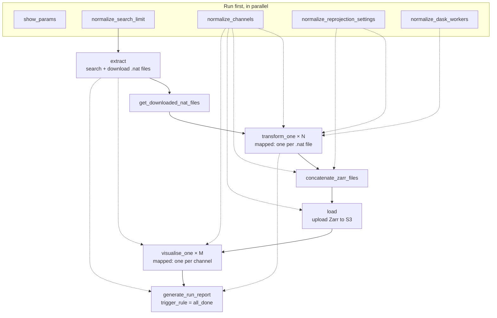
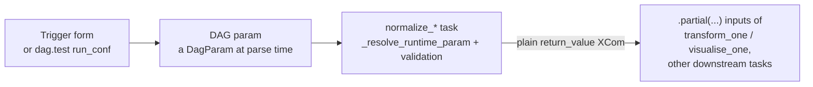
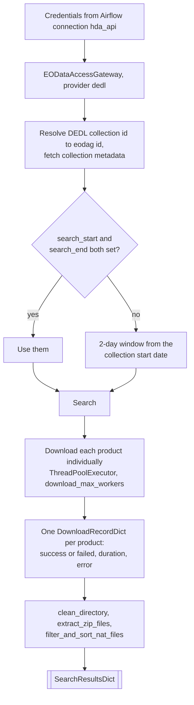
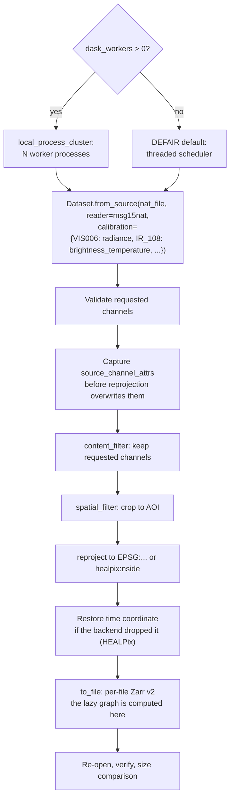
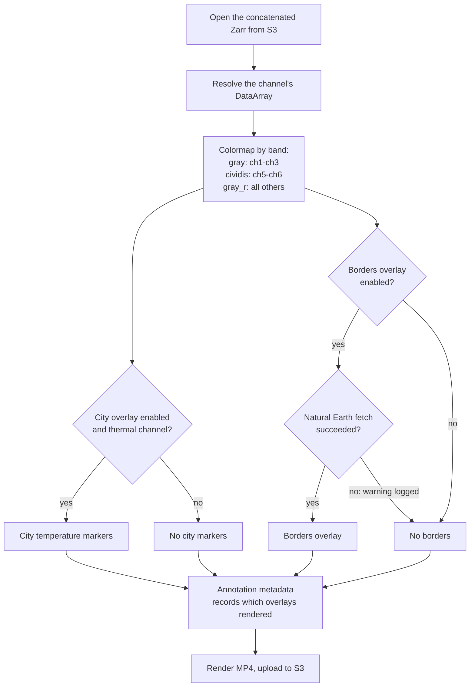
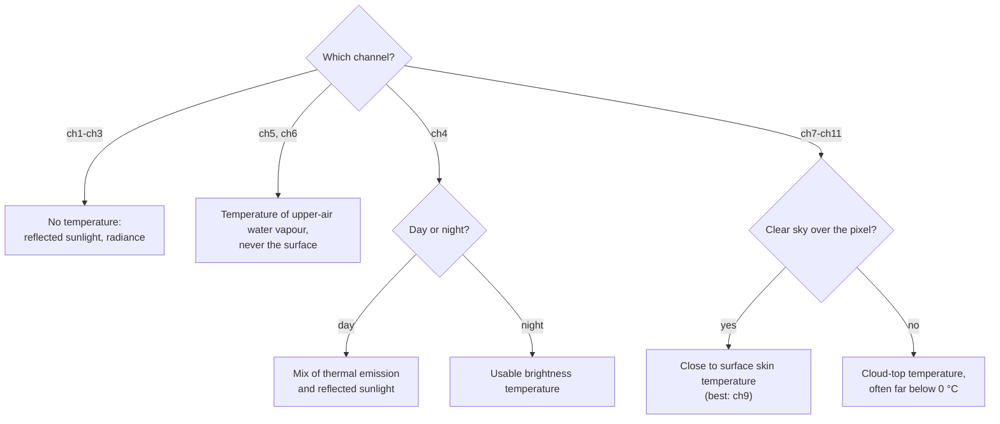
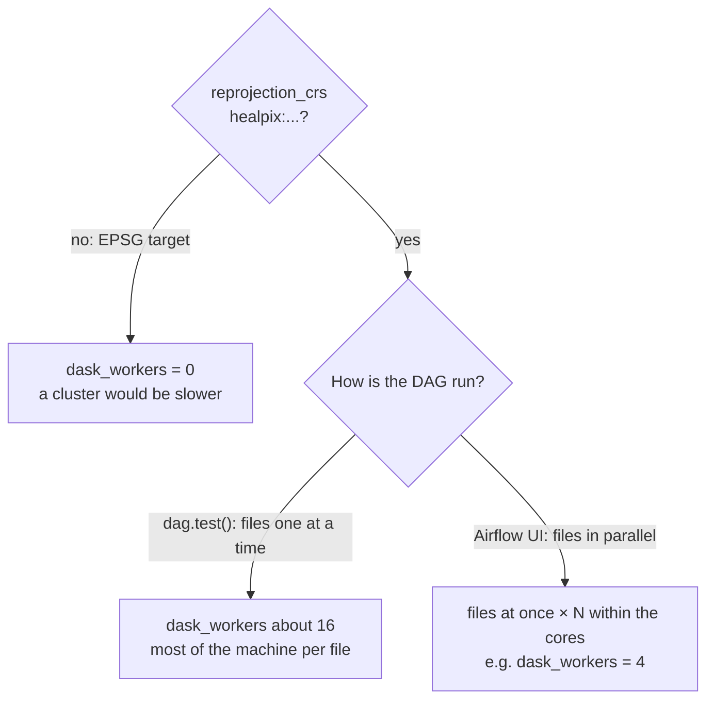
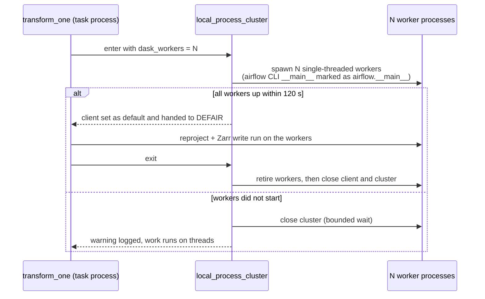
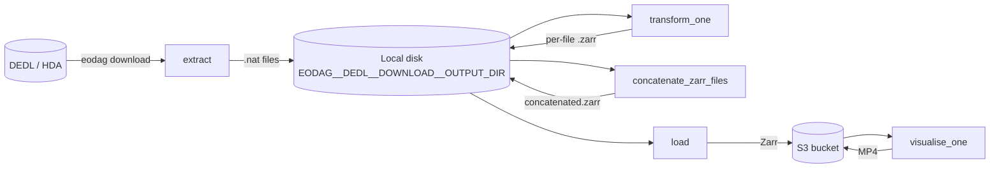
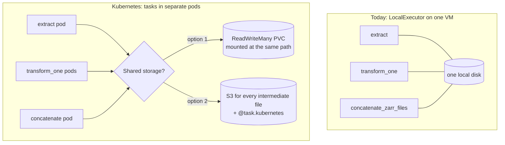

# Walkthrough: `tutorial_taskflow_api_demo2.py`

This is a task-by-task guide to `dags/dedl/demo2/tutorial_taskflow_api_demo2.py`, the
real Extract → Transform → Load → Visualise pipeline in this repo. It searches
and downloads MSG/SEVIRI products from the DestinE Data Lake (DEDL) via
`eodag`, converts them to Zarr via `defair`, uploads to S3, and renders an
annotated MP4 time-lapse per channel.

Alongside "what does this task do," every section flags whether that part of
the code is specific to running Airflow **standalone on a single VM** (this
project's setup) or would need to change to run on **Airflow on Kubernetes**.
Section 4 collects all of those callouts in one place, with pointers to the
concrete Kubernetes patterns already demonstrated in the sibling
`../airflow-kubernetes` and `../airflow-kubernetes-dags` projects.

## 1. Overview

Solid arrows are the main path. Dotted arrows are values a task also
receives (XComs), which Airflow turns into extra upstream dependencies.
`generate_run_report` also receives the normalized criteria. The
`normalize_*` tasks and `show_params` run first, in parallel with each other.

Two things look like unnecessary indirection until you know why they're
there:

- **`get_downloaded_nat_files`** (demo2.py:959-969) exists purely because
  dynamic task mapping (`.expand()`) only accepts a task's raw `return_value`
  XCom, not a subscript of a dict-returning task. It just re-exposes
  `search_results_dict["downloaded_nat_files"]` so `transform_one` can
  `.expand()` over it.
- **The `normalize_*` tasks** (demo2.py:613-675) pull validation/coercion that
  used to happen independently inside `extract`/`transform`/`load`/`visualise`
  (repeated work, repeated bugs) into a single upfront pass. Downstream tasks
  just consume the already-normalized value.

## 2. DAG-level configuration

### Params

Defined in the `@dag(params={...})` block (demo2.py:429-572):

| Param | Default | Purpose |
|---|---|---|
| `search_limit` | `5` | Max products to search/download from DEDL |
| `channels` | `["ch1".."ch9"]` | Channels to extract from each product |
| `search_start` / `search_end` | `None` | ISO 8601 search window; if either is empty, falls back to collection metadata (see `extract` below) |
| `dedl_collection_id` | `EO.EUM.DAT.MSG.HRSEVIRI` | DEDL collection to search |
| `download_max_workers` | `4` | Parallel download concurrency in `extract` |
| `dask_workers` | `0` | Dask worker processes per `transform_one` instance. `0` = DEFAIR's default threaded scheduler; set it for HEALPix targets (see [Speeding up HEALPix](#speeding-up-healpix-dask_workers)) |
| `verbose_tutorial_logging` | `True` | Extra demonstration output (collection listing, id-mapping examples) |
| `enable_city_temperature_overlay` | `True` | Overlay European capital-city markers with sampled brightness temperature on rendered frames (thermal channels only) |
| `enable_country_borders_overlay` | `True` | Draw European country border/coastline lines on rendered frames, sourced from Natural Earth via cartopy (fetched and cached on first use) |
| `reprojection_lat_min/max`, `reprojection_lon_min/max` | Europe bbox | Crop/reprojection AOI |
| `reprojection_crs` | `EPSG:4326` | Target CRS |
| `reprojection_resampling` | `bilinear` | Resampling method |
| `reprojection_resolution` / `_unit` | `0.05` / `degrees` | Target grid resolution |

### `default_args`

`retries=2`, `retry_delay=timedelta(minutes=2)` — covers transient
eodag/S3 network failures. `execution_timeout` is deliberately left unset
(demo2.py:439-445): run duration varies too widely with `search_limit` and
`channels` to pick one safe default across deployments.

### `max_active_runs=1`

Every run writes to the same local paths (`concatenated.zarr`,
`{channel}_timelapse.mp4` under `EODAG__DEDL__DOWNLOAD__OUTPUT_DIR`) and the
same channel-based S3 prefix (demo2.py:432-437), so two overlapping runs
would overwrite each other's outputs. Only one run is active at a time;
further triggers queue. To allow concurrent runs instead, put the `run_id`
into those paths.

### `DagParam` resolution

DAG params are typed as `DagParam` at DAG-definition time, not as concrete
values. `_resolve_runtime_param` (demo2.py:118-121) calls `.resolve()` against
`get_current_context()` so helpers like `_normalize_channel(s)` and
`_normalize_search_limit` can accept either a `DagParam` or a plain value and
always get the real runtime value back. Any new param that needs
validation/coercion should follow the same pattern: a `_normalize_*` helper
resolving via `_resolve_runtime_param`, wired up as its own upfront task.

## 3. Task-by-task walkthrough

### `normalize_search_limit` / `normalize_channels` / `normalize_reprojection_settings`
(demo2.py:613-675)

Validate/coerce `search_limit` (must be > 0), dedupe+validate `channels` (no
path separators, non-empty), and bundle the reprojection AOI/CRS/resampling
params into a single `ReprojectionSettingsDict`. Returned as plain
values/dicts (not closures) specifically so the *concrete* runtime values are
available to `transform_one`/`concatenate_zarr_files`, which run in a
different task's process than where the params were defined.

### `extract` (demo2.py:678-955)

1. Retrieves DEDL credentials from the Airflow connection `hda_api` via
   `BaseHook.get_connection`.
2. Initializes `EODataAccessGateway`, sets the `dedl` provider.
3. Resolves the DEDL collection id to eodag's normalized id
   (`find_eodag_collection_id_by_dedl_id`) and fetches collection metadata
   (`get_eodag_collection_info` → `get_collection_search_params`).
4. Builds the search window: uses `search_start`/`search_end` if the user
   supplied both, otherwise defaults to a short 2-day window from the
   collection's start date (not its full metadata extent — for an
   open-ended collection like HRSEVIRI the metadata end date is "today",
   which would make the default window span years).
5. Searches, then downloads each result **individually** via a
   `ThreadPoolExecutor` (`download_max_workers` workers) rather than
   `dag.download_all()` — `download_all()` swallows per-product errors and
   returns only a shorter list of successful paths with no per-product
   identity or timing; `dag.download()` raises per-product instead, which is
   caught and recorded in a `DownloadRecordDict` (status/duration/error).
6. Cleans up malformed filenames left by broken `Content-Disposition`
   headers (`clean_directory`), re-extracts anything that needed renaming
   (`extract_zip_files`), then collects and chronologically sorts the
   resulting `.nat` files (`filter_and_sort_nat_files`).

Returns a `SearchResultsDict`: file list, collection id, bbox, and
per-product download records/success/failure counts (consumed later by
`generate_run_report`).

> **VM vs Kubernetes:** downloads land under
> `EODAG__DEDL__DOWNLOAD__OUTPUT_DIR`, a local filesystem path
> (`_get_output_base_dir`, demo2.py:134-164). This is the first link in the
> shared-local-filesystem chain — see §4.

### `get_downloaded_nat_files` (demo2.py:959-969)

Bridge task — see §1. Just returns `search_results_dict["downloaded_nat_files"]`
as a raw return value so `transform_one.expand()` can consume it.

### `transform_one` (mapped, one instance per `.nat` file — demo2.py:972-1255)

The task itself only sets up Dask: it runs the per-file work
(`_transform_one_file`) inside `local_process_cluster(dask_workers)`, which
is a no-op at the default `dask_workers=0` (see
[Speeding up HEALPix](#speeding-up-healpix-dask_workers)).

Per file:

1. Loads the `.nat` file via `defair_data.core.Dataset.from_source` with
   the reader named explicitly (`reader="msg15nat"`), passing a per-channel calibration
   mapping (`_build_channel_calibration_map`). Its keys are DEFAIR's
   canonical SEVIRI channel names (`VIS006`, …, `IR_108`; see
   `_CHANNEL_NATIVE_NAMES` and `docs/defair.md` §9.1), which DEFAIR 0.4
   requires; the variables still come back as `ch1`…`ch11`.
2. Validates the requested `channels` all exist in the dataset.
3. Captures `source_channel_attrs` (`grid_mapping` per channel,
   `platform_name` dataset-wide) **from the original pre-reprojection
   dataset** — reprojection rebinds every channel's `grid_mapping` to
   `"spatial_ref"`, so the source value (`"geostationary"` for MSG/SEVIRI)
   is only readable before that happens.
4. Keeps only the requested channels via `content_filter` (first, so
   later steps never touch other variables; the read is already scoped to
   them, so this mainly records the selection in the CF history), crops to
   the AOI via `spatial_filter` (fast, no reprojection), then
   reprojects+resamples to the configured CRS/resolution via `.reproject()`.
5. Restores the `time` coordinate if the reprojection backend dropped it
   (`_restore_dropped_time_coordinate`, demo2.py:263-285). The HEALPix
   backend rebuilds its output coords from scratch and keeps only a bare
   `time` *dimension*, so xarray substitutes a virtual integer index
   (0, 1, 2, ...) in its place; left uncorrected, the visualisation banner
   later misreads that index as Unix-epoch seconds and every frame's
   timestamp renders as `01/01/1970`. The rioxarray/EPSG:4326 backend
   already preserves the real `time` coordinate, so this step is a no-op
   for it.
6. Writes a consolidated Zarr v2 file
   (`change_extension(nat_file, ".zarr")`), then re-opens it to verify
   variables/coordinates match and logs a storage-size comparison against
   the original `.nat`.

Every step before `to_file` only builds a lazy Dask graph. Reading,
calibrating, cropping and reprojecting all happen during the Zarr write,
which is why that log line ("Writing dataset to Zarr …") is where the time
goes, and why `dask_workers` affects that step.

Returns a `TransformOneResultDict` (zarr path, source `.nat` path, duration,
`source_channel_attrs`).

> **VM vs Kubernetes:** reads the `.nat` file `extract` wrote to local disk —
> same shared-filesystem dependency as above. Separately, note that
> `defair_data`, `xarray`, and `eodag` are imported **inside** the task body,
> not at module scope (demo2.py:1023-1029) — this keeps DAG parsing cheap on
> the scheduler regardless of executor, and on Kubernetes it's exactly the
> boundary along which you'd split this task into its own custom image (§4).

### `concatenate_zarr_files` (demo2.py:1257-1348)

Opens every per-file Zarr with `xr.open_zarr` and concatenates along `time`
with `xr.concat`, then sorts by `time`. `extract` already sorts `.nat`
files chronologically by filename and dynamic task mapping preserves that
order, but the sort guarantees a monotonic time axis without relying on
filenames. Takes
`source_channel_attrs` from the first transform result, assuming (like
`reprojection_crs`/etc.) it's constant across all files in one run. Writes
the combined Zarr to `{base_dir}/concatenated.zarr`.

Returns a `TransformResultsDict` (concatenated path, channel list,
reprojection metadata, `source_channel_attrs`).

### `load` (demo2.py:1353-1416)

Uploads the concatenated Zarr directory to S3 via
`dedl.demo2.s3.s3_helper.upload_directory_to_s3`, under prefix
`my_{channels_slug}_zarr_data`. Requires `S3_ENDPOINT_URL`,
`MY_S3_BUCKET_NAME`, `MY_S3_ACCESS_KEY_ID`, `MY_S3_SECRET_ACCESS_KEY` (read
via `_require_env`, demo2.py:124-131 — raises a clear error if any is unset).
Forwards reprojection metadata and `source_channel_attrs` downstream to
`visualise_one`.

> **VM vs Kubernetes:** credentials come from plain environment variables,
> sourced from `.env` on this VM. See §4 for the Kubernetes-native
> alternative (Secret injection) already demonstrated in this repo.

### `visualise_one` (mapped, one instance per channel — demo2.py:1421-1570)

Each mapped instance is fully self-contained:

1. Opens the S3-backed Zarr dataset directly (`open_s3_zarr_dataset`, via
   `s3fs` + `xr.open_zarr`) — **not** from local disk, so this task is
   already decoupled from the shared-filesystem assumption elsewhere in the
   pipeline.
2. Resolves the channel's `DataArray` (`resolve_data_variable`).
3. Picks a colormap by channel band type (`_colormap_for_channel`,
   demo2.py:183-197): `gray` for visible channels (ch1-ch3), `cividis` for
   water-vapour (ch5/ch6), `gray_r` (reversed greyscale, so cold/high cloud
   tops render bright) for everything else.
4. Resolves the two optional overlays, gated independently of each other:
   - **City temperature markers** — only when `enable_city_temperature_overlay`
     is true **and** the channel is thermal (`_is_thermal_channel`; VIS/NIR
     channels ch1-ch3 never get city markers regardless of the flag). Uses
     the static `EUROPEAN_CAPITALS` list from
     `dedl/visualization/capital_cities.py`.
   - **Country borders/coastlines** — only when `enable_country_borders_overlay`
     is true, via `load_country_border_lines()`
     (`dedl/visualization/country_borders.py`, Natural Earth data fetched
     through cartopy). Wrapped in a try/except: a fetch failure (no network,
     first-run cache miss, etc.) is logged as a warning and the render falls
     back silently to no borders overlay rather than failing the task.
5. Builds the annotation overlay metadata
   (`_build_visualization_annotation_metadata`, demo2.py:355-425) —
   combines `extract`'s collection id/bbox with `load`'s reprojection
   metadata, preferring `source_channel_attrs` for `grid_mapping`/
   `platform_name` since reprojection overwrote the live attrs, and records
   whether each overlay actually rendered this run (`city_overlay_active`,
   `country_borders_active`) so the annotation banner can flag them — see
   §4's "On-screen data provenance".
6. Renders an MP4 (4 FPS, up to 120 frames) via
   `create_mp4_from_dataarray`, and uploads it to
   `visualization/{channel}/{channel}_timelapse.mp4`.

Returns a `VisualiseOneResultDict` (channel, video path, frame count, fps,
S3 URI, duration).

### `generate_run_report` (`dedl/demo2/tasks/reporting.py`)

Runs with `trigger_rule="all_done"` so it still reports download/transform
outcomes even if `load`/`visualise` fail downstream of a healthy
`extract`/`transform`. Delegates to `build_run_report`, a pure
dict-in/dict-out function with no Airflow/eodag/S3 imports — deliberately
kept that way so it's unit-testable with plain fixtures
(`tests/dedl/demo2/tasks/...`). Aggregates the run's criteria, download
success/failure counts and records, per-file transform durations, and
per-channel visualisation durations/S3 URIs.

### `main_flow` (demo2.py:1574-1651)

Wires everything above together: normalize → `extract` →
`get_downloaded_nat_files` → `transform_one.partial(...).expand(...)` →
`concatenate_zarr_files` → `load` →
`visualise_one.partial(...).expand(...)` → `generate_run_report`. The two
`.partial().expand()` calls are what create the per-file and per-channel
dynamic task mapping fan-out.

## 4. Interpreting channel "temperatures"

Not every channel's pixel values mean "temperature," and even where they do,
it isn't the temperature you'd read off a thermometer at ground level. This
matters directly for the per-city °C labels `visualise_one` overlays on the
MP4s (`_overlay_city_temperatures`, `visualization_helper.py:331-360`) and for
choosing a `search_start`/`search_end` window where the signal you actually
want is visible.

### On-screen data provenance

The distinctions below aren't only documented in this file — every rendered
frame's annotation banner (`_build_annotation_lines`,
`visualization_helper.py:82-107`) now states them directly, so a viewer of
the MP4 alone (without this doc) still gets the key caveats:

- `source: EUMETSAT via DestinE Data Lake (DEDL)` — always present, on every
  frame.
- `city markers: satellite brightness temp, not ground station data` —
  present only when the city-temperature overlay actually rendered this run
  (`enable_city_temperature_overlay=True` **and** the channel is thermal;
  see `city_overlay_active` in `_build_visualization_annotation_metadata`,
  demo2.py:355-425).
- `borders: Natural Earth (public domain)` — present only when the
  country-borders overlay actually rendered this run (Natural Earth fetch
  succeeded and `enable_country_borders_overlay=True`; see
  `country_borders_active` in the same function).

### Which channels have a temperature at all

`_build_channel_calibration_map` (demo2.py:235-260) requests
`brightness_temperature` calibration (float32 Kelvin) for every channel
except `ch1`-`ch3`, and `radiance` for those three — `_is_thermal_channel`
(demo2.py:224-232) encodes the same split, and it's what gates the
city-temperature overlay in `visualise_one` (demo2.py:1520-1522: only passed
`EUROPEAN_CAPITALS` when `_is_thermal_channel(channel_name)` is true).

| Channels | Band | Calibration | Has a °C reading? |
|---|---|---|---|
| `ch1`, `ch2`, `ch3` | VIS0.6, VIS0.8, NIR1.6 (reflectance) | `radiance` | No — brightness temperature is undefined for visible/near-IR bands. Pixel value is reflected sunlight, not emitted heat. |
| `ch4` | IR3.9 | `brightness_temperature` | Yes, but see the day/night caveat below. |
| `ch5`, `ch6` | WV6.2, WV7.3 (water vapour) | `brightness_temperature` | Yes, but it's an atmospheric-layer temperature, not a surface one — see below. |
| `ch7`-`ch11` | IR8.7, IR9.7, IR10.8, IR12.0, IR13.4 (IR window) | `brightness_temperature` | Yes, and (clear-sky, `ch9`) the closest of any channel here to actual surface skin temperature. |

`_colormap_for_channel` (demo2.py:183-197) reflects this same three-way
split: `ch1`-`ch3` render as plain `gray` (classic monochrome VIS imagery,
nothing thermal implied), `ch5`/`ch6` use `cividis`, and everything else uses
reversed greyscale (`gray_r`) so cold pixels render bright — the standard IR
enhancement convention where high/cold cloud tops stand out.

### Brightness temperature is not surface temperature

Every Kelvin value produced here is a *brightness temperature*: the
temperature a perfect blackbody would need to radiate the energy the sensor
actually measured at that wavelength, from whatever was in the sensor's line
of sight for that pixel — assuming no atmosphere/cloud interference. It is
only a good proxy for physical surface temperature when the line of sight is
genuinely clear:

- **Clear sky:** in the `ch9` (IR10.8) atmospheric window, the atmosphere is
  mostly transparent, so brightness temperature tracks land/sea-surface skin
  temperature reasonably well. This is the channel/city-overlay combination
  closest to "the temperature in that city right now."
- **Cloud cover:** any cloud between the surface and the satellite is opaque
  at these wavelengths, so the sensor sees the *cloud top*, not the ground.
  A city's overlay label under cloud will read as a cold cloud-top
  temperature (often well below 0°C) even on a warm day at street level —
  that's expected, not a bug in `_sample_city_temperatures_celsius`
  (`visualization_helper.py:311-330`), which samples whatever raw Kelvin
  value is at that pixel with no cloud-masking.
- **Water vapour channels (`ch5`/`ch6`):** these peak in absorption bands
  where the surface is *never* visible — the brightness temperature is
  always that of mid/upper-tropospheric water vapour (and cloud tops when
  present), typically far colder than anything at ground level. Read the
  city labels on these channels as "temperature of the air mass overhead,"
  not "temperature in that city."
- **`ch4` (IR3.9):** shares its band with reflected sunlight during the day,
  so daytime brightness temperature is a mix of thermal emission and solar
  reflectance, not a clean thermal signal — it reads most reliably as
  temperature at night.

In short: only `ch7`-`ch11` under clear sky (and `ch9` especially) approach
"the temperature you'd expect for that place," `ch4` is day/night-dependent,
`ch5`/`ch6` are describing the atmosphere rather than the ground, and
`ch1`-`ch3` never had a temperature to begin with.

### Speeding up HEALPix: `dask_workers`

With `reprojection_crs: "healpix:<nside>"`, `transform_one` is CPU-bound
Python that holds the GIL, so DEFAIR's default threaded Dask scheduler uses
about one core. HEALPix output also always covers the whole globe
(12 × nside² cells), however small the crop (`docs/defair.md` §12.5,
§18). Setting `dask_workers` to N > 0 runs each `transform_one` instance on
a local cluster of N single-threaded worker processes
(`dedl.demo2.dask_helpers.dask_helper.local_process_cluster`, following
`docs/defair.md` §16.2).

Measured per file (`ch9`, `healpix:1024`, nearest, 32-core VM):

| `dask_workers` | `transform_one` |
|---|---|
| `0` (threads) | 121 s |
| `4` | 44 s |
| `8` | 30 s |
| `16` | 23 s |

Leave it at `0` for EPSG targets: the regular-grid path is already fast
(EPSG:4326, all 9 channels: 7 s per file) and a cluster makes it slower
(19 s with 8 workers), because starting workers and shipping data between
processes costs more than it saves.

- **`dag.test()` from VS Code / the command line:** mapped instances run one
  after another, so give each one most of the machine. The HEALPix
  `dag.test()` example at the bottom of the DAG file uses `"dask_workers": 16`.
- **Triggered from the Airflow UI:** `transform_one` instances for different
  files already run in parallel (up to Airflow's `max_active_tasks_per_dag`,
  16 by default), each using about one core on threads. Pick N so that
  (files running at once) × N stays within the VM's cores, e.g. `4` for a
  handful of files on 32 cores. Measured: 3 files in parallel with
  `dask_workers=4` took ~43 s each instead of ~121 s.

Two Airflow-specific details are handled in the helper. Dask starts workers
with multiprocessing `spawn`, whose children re-run the parent's `__main__`.
Inside an Airflow task that is the `airflow` CLI, which then fails to start
(Airflow gives task processes an unusable database URL on purpose) and Dask
would restart it forever. The helper therefore describes that `__main__` as
the `airflow.__main__` module while the cluster runs, which multiprocessing
does not re-run. (`fork` avoids this too, but was seen to deadlock worker
start-up when run from the DAG file, so it is not used.) And if workers
still don't start within 120 s, the helper logs a warning and falls back to
threads instead of hanging the task.

## 5. Running on a VM vs. Kubernetes

This project runs Airflow standalone with `LocalExecutor` on a single VM —
every task is a process on that same machine, sharing its filesystem, its
`.env`-sourced environment, and its Airflow metadata DB connection. The
sibling `../airflow-kubernetes` (deploying Airflow on Kubernetes via Helm)
and `../airflow-kubernetes-dags` (DAG patterns for that deployment) projects
in this repo already demonstrate the alternatives below with runnable
examples — nothing here needs to be invented from scratch.

Everything left of `load` hands data over through the local disk; `load` and
`visualise_one` already use S3.

**Shared local filesystem between tasks.** This is the big one, and it's
already called out directly in `_get_output_base_dir`'s docstring
(demo2.py:134-164): `extract`, `transform_one`, and `concatenate_zarr_files`
all read/write `EODAG__DEDL__DOWNLOAD__OUTPUT_DIR` as if it were shared,
writable storage across every task instance of the run. That's true today
under `LocalExecutor` on this VM. It stops being true under
`CeleryExecutor`/`KubernetesExecutor`, where tasks can land on different
workers/pods, unless either:
- every worker/pod mounts the **same ReadWriteMany PVC** at that path — see
  `airflow-kubernetes/helm/pvc-role.yml` for the RBAC scaffolding that lets
  Airflow create PVCs dynamically, or
- every intermediate artifact is routed through **S3** instead, and the
  heavy tasks (`transform_one` in particular) run via `@task.kubernetes` —
  see `airflow-kubernetes-dags/README.md`'s "KubernetesPodOperator" and
  "Execution Isolation" sections, and the runnable examples
  `tutorial_taskflow_api_test7_kpo_hello_world_custom_image_s3.py` /
  `test8_..._all_env.py`. Note `load` and `visualise_one` in demo2 are
  *already* S3-native (`dedl.demo2.s3.s3_helper`, `open_s3_zarr_dataset`), so this
  second option is really "extend the same pattern earlier in the
  pipeline," not a new approach.

**Credentials.** `extract` calls `BaseHook.get_connection("hda_api")`, and
`load`/`visualise_one` read plain `os.environ` S3 vars. Both work today
because the LocalExecutor task shares this VM's process, DB access, and
`.env`-sourced environment. On Kubernetes, the pattern already demonstrated
in this repo is Kubernetes `Secret` objects, injected either per-key via
`airflow.providers.cncf.kubernetes.secret.Secret`
(`tutorial_taskflow_api_test7_..._s3.py`) or in bulk via `env_from`
(`tutorial_taskflow_api_test8_..._all_env.py`), created with this repo's
`script-create-secret*.sh` helpers — not by relying on a pod inheriting the
scheduler's `.env`.

**Heavy/optional imports deferred into task bodies.** `eodag`,
`defair_data`, `xarray`, and the S3/boto3 helpers are imported inside task
functions, not at module scope, throughout demo2 — good practice regardless
of executor, since it keeps DAG parsing (which happens repeatedly,
including on the scheduler) cheap. On Kubernetes this same boundary is
where you'd cut a task out into its **own custom image** built just for it
(`airflow-kubernetes-dags/Dockerfile`, "Docker Image for
KubernetesPodOperator") rather than installing every DAG's dependencies
into the shared Airflow worker image.

**Dynamic task mapping (`transform_one.expand()`, `visualise_one.expand()`).**
Under `LocalExecutor` these mapped instances are extra local processes on
one VM. Under `KubernetesExecutor`/`@task.kubernetes`, each mapped instance
becomes its **own pod** — so `search_limit` and `channels` directly
determine how many pods a single DAG run spins up. The sibling README's
"Shared Cluster Best Practices" apply directly here: set
`container_resources` requests/limits per pod (as in `test7`/`test8`), use
pools for heavy workloads, and enable `is_delete_operator_pod=True` so
finished task pods don't linger.

**Retries and idempotency.** `retries=2` is safe on this VM because partial
local state from a failed attempt (a half-downloaded file, a partially
written Zarr directory) persists in the same directory across the retry. On
Kubernetes, a retried `@task.kubernetes`/`KubernetesPodOperator` task gets a
**fresh pod** with no local state — so retry-safety there depends entirely
on the shared-storage or S3-routing choice above, not on the retry count
itself.

**Local dry-run (`dag.test()`, demo2.py:1659-1701).** The active example
demos the HEALPix reprojection path (`reprojection_crs: "healpix:1024"`,
`reprojection_resampling: "nearest"` — see the inline comments there for why
HEALPix requires nearest-neighbour resampling) on `ch9` only, with
`"dask_workers": 16` because `dag.test()` runs the mapped `transform_one`
instances one after another (see
[Speeding up HEALPix](#speeding-up-healpix-dask_workers)). Bypasses the
scheduler/executor entirely and always runs in-process, regardless of
target deployment — useful for iterating on task logic quickly. Passing
here says nothing about whether the shared-filesystem or
credential-injection assumptions above hold under a real
`CeleryExecutor`/`KubernetesExecutor` deployment; it exercises none of them.

**If you're moving this DAG toward `airflow-kubernetes-dags`:** that
project's README lays out a learning order from plain `@task` through
`@task.virtualenv`, `KubernetesPodOperator`, and `@task.kubernetes` with
Secrets/ConfigMaps/custom images/S3 (`test1` → `test8`) — follow that
progression rather than converting every task at once.
`dedl.demo2.s3.s3_helper` and `dedl.demo2.visualization.visualization_helper` can be
reused as-is in that migration since they're already S3-native and
executor-agnostic; `dedl.demo2.eodag_helpers.eodag_helper` and the local-path assumptions
in `extract`/`transform_one`/`concatenate_zarr_files` are the parts that
need the shared-storage-or-S3 decision above.
