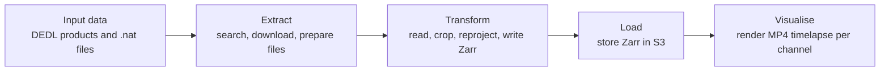

# Demo2 Workflow Overview

This document gives a simplified view of the Demo 2 pipeline in this Airflow project. The goal is to show how satellite input data moves from raw products to a transformed dataset and then becomes animated visual outputs.

## High-level flow

## 1. Input data

The workflow begins by searching the DestinE Data Lake for MSG/SEVIRI products. These products are downloaded and unpacked into local files, typically in the form of `.nat` datasets. At this stage the data is still raw satellite product data and needs to be prepared for analysis.

Key ideas:
- data is discovered from a DEDL collection,
- matching products are downloaded,
- the files are organised and sorted for downstream processing.

## 2. Transformation

Once the input files are available, the transformation stage turns them into a consistent, analysis-ready dataset.

### What happens here
- the raw `.nat` files are read,
- the requested channels are selected,
- the data is cropped to the region of interest,
- it is reprojected onto a regular grid,
- the result is written in Zarr format,
- and multiple files are combined into one dataset over time.

### Why this matters
This step makes the data easier to work with and prepares it for storage and visualisation. The transformed dataset is structured, ordered by time, and ready for downstream use.

## 3. Visualisation

The transformed Zarr dataset is read back and used to build animated MP4 videos. Each selected channel can be rendered as a timelapse, and optional overlays can be added to enrich the visual output.

### Visualisation includes
- per-channel rendering,
- colour mapping based on channel type,
- optional overlays such as city-temperature markers and country borders,
- upload of the resulting video files.

## 4. What the pipeline produces

At the end of the workflow, the system produces:
- a transformed Zarr dataset,
- cloud-stored data for later reuse,
- channel-based MP4 timelapse videos,
- and a run report summarising the outcome.

## In one sentence

Demo 2 takes satellite observations from the Data Lake, converts them into structured analysis-ready data, and turns that data into animated visual products for interpretation.
