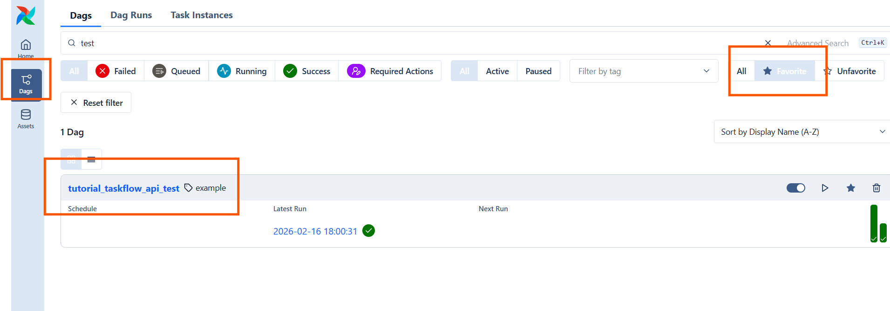
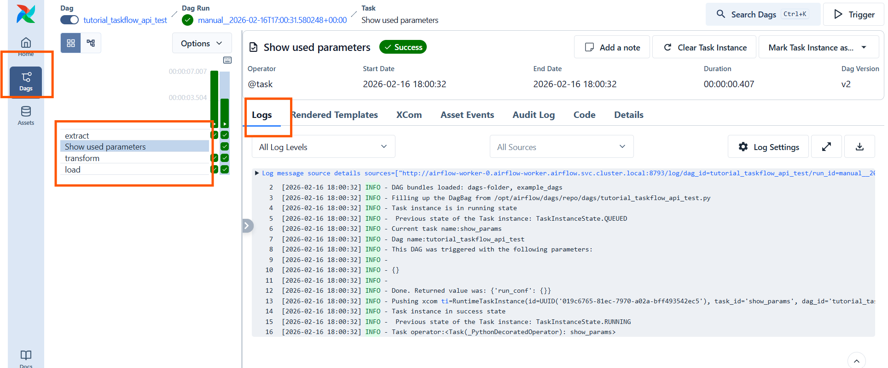

# Airflow Kubernetes DAGs

- This project is a demonstrator for creating DAGs for Apache Airflow 3 in the context of Kubernetes deployments. It can be mounted with the git-sync sidecar to an Airflow deployment on Kubernetes, so DAGs created in this repository are automatically mounted to Airflow on Kubernetes.

## Table of Contents

- [Prerequisites](#prerequisites)
- [Running Airflow DAGs locally](#running-airflow-dags-locally)
  - [Local Airflow Setup](#local-airflow-setup)
  - [Airflow Standalone](#airflow-standalone)
  - [Testing Airflow DAGs Locally](#testing-airflow-dags-locally)
  - [Debugging Airflow DAGs Locally](#debugging-airflow-dags-locally)
- [Running Airflow DAGs on Kubernetes](#running-airflow-dags-on-kubernetes)
  - [Taskflow API](#taskflow-api)
  - [KubernetesPodOperator](#kubernetespodoperator)
    - [Docker Image for KubernetesPodOperator](#docker-image-for-kubernetespodoperator)
    - [Pushing Custom Airflow Image to Harbor Registry](#pushing-custom-airflow-image-to-harbor-registry)
- [Execution Isolation](#execution-isolation)
- [Example Code](#example-code)
- [Airflow on Kubernetes – Shared Cluster Best Practices](#airflow-on-kubernetes--shared-cluster-best-practices)
  - [Guiding Principles](#guiding-principles)
  - [1. Use Pods for Real Work](#1-use-pods-for-real-work)
  - [2. Always Set Resource Requests & Limits](#2-always-set-resource-requests--limits)
  - [3. Use Pools for Heavy Workloads](#3-use-pools-for-heavy-workloads)
  - [4. Keep the Scheduler & Workers Lightweight](#4-keep-the-scheduler--workers-lightweight)
  - [5. Limit Concurrency & Backfills](#5-limit-concurrency--backfills)
  - [6. Scope Secrets & Permissions](#6-scope-secrets--permissions)
  - [7. Clean Up Task Pods](#7-clean-up-task-pods)
  - [8. Test Outside the Shared Cluster](#8-test-outside-the-shared-cluster)
  - [9. Label All Pods](#9-label-all-pods)
- [Anti-Patterns](#anti-patterns)
- [Recommended Architecture](#recommended-architecture)


## Prerequisites

- Apache Airflow 3.x target runtime (examples in this README use Airflow 3.1.7)
- Airflow on Kubernetes (see airflow-kubernetes for a walkthrough of deploying Airflow on Kubernetes using Helm)
- GitHub repository (for mounting DAGs to Airflow on Kubernetes using git-sync sidecar)
- Git (for version control and pushing DAGs to GitHub repository)
- Python 3.12 (for local development and testing of Airflow DAGs)
- Docker for building images for Airflow's KubernetesPodOperator (optional, for running tasks in isolated pods on Kubernetes)

## Running Airflow DAGs locally

### Local Airflow Setup

- In the same way that we saw in the section airflow-getting-started we will setup a local Airflow environment for developing and testing our DAGs before deploying them to Airflow on Kubernetes. This is optional but can be useful for faster development iterations.

```bash

# Create a virtual environment for Airflow development
uv venv .venv --python 3.12

# Activate the virtual environment
source .venv/bin/activate

# Install Airflow with the appropriate constraints for your Python version
AIRFLOW_VERSION=3.1.7

# Here we extract the version of Python you have installed.
PYTHON_VERSION="$(python -c 'import sys; print(f"{sys.version_info.major}.{sys.version_info.minor}")')"

# Here we construct a constraint URL based on the airflow version and python version
CONSTRAINT_URL="https://raw.githubusercontent.com/apache/airflow/constraints-${AIRFLOW_VERSION}/constraints-${PYTHON_VERSION}.txt"

# For example this would install 3.1.3 with python 3.12: https://raw.githubusercontent.com/apache/airflow/constraints-3.1.3/constraints-3.12.txt

# Install Airflow using pip with the specified version and constraints
uv pip install "apache-airflow==${AIRFLOW_VERSION}" --constraint "${CONSTRAINT_URL}"

# For KubernetesPodOperator we also need to install the Kubernetes provider package with the appropriate constraints
uv pip install "apache-airflow-providers-cncf-kubernetes" --constraint "${CONSTRAINT_URL}"


```

### Airflow Standalone

- Now we can run Airflow locally to test our DAGs before deploying them to Airflow on Kubernetes. This is optional but can be useful for faster development iterations.

- Execute **airflow standalone** to run airflow on the vm (This is suitable for development and installs automatically a number of example DAGs)
- You will notice that when airflow starts up you get a randomised password for the admin user
  - This can also be found in the airflow home folder in the file ./simple_auth_manager_passwords.json.generated and can be changed later if needed. (note: for production use a proper authentication mechanism should be used)

```bash

# Start  Airflow Standalone
airflow standalone

....

standalone | Starting Airflow Standalone
Simple auth manager | Password for user 'admin': XXXYYYZZZ
standalone | Checking database is initialized

....

# To stop Airflow, simply press Ctrl+C in the terminal where it is running.

```

- To synchronise the DAGs in the project with the local Airflow instance, you can create a symbolic link from the project's DAGs directory to the Airflow home directory's DAGs folder. This way, any changes you make to the DAGs in the project will be reflected in the local Airflow instance.

```bash

# execute the script 'script-symlink-dags.sh' to create a symbolic link from the project's DAGs directory to the Airflow home directory's DAGs folder
./script-symlink-dags.sh

```

### Testing Airflow DAGs Locally

- With Airflow running locally, you can test your DAGs by triggering them manually from the Airflow web UI or by using the Airflow CLI. This allows you to verify that your DAGs are working as expected before deploying them to Airflow on Kubernetes.

### Debugging Airflow DAGs Locally

- With Airflow stopped locally you can run a DAG in debug mode in for example VSCode. Open for example the file `dags/tutorial_taskflow_api_test1.py` and set a breakpoint in one of the functions. Then run the test in debug mode. This allows you to step through the code and inspect variables to help with debugging your DAGs.

- Notice at the end of the file we assign the DAG to a variable called dag_instance. This is important for testing and debugging the DAG locally, as we can then call the test method on this instance to run the DAG in debug mode.


```python
# tutorial_taskflow_api_test1.py
...

# [START dag_invocation]
dag_instance = tutorial_taskflow_api_test1()
# [END dag_invocation]

# [END tutorial]
if __name__ == "__main__":

    from dotenv import load_dotenv
    import os

    # Load the .env file used for tests
    load_dotenv()

    toto = os.getenv("TOTO", "No TOTO value found in .env file")

    # get dag_id for test run conf
    dag_id = dag_instance.dag_id

    # This simulates a DAG run for testing purposes, passing in the conf parameters as if they were passed in from the Airflow UI or CLI when triggering a DAG run.
    # This allows you to test how your DAG would behave with different parameters without having to actually trigger runs from the Airflow UI or CLI.
    dag_instance.test(
        run_conf={
            "toto": toto,
        }
    )


```

## Running Airflow DAGs on Kubernetes

- Once you have tested your DAGs locally and are satisfied with their functionality, you can deploy them to Airflow on Kubernetes. Since the project is mounted to Airflow on Kubernetes using the git-sync sidecar, you can simply push your changes to the GitHub repository and they will be automatically reflected in Airflow on Kubernetes.




### Taskflow API

- Using the Taskflow API allows you to write Airflow DAGs in a more Pythonic way by defining tasks as Python functions and using decorators to specify task dependencies. This can make your DAGs easier to read and maintain.

  - [tutorial_taskflow_api](https://airflow.apache.org/docs/apache-airflow/stable/tutorial_taskflow_api.html)

- A Task is executed on kubernetes by default using the worker pods, but you can also specify a custom KubernetesPodOperator to run a task in an isolated pod with specific dependencies. This allows you to have more control over the execution environment of your tasks while still benefiting from the simplicity of the Taskflow API.

- Notice that helper functions can be called from the DAGs, see for example the function 'show_params' in the file `dags/tutorial_taskflow_api_test1.py` which is called in the DAG `tutorial_taskflow_api_test1`. This allows you to keep your DAGs clean and modular by moving helper functions to separate files and importing them into your DAGs as needed.

  - Here we see that our utility function has been called.



### KubernetesPodOperator

- KubernetesPodOperator allows you to run tasks in isolated pods on Kubernetes, which can be useful for running data processing tasks with specific dependencies. In this section, we will create a custom Docker image that can be used in the KubernetesPodOperator.

#### Docker Image for KubernetesPodOperator

**Dockerfile example:**

- This image demonstrates how to create a custom Python image for use with Airflow's KubernetesPodOperator. 

```dockerfile

# Use the official Python image as the base
FROM python:3.12

# Set environment variables to prevent Python from writing .pyc files
# and to ensure stdout/stderr are unbuffered
ENV PYTHONDONTWRITEBYTECODE=1 \
  PYTHONUNBUFFERED=1

# Install dependencies
COPY requirements.txt /tmp/
RUN pip install --no-cache-dir -r /tmp/requirements.txt && \
  rm /tmp/requirements.txt

# Create necessary directories with proper permissions
RUN mkdir -p /airflow/xcom /mymodules

# Copy supporting code (setup.py)
COPY dags/dedl /mymodules/dedl
COPY resources/docker/setup.py /mymodules/setup.py

# Install modules
RUN pip install --no-cache-dir /mymodules

# Prepare XCom output file
RUN touch /airflow/xcom/return.json && chmod 666 /airflow/xcom/return.json

# Set working directory
WORKDIR /app

```

- To build the image, run the following command in the terminal from the directory containing the Dockerfile:

```bash

# Build the kubernetes pod operator kpo example. e.g. image name = destine_datalakelab_kpo_example
docker build -f Dockerfile -t YOUR_IMAGE_NAME:latest .

```

### Pushing Custom Airflow Image to Harbor Registry

```bash

# Logout of registry if you are currently logged in with different credentials or want to switch accounts
docker logout registry.central.data.destination-earth.eu

# You can connect to your registry using your Robot Account credentials as follows:
docker login registry.central.data.destination-earth.eu

# Example: Tag the image with the registry path and push it to Harbor
docker tag YOUR_IMAGE_NAME:latest registry.central.data.destination-earth.eu/[YOUR_HARBOR_PROJECT]/[YOUR_IMAGE_NAME]:latest

# Push the tagged image to the registry
docker push registry.central.data.destination-earth.eu/[YOUR_HARBOR_PROJECT]/[YOUR_IMAGE_NAME]:latest


```

## Execution Isolation

Airflow tasks can be executed with different levels of isolation depending on the operator used. 

- The Taskflow API with the @task decorator runs tasks on Airflow worker pods without isolation, which is suitable for light orchestration and small tasks. 

- The @task.virtualenv decorator provides some isolation by creating a virtual environment for the task, but it still runs on the same underlying worker pod. 

- For heavy workloads with specific dependencies and resource requirements, the KubernetesPodOperator can be used to run tasks in isolated Kubernetes pods.=
  - For a more pythonic way to run tasks in Kubernetes pods while still using the Taskflow API, you can use the @task.kubernetes decorator, which allows you to define tasks that run in Kubernetes pods with specific configurations while maintaining the simplicity of the Taskflow API. (preferred for new code)

Here's a summary of the execution isolation levels for different Airflow operators:

```bash
# runs on Airflow worker pods, not isolated, suitable for light orchestration and small tasks
- @task (PythonOperator under the hood) 
   ↓
# runs on Airflow worker pods, provides some isolation by creating a virtual environment, but still shares the same underlying pod    
- @task.virtualenv (VirtualenvOperator) and resources
   ↓
# runs in an isolated Kubernetes pod, suitable for heavy workloads with specific dependencies and resource requirements   
- KubernetesPodOperator (custom image with dependencies, resource limits, and scoped secrets)
- @task.kubernetes (TaskFlow API style for Kubernetes pods, preferred for new code)

```

## Example Code

- The following gives a high level overview of the example code included in this project. You can find the actual code in the `dags/` folder.
- This can be executed locally with the local Airflow setup or on Airflow on Kubernetes. 
  - In particular the examples show use of the Taskflow API and the KubernetesPodOperator.
  - Note: For local tests to work with your Kubernetes Cluster, make sure you have the appropriate kubeconfig set up and that your local environment can communicate with the Kubernetes cluster where Airflow is running. This can be useful before pushing your code to your GitHub repository and having it automatically deployed to Airflow on Kubernetes, as it allows you to test your DAGs locally first.

### Installing Kubernetes Provider for Local Airflow Testing

```bash
# Note: For KubernetesPodOperator we also need to install the Kubernetes provider package with the appropriate constraints
# Execute this locally with the local .venv activated

AIRFLOW_VERSION=3.1.7
PYTHON_VERSION="$(python -c 'import sys; print(f"{sys.version_info.major}.{sys.version_info.minor}")')"
CONSTRAINT_URL="https://raw.githubusercontent.com/apache/airflow/constraints-${AIRFLOW_VERSION}/constraints-${PYTHON_VERSION}.txt"

uv pip install "apache-airflow-providers-cncf-kubernetes" --constraint "${CONSTRAINT_URL}"

```

- The example DAGs are designed as a learning progression from basic TaskFlow usage to Kubernetes pod execution with secrets, ConfigMaps, custom images, and S3 access.

### Recommended Learning Order

1. `tutorial_taskflow_api_test1.py`
2. `tutorial_taskflow_api_test2_virtualenv_op.py`
3. `tutorial_taskflow_api_test3_kpo_hello_world.py`
4. `tutorial_taskflow_api_test4_kpo_hello_world_python_scecret.py`
5. `tutorial_taskflow_api_test5a_kpo_hello_world_python_config_map.py`
6. `tutorial_taskflow_api_test5b_kpo_hello_world_python_config_map.py`
7. `tutorial_taskflow_api_test6_kpo_hello_world_custom_image.py`
8. `tutorial_taskflow_api_test7_kpo_hello_world_custom_image_s3.py`
9. `tutorial_taskflow_api_test8_kpo_hello_world_custom_image_all_env.py`

### DAG-by-DAG Guide

- `tutorial_taskflow_api_test1.py` — **TaskFlow fundamentals**
  - Shows a simple ETL flow with `@task` functions (`extract`, `transform`, `load`).
  - Demonstrates importing and reusing shared task code (`show_params`) from project modules.
  - Useful beginner takeaway: how Airflow task dependencies are inferred from Python function calls.

- `tutorial_taskflow_api_test2_virtualenv_op.py` — **Task isolation with `@task.virtualenv`**
  - Runs each task in an isolated virtual environment with explicit `requirements`.
  - Demonstrates an important detail: imports for virtualenv tasks should be inside the task function.
  - Useful beginner takeaway: use this when you need per-task Python dependencies without a full custom image.

- `tutorial_taskflow_api_test3_kpo_hello_world.py` — **Classic KubernetesPodOperator**
  - Uses `KubernetesPodOperator` directly with the `hello-world` image.
  - Focuses on core KPO settings like namespace, log streaming, and pod cleanup.
  - Useful beginner takeaway: the operator-centric style before switching to TaskFlow Kubernetes decorators.

- `tutorial_taskflow_api_test4_kpo_hello_world_python_scecret.py` — **TaskFlow Kubernetes + secret injection**
  - Uses `@task.kubernetes` to run Python code in a pod while still writing in TaskFlow style.
  - Injects Kubernetes Secret values into environment variables (`DESP_USERNAME`, `DESP_PASSWORD`).
  - Run `./script-create-secret.sh` first so `my-desp-secret` exists.

- `tutorial_taskflow_api_test5a_kpo_hello_world_python_config_map.py` — **KPO + ConfigMap mounted script**
  - Uses `KubernetesPodOperator` with a ConfigMap-mounted file at `/scripts/script.py`.
  - Shows rapid iteration by mounting script content without rebuilding an image (good for demos, less ideal for production).
  - Run `./script-create-config-map.sh` first so `my-script` exists.

- `tutorial_taskflow_api_test5b_kpo_hello_world_python_config_map.py` — **TaskFlow Kubernetes + ConfigMap mount**
  - Similar concept to test5a, but implemented with `@task.kubernetes`.
  - Reads mounted ConfigMap content inside the Python task and logs it for verification.
  - Useful beginner takeaway: same Kubernetes mounting concept, more TaskFlow-native style.

- `tutorial_taskflow_api_test6_kpo_hello_world_custom_image.py` — **Custom image + XCom return flow**
  - Runs a task in a custom registry image and passes output to a downstream TaskFlow task.
  - Demonstrates `do_xcom_push=True` and Pythonic task-to-task data flow (`result = hello_world_task(); log_result(result)`).
  - Requires image pull secret (`harborcred`) and access to the referenced registry image.

- `tutorial_taskflow_api_test7_kpo_hello_world_custom_image_s3.py` — **Custom image + Defair + S3 access**
  - Extends test6 by adding S3 credential injection and listing buckets/objects via `boto3`.
  - Demonstrates richer in-pod logic, including external library usage and structured return data.
  - Run `./script-create-secret-s3.sh` (and `./script-create-secret.sh`) before executing.

- `tutorial_taskflow_api_test8_kpo_hello_world_custom_image_all_env.py` — **Bulk env injection with `env_from`**
  - Similar behavior to test7, but injects an entire secret as environment variables using `env_from`.
  - Demonstrates an alternative to passing many individual `Secret(...)` definitions.
  - Run `./script-create-secret-from-env.sh` first so `my-env-secret` exists.

### Notes for New Airflow Users

- `dag.test()` sections in these files are for local development convenience and are helpful for debugging task logic before cluster deployment.
- `schedule="@once"` examples are easier to reason about while learning than frequent schedules.
- Prefer small, composable tasks; move heavy dependencies to Kubernetes pods (`@task.kubernetes` or `KubernetesPodOperator`) rather than worker-local `@task` functions.

### Root Helper Scripts

- `script-symlink-dags.sh`: Creates a symlink from this repository's `dags/` folder to your local Airflow DAGs folder.
- `script-create-config-map.sh`: Creates or updates the `my-script` ConfigMap from a selected script in `resources/config-map/`.
- `script-create-secret.sh`: Creates or updates the `my-desp-secret` Kubernetes Secret from selected keys in `.env`.
- `script-create-secret-from-env.sh`: Creates or updates the `my-env-secret` Kubernetes Secret from `.env`.
- `script-create-secret-s3.sh`: Creates or updates the `my-s3-credentials` Kubernetes Secret from S3 keys in `.env`.
- `script-api-execution.py`: Triggers a DAG run via the Airflow API and optionally waits for completion.

## Airflow on Kubernetes – Shared Cluster Best Practices

- The following best practices are recommended for running Airflow DAGs on a shared Kubernetes cluster to ensure stability, performance, and security for all teams using the cluster.

### Guiding Principles

- **Airflow is the control plane, not the data plane**
- **All heavy work must run in isolated Kubernetes pods**
- **Every task must declare resource limits**
- **Assume your DAGs share infrastructure with other teams**

---

### 1. Use Pods for Real Work
- Use KubernetesPodOperator or KubernetesExecutor for:
  - ETL
  - ML training
  - Data processing
  - Large file handling
- Use PythonOperator / TaskFlow only for:
  - branching
  - orchestration logic
  - small API calls

### 2. Always Set Resource Requests & Limits
- Every task pod must define:
  - CPU requests
  - CPU limits
  - Memory requests
  - Memory limits

### 3. Use Pools for Heavy Workloads
- Assign resource-intensive tasks to pools
- Prevents cluster stampedes and scheduler overload

### 4. Keep the Scheduler & Workers Lightweight
- Avoid CPU-heavy logic in Airflow tasks
- Avoid large dependency installs at runtime
- Do not download large files inside worker pods

### 5. Limit Concurrency & Backfills
- Set:
  - `max_active_runs`
  - `concurrency`
- Avoid large backfills during business hours
- Avoid high-frequency schedules for heavy jobs

### 6. Scope Secrets & Permissions
- Use Kubernetes Secrets or external secret managers
- Use scoped service accounts per workload
- Follow least-privilege RBAC

### 7. Clean Up Task Pods
- Enable automatic pod deletion
- Ensure logs go to remote storage
- Do not leave debug pods running

### 8. Test Outside the Shared Cluster
- Use dev environments or local Airflow for testing
- Do not experiment in shared production Airflow

### 9. Label All Pods
- Add labels for:
  - team
  - owner
  - dag
- Helps operations debug issues quickly

---

## Anti-Patterns

- Running pandas / ML / Spark in PythonOperator or TaskFlow tasks
- Installing Python dependencies at runtime
- Launching large numbers of pods without limits
- Running untrusted or user-submitted code on Airflow workers
- Leaving long-running debug pods in the cluster
- Hardcoding secrets in DAG files

---

## Recommended Architecture

Airflow orchestrates. Kubernetes executes.

```text

Airflow (shared)
   |
   ├── @task (light orchestration)
   |
   └── KubernetesPodOperator
           └── Team-owned Docker image
                   └── CPU/memory limits
                   └── Scoped secrets
                   └── Auto-cleanup

```
